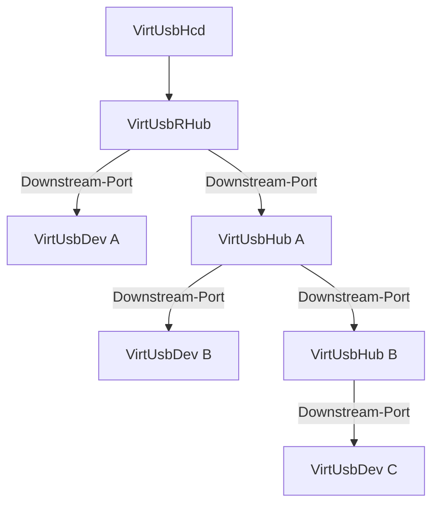

# High-Level Architecture

## Zweck

**Fragestellung:**

> Woraus besteht VirtUSB und wie hängen die Kernkomponenten zusammen?

Die High-Level Architecture konkretisiert die Systemübersicht.

Sie beschreibt den grundsätzlichen Aufbau von VirtUSB, die Beziehungen der
Kernkomponenten sowie deren grundlegende Verantwortlichkeiten.

Sie beschreibt ausschließlich die Architektur auf hoher Abstraktionsebene und
enthält keine Implementierungsdetails.

Sie bildet die Grundlage für nachgelagerte Architekturdokumente, welche
einzelne Teilbereiche der High-Level Architecture weiter konkretisieren.

## Grundlegender Systemaufbau

VirtUSB bildet eine vollständig virtuelle USB-Infrastruktur, deren Aufbau sich
an der Struktur eines realen USB-Systems orientiert.

Eine VirtUSB-Topologie besteht ausschließlich aus virtuellen Komponenten. Eine
Vermischung virtueller und physischer USB-Komponenten innerhalb derselben
VirtUSB-Topologie ist nicht vorgesehen.

Mehrere `VirtUsbHcd` können gleichzeitig existieren. Jeder `VirtUsbHcd` bildet
den Ausgangspunkt einer eigenen VirtUSB-Topologie und besitzt genau einen
`VirtUsbRHub`.

Die grundlegenden Kernkomponenten von VirtUSB sind:

- `VirtUsbHcd`
- `VirtUsbRHub`
- `VirtUsbHub`
- `VirtUsbDev`

Ihre fachliche Bedeutung ist im Glossar definiert.

### Beispiel einer VirtUSB-Topologie



Das Diagramm zeigt den grundsätzlichen Aufbau einer VirtUSB-Topologie. Die
Beziehungen und Architekturregeln werden in den nachfolgenden Kapiteln
beschrieben.

## Beziehungen der Kernkomponenten

Die Beziehungen der Kernkomponenten definieren den Aufbau einer
VirtUSB-Topologie.

Eine VirtUSB-Topologie bildet einen Parent-Child-Baum, dessen Wurzel ein
`VirtUsbHcd` mit seinem `VirtUsbRHub` ist.

### Beziehung `VirtUsbHcd` ↔ `VirtUsbRHub`

Jeder `VirtUsbHcd` besitzt genau einen `VirtUsbRHub`. Jeder `VirtUsbRHub`
gehört genau zu einem `VirtUsbHcd`.

### Beziehung Hub ↔ Downstream-Ports

Sowohl `VirtUsbRHub` als auch `VirtUsbHub` stellen Downstream-Ports bereit.
Downstream-Ports sind Bestandteil ihres jeweiligen Hubs und besitzen keine
eigenständige Existenz.

### Beziehung Downstream-Port ↔ `VirtUsbDev`

An einem Downstream-Port kann höchstens ein `VirtUsbDev` angeschlossen sein.
Ein `VirtUsbDev` kann gleichzeitig an höchstens einem Downstream-Port
angeschlossen sein.

Durch das Anstecken entsteht eine Parent-Child-Beziehung zwischen Hub und
Device.

### Beziehung `VirtUsbHub` ↔ Topologie

`VirtUsbHub` ist funktional ein spezialisiertes `VirtUsbDev`.

Ein `VirtUsbHub` kann an höchstens einem Downstream-Port angeschlossen sein.
Ein `VirtUsbRHub` besitzt dagegen keinen Parent-Port.

Das Abstecken eines `VirtUsbHub` verändert nicht die Parent-Child-Struktur des
darunterliegenden Teilbaums. Der Teilbaum bleibt intern erhalten und kann
später wieder Bestandteil einer VirtUSB-Topologie werden.

### Beziehung `VirtUsbDev` ↔ Topologie

Ein `VirtUsbDev` existiert unabhängig von einer VirtUSB-Topologie.

Erst durch eine Parent-Child-Beziehung mit einem Hub-Port und einen
durchgängigen Pfad zu genau einem `VirtUsbHcd` wird es Bestandteil einer
VirtUSB-Topologie.

Das Abstecken verändert nicht die Existenz des Gerätes.

### Kaskadierung

VirtUSB führt keine zusätzliche künstliche Begrenzung der Hub-Kaskadierung ein.
Es gelten ausschließlich die Grenzen der USB-Spezifikation und der jeweiligen
Implementierung.

Zustandsänderungen können sich rekursiv entlang bestehender Parent-Child-
Beziehungen auswirken, verändern jedoch niemals die Struktur des Teilbaums.

### Komponentenbeziehungen

```mermaid
flowchart TD
    HCD["VirtUsbHcd"]
    RHUB["VirtUsbRHub"]
    HUB["VirtUsbHub"]
    PORT["Downstream-Port"]
    DEV["VirtUsbDev"]

    HCD -->|"besitzt"| RHUB
    RHUB -->|"enthält"| PORT
    HUB -->|"enthält"| PORT
    PORT -->|"verbindet"| DEV

    HUB -.->|"funktional spezialisiertes Device"| DEV
  ```

## Architekturebenen

Die Architekturebenen beschreiben unterschiedliche fachliche
Betrachtungsweisen derselben Kernkomponenten. Sie stellen keine Software- oder
Implementierungsschichten dar.

- Geräteebene
- USB-Topologieebene
- USB-Device-Controller-Ebene
- USB-Protokollebene

Jede Kernkomponente besitzt Zustände und Eigenschaften auf allen vier
Architekturebenen.

## Systemoperationen

Systemoperationen verändern Zustände einer VirtUSB-Topologie.

Hierzu gehören insbesondere:

- Einschalten
- Ausschalten
- Anstecken
- Abstecken
- USB Connect
- USB Disconnect
- Enumeration

Die Bedeutung der einzelnen Systemoperationen ist im Glossar definiert.

Systemoperationen können rekursiv entlang bestehender Parent-Child-Beziehungen
wirken, verändern jedoch nicht die Topologiestruktur.

## Schnittstellen- und Kommunikationsmodell

Jede Kernkomponente besitzt eine definierte Schnittstelle.

Die Kommunikation erfolgt ausschließlich entlang bestehender Parent-Child-
Beziehungen und wird in zwei voneinander getrennte Kommunikationswege
unterteilt:

- Handling
- USB-Kommunikation

Handling umfasst alle Vorgänge außerhalb der USB-Kommunikation, insbesondere
Topologie- und Zustandsänderungen.

USB-Kommunikation umfasst ausschließlich die durch die USB-Spezifikation
definierten Kommunikationsabläufe.

Beide Kommunikationswege orientieren sich am Verhalten realer USB-Hardware.

## USB-Abstraktion

VirtUSB emuliert keine physische USB-Hardware.

Insbesondere werden nicht emuliert:

- elektrische Signalebene
- Bit-Ebene
- Paketebene

Die Kommunikation erfolgt auf einer höheren USB-Abstraktionsebene.

## Grundlegende Architekturregeln

- mehrere `VirtUsbHcd` möglich
- genau ein `VirtUsbRHub` je `VirtUsbHcd`
- `VirtUsbHub` ist funktional ein spezialisiertes `VirtUsbDev`
- `VirtUsbRHub` und `VirtUsbHub` verwenden nach Möglichkeit dasselbe funktionale Hub-Modell
- Hubs können entsprechend der USB-Spezifikation kaskadiert werden
- ein `VirtUsbDev` kann nur an einem Downstream-Port angeschlossen sein
- die Existenz einer Kernkomponente ist unabhängig von ihrer Einbindung in eine VirtUSB-Topologie
- Zustandsänderungen verändern nicht die Parent-Child-Struktur
- Handling und USB-Kommunikation sind getrennte Kommunikationswege
- jede Kernkomponente wird ausschließlich über ihre definierte Schnittstelle gesteuert
