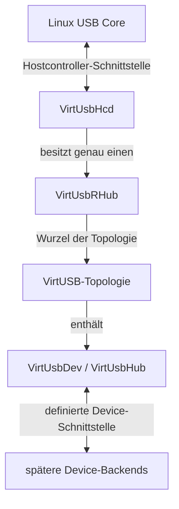
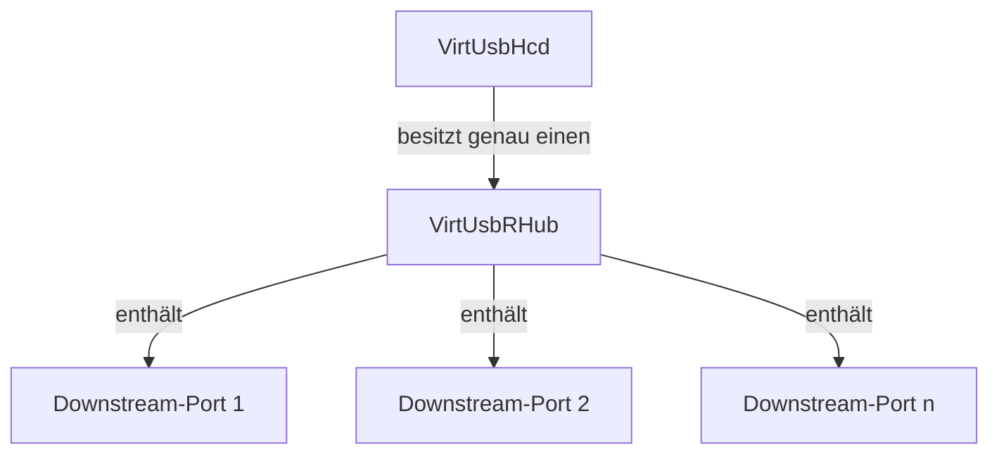
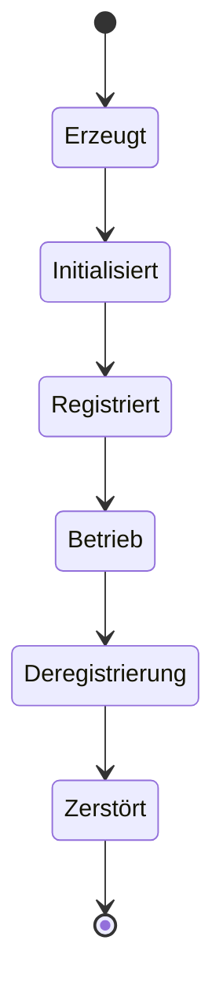
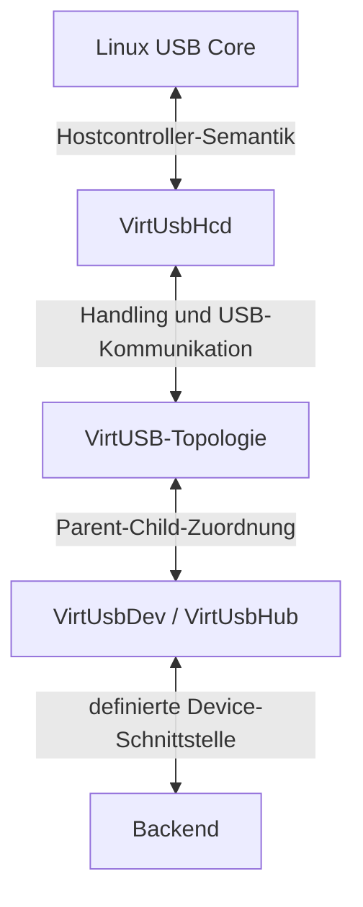

# Virtual Host Controller Architecture

## Zweck

**Fragestellung:**

> Wie ist der virtuelle USB-Hostcontroller innerhalb von VirtUSB aufgebaut und
> wofür ist er verantwortlich?

Dieses Dokument konkretisiert die High-Level Architecture für den
`VirtUsbHcd`.

Es beschreibt die Rolle des virtuellen Hostcontrollers innerhalb des
Gesamtsystems, seinen grundlegenden Aufbau, seinen Lebenszyklus und seine
Verantwortungsgrenzen gegenüber dem Linux USB Core, den übrigen
VirtUSB-Komponenten und späteren Backends.

Das Dokument enthält keine konkreten Linux-Kernel-APIs, C-Datenstrukturen,
Funktionssignaturen oder Synchronisationsmechanismen. Diese werden erst in
nachgelagerten Spezifikations- und Design-Dokumenten festgelegt.

Die fachliche Bedeutung der verwendeten VirtUSB-Begriffe ist im Glossar
definiert.

## Rolle im Gesamtsystem

Der `VirtUsbHcd` bildet gegenüber dem Linux USB Core einen virtuellen
USB-Hostcontroller ab.

Er stellt die Hostschnittstelle einer VirtUSB-Topologie bereit und bildet deren
Wurzel. Jeder `VirtUsbHcd` besitzt genau einen `VirtUsbRHub`, über den die
virtuellen Downstream-Ports der Topologie gegenüber dem Linux USB Core sichtbar
werden.

Mehrere `VirtUsbHcd` können gleichzeitig existieren. Jeder von ihnen stellt
einen eigenständigen virtuellen USB-Bus mit einer eigenen VirtUSB-Topologie
bereit.

Der `VirtUsbHcd` bildet die Grenze zwischen zwei Sichtweisen:

- Der Linux USB Core betrachtet ihn als USB-Hostcontroller.
- VirtUSB betrachtet ihn als Wurzel und Hostschnittstelle einer virtuellen
  USB-Topologie.

Der `VirtUsbHcd` besitzt keine Kenntnis über die konkrete Implementierung eines
virtuellen USB-Gerätes oder eines späteren Backends. Er verarbeitet
ausschließlich die über definierte VirtUSB-Schnittstellen bereitgestellten
Zustände und USB-Operationen.

### Einordnung in das Gesamtsystem

Das Diagramm beschreibt Verantwortungsgrenzen und keine konkrete
Softwarestruktur. Insbesondere wird keine direkte technische Kopplung zwischen
dem Linux USB Core und späteren Backends festgelegt.

## Grundlegender Aufbau

Ein `VirtUsbHcd` besteht fachlich aus dem virtuellen Hostcontroller und dem ihm
fest zugeordneten `VirtUsbRHub`.

Der `VirtUsbRHub` stellt die Downstream-Ports des virtuellen USB-Busses bereit.
Diese Ports sind Bestandteil des Root-Hubs und besitzen auf dieser
Architekturebene keine eigenständige Existenz.

Jeder Downstream-Port besitzt einen eigenen Zustand. Dieser bildet die
hostseitig beobachtbaren Eigenschaften eines virtuellen Root-Hub-Ports ab.

Hierzu gehören insbesondere:

- Port Power
- Connection
- Enable
- Reset
- Suspend
- zugehörige Zustandsänderungen

Die genaue Menge und Darstellung der Portzustände richtet sich nach den
Anforderungen des Linux USB Core und der USB-2.0-Spezifikation. Interne
Datenstrukturen werden in diesem Dokument nicht festgelegt.

Der `VirtUsbHcd` und sein `VirtUsbRHub` bilden gemeinsam ausschließlich die
Wurzel einer VirtUSB-Topologie. Virtuelle USB-Geräte und weitere virtuelle
USB-Hubs existieren unabhängig von dieser Wurzel und werden erst durch
Parent-Child-Beziehungen Bestandteil der Topologie.

### Aufbau eines virtuellen Hostcontrollers

Die Anzahl der Root-Hub-Ports wird durch die konkrete Implementierung
festgelegt. Eine projektweite Standardanzahl kann später definiert werden,
gehört jedoch nicht zu den grundlegenden Architekturentscheidungen dieses
Dokuments.

## Lebenszyklus

Der Lebenszyklus eines `VirtUsbHcd` ist vom Lebenszyklus der an ihn
angeschlossenen virtuellen USB-Geräte getrennt.

Ein virtueller Hostcontroller durchläuft fachlich die folgenden Phasen:

1. Erzeugung
2. Initialisierung
3. Registrierung beim Linux USB Core
4. Betrieb
5. Deregistrierung
6. Zerstörung

Nach erfolgreicher Registrierung wird der zugehörige `VirtUsbRHub` gegenüber
dem Linux USB Core sichtbar. Erst ab diesem Zeitpunkt kann die Topologie
hostseitig verwendet werden.

Während des Betriebs können virtuelle USB-Geräte erzeugt, angesteckt,
abgesteckt und zerstört werden, ohne dass der `VirtUsbHcd` selbst neu erzeugt
werden muss.

Bei der Deregistrierung wird der virtuelle USB-Bus gegenüber dem Linux USB Core
entfernt. Vorhandene hostseitige USB-Zustände und ausstehende USB-Operationen
müssen dabei kontrolliert beendet werden.

Die Deregistrierung oder Zerstörung eines `VirtUsbHcd` darf keine
Kernkomponenten unkontrolliert zurücklassen. Die konkrete Ownership- und
Freigabereihenfolge wird in einem nachgelagerten Dokument festgelegt.

### Lebenszyklus des Hostcontrollers

Fehlerpfade und teilweise erfolgte Initialisierungen werden im Detailed Design
beschrieben.

## Verantwortlichkeiten

### Hostcontroller

Der `VirtUsbHcd` ist verantwortlich für:

- die Darstellung eines virtuellen USB-Hostcontrollers gegenüber dem Linux USB
  Core,
- die Bereitstellung genau eines `VirtUsbRHub`,
- die Bereitstellung eines eigenständigen virtuellen USB-Busses,
- die Annahme und Rückgabe von USB-Operationen,
- die Zuordnung hostseitiger USB-Operationen zur entsprechenden
  VirtUSB-Topologie,
- die kontrollierte Beendigung ausstehender USB-Operationen bei
  Zustandsänderungen oder beim Entfernen des Hostcontrollers.

Der `VirtUsbHcd` implementiert kein gerätespezifisches USB-Verhalten.

### Root-Hub

Der `VirtUsbRHub` ist verantwortlich für:

- die Bereitstellung der Root-Hub-Downstream-Ports,
- die Darstellung der Portzustände gegenüber dem Linux USB Core,
- die Entgegennahme hostseitiger Root-Hub-Operationen,
- die Meldung relevanter Portzustandsänderungen,
- die Bildung des Einstiegspunkts der VirtUSB-Topologie.

Der Root-Hub ist Bestandteil des Hostcontrollers und kein frei ansteckbares
`VirtUsbDev`.

### Portverwaltung

Die Portverwaltung ist verantwortlich für:

- die Verwaltung der Zustände jedes Root-Hub-Ports,
- die Zuordnung von höchstens einem `VirtUsbDev` zu einem Port,
- das Anstecken und Abstecken virtueller USB-Geräte,
- die Trennung von Topologiezuordnung und hostseitiger USB-Verbindung,
- die Weitergabe relevanter Zustandsänderungen in kausaler Reihenfolge.

Ein Gerät kann einem Port zugeordnet sein, ohne dem Host aktuell eine
USB-Verbindung zu signalisieren.

### USB-Operationen

Der `VirtUsbHcd` nimmt USB-Operationen des Linux USB Core entgegen und führt sie
dem zuständigen virtuellen USB-Gerät zu.

Er transportiert dabei ausschließlich USB-Semantik. Gerätespezifische
USB-Requests, Descriptoren und Geräteklassen werden nicht durch den
Hostcontroller interpretiert.

Der Hostcontroller muss mindestens folgende grundlegende Vorgänge ermöglichen:

- Annahme einer USB-Operation,
- Zuordnung zu einem virtuellen USB-Gerät und Endpoint,
- kontrollierte Weitergabe,
- Abschluss mit Ergebnis und übertragenen Daten,
- Abbruch einer noch nicht abgeschlossenen Operation,
- Abschluss ausstehender Operationen bei Disconnect oder Entfernen des
  Hostcontrollers.

Die konkrete Repräsentation und Ablaufsteuerung wird in den nachgelagerten
Dokumenten zum Transfermodell und zur Synchronisation festgelegt.

### Zustandsänderungen

Relevante Zustandsänderungen können sich entlang bestehender
Parent-Child-Beziehungen auswirken.

Die Weitergabe folgt den zugrunde liegenden kausalen Abhängigkeiten. Ein
fehlender vorgelagerter Zustand verhindert nachgelagerte USB-Operationen.

Beispiele:

- Ohne Port Power kann ein bus-powered Gerät nicht betrieben werden.
- Ohne USB Connect kann keine Enumeration stattfinden.
- Nach einem Disconnect können keine weiteren USB-Transfers erfolgreich
  durchgeführt werden.

Zustandsänderungen verändern nicht automatisch die Parent-Child-Struktur der
VirtUSB-Topologie.

## Zusammenarbeit mit anderen Komponenten

### Linux USB Core

Der Linux USB Core ist verantwortlich für:

- die Verwaltung der hostseitigen USB-Gerätehierarchie,
- die Enumeration neu verbundener USB-Geräte,
- die Verwaltung der USB-Adressen und USB-Gerätezustände,
- die Ausführung standardisierter USB- und Hub-Abläufe,
- die Bereitstellung der hostseitigen USB-Treibermodelle.

Der `VirtUsbHcd` stellt dem Linux USB Core ausschließlich die von einem
Hostcontroller erwartete Sicht bereit.

VirtUSB ersetzt weder die Enumeration noch den generischen Linux-Hub-Treiber.
Diese Abläufe bleiben Aufgabe des Linux USB Core.

### VirtUSB-Topologie

Der `VirtUsbHcd` bildet die Wurzel genau einer VirtUSB-Topologie.

Die Topologie legt fest:

- welches virtuelle USB-Gerät an welchem Port angeschlossen ist,
- welche Parent-Child-Beziehungen bestehen,
- welcher Teilbaum zu welchem `VirtUsbHcd` gehört.

Der Hostcontroller verwaltet keine gerätespezifische Funktionalität. Er nutzt
die Topologie ausschließlich zur Zuordnung und Weitergabe von Handling- und
USB-Operationen.

### VirtUsbDev und VirtUsbHub

Ein `VirtUsbDev` stellt das USB-Verhalten eines virtuellen USB-Gerätes bereit.

Ein `VirtUsbHub` ist funktional ein spezialisiertes `VirtUsbDev`. Seine
Hub-spezifischen Requests und Transfers werden wie das Verhalten jedes anderen
USB-Gerätes über den normalen USB-Kommunikationsweg verarbeitet.

Der `VirtUsbHcd` kennt keine USB-Geräteklassen. Aus seiner Sicht unterscheiden
sich beispielsweise HID-, CDC-, Mass-Storage- und Hub-Geräte ausschließlich
durch ihr von der Device-Seite bereitgestelltes USB-Verhalten.

### Backends

Spätere Backends repräsentieren oder implementieren das Verhalten konkreter
virtueller USB-Geräte.

Der `VirtUsbHcd`:

- kennt keine konkreten Backend-Typen,
- ruft keine backend-spezifischen Funktionen auf,
- stellt keine Backend-Implementierungsdetails gegenüber dem Linux USB Core
  bereit,
- setzt ausschließlich die von den definierten VirtUSB-Schnittstellen
  bereitgestellten Zustände und Ergebnisse um.

Die konkrete Backend-Anbindung wird in nachgelagerten Schnittstellen- und
Protokolldokumenten festgelegt.

### Verantwortungsgrenzen

Jede Grenze beschreibt eine fachliche Verantwortung. Die spätere technische
Umsetzung kann innerhalb dieser Grenzen variieren.

## Architekturregeln

- Ein `VirtUsbHcd` bildet genau einen virtuellen USB-Bus ab.
- Mehrere `VirtUsbHcd` können gleichzeitig existieren.
- Jeder `VirtUsbHcd` besitzt genau einen `VirtUsbRHub`.
- Der `VirtUsbRHub` ist Bestandteil des `VirtUsbHcd`.
- Der `VirtUsbHcd` bildet die Grenze zwischen Linux USB Core und
  VirtUSB-Topologie.
- Der `VirtUsbHcd` kennt keine konkreten Backend-Implementierungen.
- Der `VirtUsbHcd` kennt keine USB-Geräteklassen.
- Gerätespezifisches USB-Verhalten wird nicht im Hostcontroller implementiert.
- Die Enumeration bleibt Aufgabe des Linux USB Core.
- Topologiezuordnung und hostseitige USB-Verbindung sind getrennte Zustände.
- Zustandsänderungen können sich rekursiv auswirken, verändern jedoch nicht
  automatisch die Parent-Child-Struktur.
- Handling und USB-Kommunikation bleiben getrennte Kommunikationswege.
- USB-Operationen werden ausschließlich über definierte Schnittstellen
  weitergegeben.
- Die Architektur legt keine konkreten Linux-Kernel-APIs, C-Datenstrukturen,
  Synchronisationsverfahren oder Backend-Protokolle fest.
