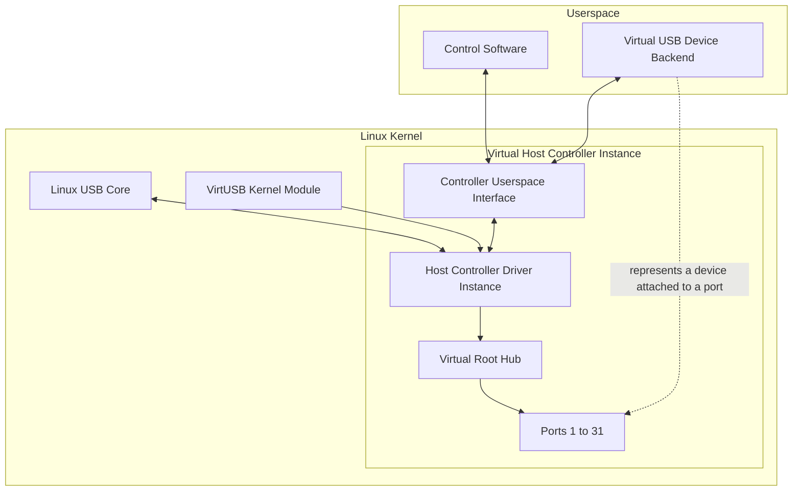

# VirtUSB High-Level Architecture

## 1. Purpose

This document defines the high-level architecture of VirtUSB.

It describes the major architectural building blocks, their responsibilities,
their relationships, and the fundamental boundaries between the Linux USB
subsystem, the VirtUSB kernel module, userspace control software, and virtual
USB device backends.

The document provides the common architectural foundation for:

- further architecture documents
- Architecture Decision Records
- kernel module implementation
- userspace API design
- backend development
- testing and verification

The intended audience includes project maintainers, contributors, backend
developers, reviewers, and users who need to understand the internal structure
of VirtUSB.

This document defines architectural structure and responsibility boundaries. It
does not define:

- concrete C data structures
- function signatures
- ioctl numbers
- binary protocol layouts
- detailed synchronization mechanisms
- kernel API usage
- implementation-specific algorithms

Such details are specified in dedicated design documents, ADRs, interface
specifications, or source code documentation.

The architecture described here shall remain consistent with the system
requirements and the system overview. In case of conflict, the system
requirements take precedence.

---

## 2. Architectural Goals

VirtUSB shall provide a reusable infrastructure for implementing virtual USB
devices on Linux without requiring physical USB hardware.

The architecture shall pursue the following goals:

### 2.1 Native Linux USB Integration

VirtUSB shall integrate with the standard Linux USB subsystem through the Host
Controller Driver interface.

Virtual USB devices shall appear to the operating system and to applications as
regular USB devices. Existing Linux USB drivers and userspace tools shall be
usable without requiring VirtUSB-specific modifications.

### 2.2 Multiple Virtual Host Controllers

VirtUSB shall support one or more independent virtual USB Host Controller
instances.

The number of controller instances shall be configurable when the kernel module
is loaded. Each controller instance shall expose its own userspace interface
and shall operate independently from other controller instances.

### 2.3 Backend Independence

The kernel module shall not depend on a specific virtual device backend,
userspace framework, USB device stack, programming language, or application
architecture and shall not require a particular execution model.

Backends shall be able to implement arbitrary virtual USB devices as long as
they comply with the VirtUSB userspace interface and the relevant USB protocol
requirements.

### 2.4 Support for All USB Transfer Types

The architecture shall support all USB transfer types defined by the USB
specification:

- Control
- Bulk
- Interrupt
- Isochronous

No transfer type shall be excluded solely because precise real-time timing
cannot be guaranteed by a general-purpose Linux operating system.

Isochronous transfers shall be supported on a best-effort basis. The
architecture shall preserve the functional behaviour of isochronous transfers,
while acknowledging that strict USB frame timing cannot be guaranteed.

### 2.5 USB Bus and Device Lifecycle Support

The architecture shall support the relevant USB bus and device lifecycle
operations required for realistic virtual USB device behaviour.

This includes, but is not limited to:

- device connection and disconnection
- device enumeration
- port enable and disable
- port reset
- suspend
- resume
- Start-of-Frame (SOF) events
- transfer cancellation
- endpoint stall and clear-feature handling

The architecture shall provide a virtual USB bus environment that allows
virtual USB devices to behave, from the perspective of the Linux USB subsystem,
like equivalent physical USB devices, within the limitations of a software-only
implementation.

USB bus events shall therefore be represented in a manner that preserves the
observable behaviour defined by the USB specification, even where exact
hardware timing cannot be reproduced.

Where precise hardware timing cannot be achieved, the architecture shall
provide an appropriate abstraction or simulation of the corresponding USB bus
events. This particularly applies to Start-of-Frame (SOF) events and
timing-sensitive isochronous operation.

The architecture intentionally does not guarantee hard real-time USB timing.

### 2.6 Clear Separation of Responsibilities

The architecture shall clearly separate:

- Linux USB Host Controller integration
- virtual Root Hub and port management
- backend communication
- transfer transport and completion
- userspace control operations
- virtual USB device behaviour
- backend-specific implementation details

VirtUSB shall provide the Host Controller infrastructure, USB bus management,
and transfer transport.

Device-specific USB behaviour, including USB Chapter 9 request handling,
descriptor generation, endpoint behaviour, and application logic, shall remain
the responsibility of the backend.

### 2.7 Modular and Extensible Design

The architecture shall allow individual components and interfaces to evolve
without requiring a redesign of the entire system.

Future extensions may include:

- additional backend implementations
- a userspace support library
- diagnostic and testing tools
- additional communication mechanisms
- performance optimizations
- support for newer Linux kernel versions

Extensions shall not bypass the documented public interfaces or introduce
backend-specific behaviour into the core kernel module.

### 2.8 Deterministic Resource Boundaries

The architecture shall define explicit limits and ownership rules for:

- controller instances
- Root Hubs
- ports
- attached devices
- endpoints
- pending transfers
- userspace connections
- backend connections
- kernel and userspace memory

Resource usage shall be bounded or configurable where practical.

### 2.9 Robust Failure Handling

A failure of a backend, userspace process, controller instance, or attached
virtual device shall not corrupt unrelated VirtUSB instances or destabilize the
Linux USB subsystem.

The architecture shall support controlled startup and shutdown of all
architectural components.

The architecture shall support controlled cleanup of:

- pending transfers
- device connections
- port state
- userspace sessions
- controller resources
- controller removal

### 2.10 Maintainability and Testability

The architecture shall support isolated testing of major components and clear
verification of system requirements.

Interfaces and component boundaries shall be designed so that controller
logic, protocol handling, error paths, lifecycle behaviour, and backend
integration can be tested independently and systematically.

---

## 3. Architectural Principles

The following principles guide the design and evolution of VirtUSB. They shall
be considered when evaluating architectural decisions and future extensions.

### 3.1 Separation of Concerns

The architecture shall separate responsibilities into clearly defined
components.

Each component shall have a well-defined purpose and shall avoid unnecessary
knowledge of internal implementation details of other components.

### 3.2 Backend Independence

The VirtUSB kernel module shall remain independent of any specific backend
implementation.

Backends may be implemented using different programming languages, USB device
stacks, execution models, or application architectures without requiring
changes to the kernel module.

### 3.3 Stable Kernel-Userspace Interface

The interface between the VirtUSB kernel module and userspace shall be stable,
well documented, and independent of individual backend implementations.

Future extensions shall preserve backward compatibility whenever reasonably
possible.

### 3.4 Explicit and Exclusive Ownership

Ownership of all resources shall be explicitly defined.

This applies to, but is not limited to:

- controller instances
- Root Hubs
- ports
- virtual devices
- endpoints
- transfers
- messages
- memory
- backend connections

Every resource shall have a clearly defined owner and lifecycle.

Resources exchanged between the kernel and userspace, in particular messages
and transfer-related data, shall have exactly one owner at any point in time.

Ownership transfers shall be explicit. The current owner is responsible for the
validity, lifetime, and release of the resource until ownership is transferred
or the resource is destroyed.

The architecture shall avoid implicit shared ownership and ambiguous cleanup
responsibilities.

### 3.5 Linux-Native Design

VirtUSB shall integrate naturally into the Linux kernel architecture and shall
follow established Linux kernel design principles where appropriate.

Existing Linux kernel infrastructure shall be reused instead of introducing
project-specific alternatives whenever practical.

### 3.6 Predictable Behaviour

The architecture shall provide predictable and well-defined behaviour.

Equivalent operations under equivalent conditions shall produce equivalent
observable results, independent of the backend implementation.

Timing behaviour that cannot be guaranteed shall be documented explicitly.

Unexpected implicit behaviour shall be avoided.

### 3.7 Layered Architecture

The architecture shall be organized into clearly separated abstraction layers.

Higher layers shall depend only on the documented interfaces of lower layers
and shall not rely on implementation details.

### 3.8 Extensibility

New functionality shall be introduced by extending documented interfaces
instead of modifying unrelated architectural components.

The architecture shall avoid introducing backend-specific functionality into
the common kernel infrastructure.

### 3.9 Documentation Before Implementation

Architectural changes shall be documented before implementation.

Significant architectural decisions shall be captured in Architecture Decision
Records (ADRs) and reflected in the corresponding architecture documents.

### 3.10 Simplicity

Architectural solutions should be as simple as reasonably possible while
meeting the project requirements.

Unnecessary complexity, premature optimization, and overengineering should be
avoided.

---

## 4. System Decomposition

VirtUSB is divided into kernel-space and userspace components.

The kernel-space components provide the virtual USB Host Controller
infrastructure and integrate it with the Linux USB subsystem.

The userspace components control virtual device attachment and implement the
behaviour of virtual USB devices.



### 4.1 Linux USB Core

The Linux USB Core discovers and manages virtual USB devices through the
standard Linux Host Controller Driver interface.

From the perspective of the Linux USB subsystem, a VirtUSB controller behaves
like a regular USB Host Controller within the functional and timing limitations
of the software-only implementation.

### 4.2 VirtUSB Kernel Module

The VirtUSB kernel module provides the common infrastructure required to create
and manage virtual Host Controller instances.

Its responsibilities include:

- registering Host Controller instances with the Linux USB subsystem
- managing controller creation and destruction
- providing the kernel-userspace interface
- managing virtual Root Hubs and ports
- transporting USB transfers and bus events
- handling transfer completion and cancellation
- cleaning up resources after failures or disconnection

The kernel module shall not implement device-specific USB behaviour.

### 4.3 Virtual Host Controller Instance

Each configured controller instance is an independent runtime object.

A controller instance contains:

- one Host Controller Driver instance
- one virtual Root Hub
- exactly 31 downstream ports
- one userspace-facing controller interface
- the queues, state, and resources associated with that controller

Failures or state changes within one controller instance shall not directly
affect other controller instances.

### 4.4 Virtual Root Hub and Ports

Each controller instance owns exactly one virtual Root Hub.

The Root Hub provides exactly 31 downstream ports. Each port may contain zero
or one attached virtual USB device.

The Root Hub and port model is responsible for representing USB bus state,
including:

- device connection and disconnection
- port status changes
- port enable and disable
- reset
- suspend and resume
- change notifications to the Linux USB subsystem

### 4.5 Controller Userspace Interface

Each controller instance exposes a userspace-facing controller interface through
an associated device node such as:

```text
/dev/virtusbX
```

The device node is the entry point through which userspace accesses a specific
controller instance.

The controller interface provides logical access to:

- controller management
- Root Hub and port management
- virtual device attachment and removal
- backend registration and association
- USB transfers
- transfer completion and cancellation
- asynchronous bus and lifecycle events

The controller interface is a logical architectural interface and shall not be
equated with a specific transport mechanism.

The concrete communication protocol and transport mechanisms are defined
separately. An implementation may use one or more mechanisms, including:

- `ioctl()` for control operations
- `read()` and `write()` for message exchange
- `mmap()` for shared-memory regions
- shared queues or ring buffers
- `poll()` or `epoll()` for event notification

The high-level architecture does not require all control, event, and transfer
traffic to use the same communication mechanism.

In particular, low-frequency administrative operations and high-volume USB
transfer data may use different transport paths while remaining part of the
same logical controller interface.

### 4.6 Control Software

Control software manages the administrative state of a virtual controller.

Typical responsibilities may include:

- selecting a controller
- selecting a Root Hub port
- attaching a backend to a port
- connecting and disconnecting a virtual device
- querying controller and port state

Control software communicates with a controller through its controller
userspace interface.

Control software describes an architectural role and does not necessarily
require a separate process or executable.

### 4.7 Virtual USB Device Backend

A backend implements the observable USB behaviour of a virtual device.

Its responsibilities include:

- USB descriptors
- USB Chapter 9 request handling
- endpoint behaviour
- device-specific protocol handling
- device state
- reactions to USB bus and lifecycle events

A backend is associated with a virtual device attached to a particular
controller port.

The backend exchanges USB transfers and bus events with the controller through
the controller userspace interface.

The backend role may be implemented in the same userspace process as the
control role or in a separate component. The architecture shall not require a
specific process model.

### 4.8 Component Relationships

The Linux USB Core communicates with VirtUSB exclusively through the standard
Host Controller Driver integration.

Userspace communicates with a specific virtual controller through its logical
controller interface and the associated device node.

Control software uses the interface primarily for administrative and lifecycle
operations.

A backend uses the interface to receive USB requests and bus events and to
return transfer results and device responses.

The controller routes USB transfers and bus events between the Linux USB
subsystem and the backend associated with the affected port.

Control operations, event notification, and transfer-data exchange may use
different concrete transport mechanisms. This distinction shall remain
transparent to the higher-level component model.

The detailed communication channels, message formats, ownership transfers,
shared-memory layout, queueing model, synchronization mechanisms, and failure
semantics are defined in subsequent architecture documents.

---


## 5. Kernel-Side Components

The VirtUSB kernel module provides the common infrastructure required to expose
one or more virtual USB Host Controllers to the Linux USB subsystem.

Its primary responsibility is to model and manage the virtual USB bus. Device-
specific USB behaviour remains entirely in userspace.

The kernel-side architecture is responsible for:

- Host Controller implementation
- virtual Root Hub implementation
- port management
- USB request routing
- USB transfer management
- bus event propagation
- Linux USB subsystem integration
- controller lifecycle management
- userspace interface management
- backend communication
- resource ownership and lifetime management
- synchronization and concurrency control
- failure detection and cleanup

The kernel-side architecture intentionally does **not** implement:

- USB device descriptors
- USB Chapter 9 request handling
- endpoint-specific behaviour
- device-specific protocols
- application-specific logic

These responsibilities belong exclusively to the userspace backend.

### 5.1 Host Controller

The Host Controller implements the Linux Host Controller Driver interface and
represents a virtual USB Host Controller within the Linux USB subsystem.

It is responsible for coordinating USB transfers, Root Hub operation, and
communication with userspace.

Each Host Controller instance operates independently.

Failures, state changes, or resource exhaustion affecting one controller
instance shall not directly affect other controller instances.

### 5.2 Root Hub

Each controller instance owns one virtual Root Hub.

The Root Hub models the upstream USB hub visible to the Linux USB subsystem and
manages exactly 31 downstream ports.

### 5.3 Port Management

Each downstream port maintains its own operational state.

Typical responsibilities include:

- device connection
- device disconnection
- enable and disable
- reset
- suspend and resume
- change notification

### 5.4 USB Request Routing

USB requests received from the Linux USB subsystem are routed to the backend
associated with the addressed virtual device.

The kernel is responsible for tracking the lifecycle of each USB transfer from
submission until completion or cancellation.

Responses generated by the backend are returned to the Linux USB subsystem
through the corresponding Host Controller instance.

### 5.5 Userspace Communication

The kernel communicates with userspace through the controller interface.

The controller interface transports:

- administrative requests
- USB transfers
- transfer completion
- asynchronous bus events
- lifecycle notifications

The concrete communication mechanisms are defined separately.

The kernel shall detect backend disconnection or failure and perform the
necessary cleanup to maintain a consistent controller state.

### 5.6 Resource Management

The kernel owns and manages all kernel-side resources.

Ownership transfers between kernel and userspace shall follow the architectural
ownership model defined by the communication architecture.

### 5.7 Concurrency

The kernel-side implementation shall support concurrent operation of multiple
controller instances.

Synchronization shall be performed internally and shall remain transparent to
userspace.

---

## 6. Controller and Root Hub Model

VirtUSB models one or more independent virtual USB Host Controllers.

Each controller instance:

- is exposed through one controller interface (e.g. `/dev/virtusbX`)
- owns exactly one virtual Root Hub
- provides exactly 31 downstream ports
- operates independently of other controller instances

The Root Hub represents the upstream hub visible to the Linux USB subsystem.

Each downstream port is an independent attachment point and may contain zero or
one virtual USB device.

A virtual device is associated with exactly one controller instance and exactly
one downstream port.

A virtual device shall not be attached to multiple ports or multiple
controllers simultaneously.

Ports exist independently of attached devices.

Device attachment and removal affect the state of a port but do not create or
destroy the port itself.

### 6.1 Controller Instance

A controller instance represents one independent virtual USB bus.

Each controller maintains its own:

- Root Hub
- port state
- userspace interface
- backend associations
- transfer state
- runtime resources

Controller instances are isolated from one another. State changes, failures, or
resource exhaustion affecting one controller shall not directly affect other
controllers.

### 6.2 Root Hub

Each controller owns one virtual Root Hub.

The Root Hub provides exactly 31 downstream ports and is responsible for
presenting the USB bus topology to the Linux USB subsystem.

The Root Hub does not implement device-specific behaviour.

### 6.3 Downstream Ports

Each downstream port represents a physical USB port abstraction.

A port may be in different operational states, including:

- empty
- device attached
- enabled
- suspended
- reset

The exact port state model is defined separately.

Each port is associated with at most one backend at any point in time.

Backend association and device attachment are related but distinct concepts.

A backend may be associated with a port before the corresponding virtual device
becomes visible to the Linux USB subsystem.

### 6.4 Bus Topology

From the perspective of the Linux USB subsystem, each controller represents one
independent USB bus.

The bus topology consists of:

- one Host Controller
- one virtual Root Hub
- 31 downstream ports
- zero or one virtual USB device per port

Additional hubs may be implemented as virtual USB devices behind a downstream
port rather than as part of the controller architecture.

---

## 7. Port and Device Model

A downstream port represents the attachment point of a virtual USB device.

Ports exist independently of attached devices and remain part of the controller
for their entire lifetime.

A virtual USB device becomes visible to the Linux USB subsystem only after it is
attached to a downstream port and a corresponding connection event is presented
by the virtual Root Hub.

Removing a device affects only the attachment state of the port. The port
itself continues to exist.

### 7.1 Port Model

Each downstream port:

- belongs to exactly one Root Hub
- exists for the lifetime of its controller instance
- may contain zero or one virtual USB device
- maintains its own operational state

The detailed port state machine is defined separately.

### 7.2 Device Association

A backend represents the implementation of a virtual USB device.

A backend may exist independently of any controller or port assignment.

A backend may be associated with at most one downstream port at any point in
time.

Likewise, each downstream port may be associated with at most one backend.

### 7.3 Device Attachment

Associating a backend with a downstream port does not automatically make the
corresponding virtual USB device visible to the Linux USB subsystem.

Visibility is established only after the virtual device is attached to the port
and the corresponding USB connection event is generated.

Detaching a virtual device removes the USB connection without necessarily
destroying the backend.

The lifecycle of a backend is therefore independent of the lifecycle of the
corresponding virtual USB device.

### 7.4 Port Reassignment

A backend may be reassigned to a different downstream port.

Port reassignment shall only occur while no virtual USB device is attached to
the current port.

If a virtual USB device is currently visible to the Linux USB subsystem, it
shall first be detached before the backend may be assigned to another port.

The architecture intentionally models this behaviour after physically
disconnecting a USB cable and reconnecting it to another port.

### 7.5 Device Visibility

From the perspective of the Linux USB subsystem, a virtual USB device exists
only while it is attached to a downstream port and connected through the
virtual Root Hub.

A backend may therefore exist in one of the following situations:

- not assigned to any port
- assigned to a port but not connected
- assigned to a port and connected

Only the final state results in a visible USB device on the virtual USB bus.

---

## 8. Backend Model

A backend implements the behaviour of one virtual USB device.

The backend is responsible for emulating the complete USB device behaviour
required by the Linux USB subsystem while remaining independent of the VirtUSB
kernel module.

Typical backend responsibilities include:

- USB descriptors
- USB Chapter 9 request handling
- endpoint behaviour
- device-specific protocols
- device state management
- processing USB transfers
- generating transfer responses

The backend does not directly interact with the Linux USB subsystem.

Instead, all communication is performed through the controller interface
provided by the VirtUSB kernel module.

### 8.1 Backend Lifecycle

A backend may exist independently of any controller or port assignment.

Its lifecycle is independent of the lifecycle of the corresponding virtual USB
device.

A backend may therefore exist while:

- not assigned to any controller
- assigned to a controller but not connected
- connected to the virtual USB bus

The architecture intentionally separates backend existence from USB device
visibility.

### 8.2 Backend Responsibilities

The backend is responsible for all device-specific behaviour, including:

- descriptor generation
- USB standard request handling
- endpoint implementation
- class-specific request handling
- vendor-specific request handling
- device state management

The VirtUSB kernel module intentionally remains unaware of these details.

### 8.3 Backend Independence

The VirtUSB architecture intentionally does not define how a backend is
implemented.

Possible backend implementations include:

- software emulation
- protocol bridges
- hardware adapters
- device proxies
- simulation environments

As long as a backend complies with the controller interface, its internal
implementation remains outside the scope of this architecture.

---

## 9. Transfer Model

VirtUSB transports USB transfers between the Linux USB subsystem and the
backend associated with the addressed virtual USB device.

The architecture supports all USB transfer types defined by USB 2.0:

- Control
- Bulk
- Interrupt
- Isochronous

Transfer handling is independent of the concrete communication mechanism
between kernel and userspace.

### 9.1 Transfer Lifecycle

Each USB transfer progresses through a well-defined lifecycle:

1. submission by the Linux USB subsystem
2. routing to the associated backend
3. backend processing
4. transfer completion
5. completion notification to the Linux USB subsystem

Transfers may also be cancelled before completion.

The detailed transfer state model is defined separately.

### 9.2 Transfer Ownership

A transfer is owned by exactly one component at any point in time.

Ownership is transferred explicitly between the Linux USB subsystem, the
VirtUSB kernel module, and the backend.

The architecture intentionally avoids implicit shared ownership of transfer
objects.

### 9.3 Transfer Independence

Each transfer is processed independently of other transfers unless ordering is
required by the USB specification.

The architecture does not impose additional ordering constraints beyond those
required for correct USB operation.

### 9.4 Transfer Completion

Each submitted transfer shall eventually reach exactly one terminal state:

- completed successfully
- completed with an error
- cancelled

Once completed, a transfer shall not become active again.

### 9.5 Transfer Types

All supported USB transfer types follow the same architectural transfer model.

Differences between transfer types affect USB protocol semantics but do not
change the overall transfer lifecycle defined by VirtUSB.

Transfer-specific behaviour remains the responsibility of the backend where
required by the USB specification.

---

## 10. Communication Model

The VirtUSB architecture defines a logical communication model between the
VirtUSB kernel module and userspace components.

Communication is performed through the controller interface associated with a
specific virtual Host Controller instance.

The communication model is independent of the underlying transport mechanism.

The architecture distinguishes four categories of communication:

- administrative operations
- device lifecycle events
- USB transfer requests
- USB transfer completions

The concrete communication protocol, message formats, transport mechanisms, and
serialization are defined separately.

### 10.1 Communication Principles

Communication between the kernel module and userspace shall follow the
architectural principles defined by this document.

In particular:

- communication is controller-local
- ownership transfers are explicit
- each message has exactly one owner at any point in time
- communication shall remain backend-independent
- transport mechanisms remain transparent to higher architectural layers

### 10.2 Administrative Operations

Administrative operations are used to configure and control the virtual USB
environment.

Typical operations include:

- backend association
- backend removal
- device attachment
- device detachment
- controller management
- port management

Administrative operations are independent of USB transfer processing.

### 10.3 Device Lifecycle Events

Device lifecycle events represent changes affecting the virtual USB bus.

Typical lifecycle events include:

- device connected
- device disconnected
- port reset
- suspend
- resume
- Start-of-Frame (SOF)

These events describe USB bus state changes rather than USB data transfers.

### 10.4 USB Transfer Requests

USB transfer requests originate from the Linux USB subsystem.

The VirtUSB kernel module routes each transfer request to the backend
associated with the addressed virtual USB device.

Each request represents one USB transfer requiring backend processing.

### 10.5 USB Transfer Completion

After processing a transfer request, the backend returns exactly one transfer
completion.

A completion reports the final result of the corresponding transfer.

Possible completion results include:

- successful completion
- failed completion
- cancelled transfer

### 10.6 Communication Scope

Communication is always associated with exactly one controller instance.

Administrative operations, lifecycle events, and USB transfers belonging to one
controller shall not affect other controller instances.

The architecture intentionally isolates communication between different virtual
USB buses.

### 10.7 Communication Ordering

Communication shall preserve the ordering required for correct USB operation.

The architecture intentionally does not impose additional ordering constraints
beyond those required by the USB specification.

Ordering requirements specific to individual communication mechanisms are
defined separately from this high-level architecture.

---
## 11. Runtime Model

The runtime model describes how architectural components are created, interact,
change state, and are removed during normal operation.

The architecture intentionally separates the lifecycles of controllers, Root
Hubs, ports, backends, virtual USB devices, and USB transfers. Each runtime
object follows its own lifecycle while interacting through well-defined
architectural interfaces.

Runtime behaviour shall remain consistent with the architectural principles and
responsibility boundaries defined by this document.

### 11.1 Controller Lifecycle

A controller instance is created by the VirtUSB kernel module and registered
with the Linux USB subsystem.

During its lifetime, each controller instance provides:

- one virtual Host Controller
- one virtual Root Hub
- exactly 31 downstream ports
- one controller interface

A controller instance remains operational until it is explicitly removed or the
VirtUSB kernel module is unloaded.

Removing a controller terminates all runtime state associated with that
controller, including attached devices, pending transfers, and userspace
communication.

### 11.2 Port Lifecycle

Downstream ports exist for the entire lifetime of their controller instance.

A port may change its operational state multiple times while remaining the same
runtime object.

Typical state transitions include:

- backend association
- backend removal
- device connection
- device disconnection
- enable and disable
- reset
- suspend
- resume

The detailed port state machine is defined separately.

### 11.3 Backend Lifecycle

A backend exists independently of any controller or port assignment.

During its lifetime, a backend may:

- be created
- become associated with a downstream port
- become connected to the virtual USB bus
- become disconnected
- be reassigned to another port
- terminate

The lifecycle of a backend is independent of the lifecycle of the corresponding
virtual USB device.

### 11.4 Virtual Device Lifecycle

A virtual USB device becomes visible to the Linux USB subsystem only after:

1. a backend has been associated with a downstream port
2. the virtual device is connected to the virtual USB bus

The Linux USB subsystem subsequently performs normal USB enumeration.

A virtual USB device becomes invisible again when it is disconnected from the
virtual USB bus.

Removing a virtual USB device does not necessarily destroy the associated
backend.

### 11.5 Transfer Runtime

USB transfers exist only while actively processed.

Each transfer progresses through the lifecycle defined by the Transfer Model.

During runtime, a transfer may be:

- pending
- being processed
- completed
- cancelled

Completed and cancelled transfers are removed from the active runtime state.

### 11.6 Runtime Relationships

During normal operation:

- controllers own one Root Hub
- Root Hubs own exactly 31 downstream ports
- ports may be associated with one backend
- connected backends represent one virtual USB device
- transfers exist only while actively processed

The runtime model intentionally separates:

- object existence
- object ownership
- object association
- object visibility

These concepts are related but shall not be considered equivalent.

### 11.7 Typical Runtime Sequence

A typical runtime sequence consists of:

1. controller creation
2. backend creation
3. backend association
4. virtual device connection
5. USB enumeration
6. normal USB operation
7. virtual device disconnection
8. backend removal or reassignment
9. controller removal

Actual implementations may perform additional management operations while
preserving the architectural relationships defined by this document.

---

## 12. Concurrency Model

The VirtUSB architecture supports concurrent operation of multiple controller
instances, userspace components, and USB transfers.

Concurrency shall not change the architectural behaviour defined by this
document. Independent operations shall remain independent, while operations that
require coordination shall preserve the ordering defined by the USB
specification.

The architecture intentionally does not mandate a particular synchronization or
threading implementation.

### 12.1 Controller Isolation

Each controller instance operates independently.

State changes, resource exhaustion, failures, or heavy workload affecting one
controller instance shall not directly affect other controller instances.

Communication, runtime state, and resources remain local to the corresponding
controller.

### 12.2 Backend Isolation

Each backend operates independently of other backends.

A backend shall not require knowledge of the internal state of another backend.

The architecture permits multiple backends to execute concurrently.

### 12.3 Transfer Concurrency

Multiple USB transfers may be active simultaneously.

Transfers associated with different controllers, devices, or endpoints may be
processed concurrently where permitted by the USB specification.

The architecture intentionally does not require sequential processing unless
mandated by USB protocol semantics.

### 12.4 Synchronization Principles

The architecture defines synchronization requirements but not synchronization
mechanisms.

Implementations shall ensure:

- consistent object ownership
- consistent object lifetime
- consistent controller state
- correct transfer processing
- correct communication ordering

The choice of synchronization primitives remains implementation-specific.

### 12.5 Ownership Under Concurrency

Concurrent execution shall not violate the architectural ownership model.

At any point in time:

- each runtime object has exactly one owner
- ownership transfers are explicit
- ownership changes shall appear atomic from an architectural perspective

The architecture intentionally avoids implicit shared ownership.

### 12.6 Ordering Guarantees

Operations shall preserve the ordering required by correct USB operation.

The architecture intentionally does not impose additional ordering constraints
that are unrelated to USB semantics.

Ordering requirements may differ between independent controller instances.

### 12.7 Execution Model Independence

The VirtUSB architecture intentionally remains independent of the userspace
execution model.

Backends may be implemented using, for example:

- a single-threaded event loop
- multiple worker threads
- asynchronous execution
- multiple cooperating processes

Likewise, the architecture does not require a particular kernel-side execution
model beyond the guarantees defined by the Linux kernel and the Host Controller
Driver interface.

As long as the architectural interfaces, ownership rules, and behavioural
guarantees defined by this document are preserved, the concrete execution model
remains outside the scope of the architecture.

---

## 13. Failure and Recovery Model

The VirtUSB architecture defines how failures are detected, contained, and
recovered while preserving a consistent runtime state.

Failures shall remain isolated whenever practical and shall not compromise the
correct operation of unrelated controller instances or virtual USB devices.

The architecture intentionally defines behavioural guarantees rather than
implementation-specific recovery mechanisms.

### 13.1 Failure Detection

The architecture assumes that failures affecting architectural components can be
detected.

Typical failures include:

- backend termination
- userspace communication failure
- unexpected controller shutdown
- device removal
- transfer cancellation

The concrete detection mechanisms are implementation-specific.

### 13.2 Fault Isolation

Failures shall be contained as locally as reasonably possible.

In particular:

- failures affecting one backend shall not directly affect other backends
- failures affecting one controller shall not directly affect other controllers
- failures shall not corrupt unrelated runtime objects

The architecture intentionally separates controller runtime state to support
fault isolation.

### 13.3 Backend Failure

If a backend becomes unavailable while associated with a controller, the
controller shall restore a consistent runtime state.

Typical recovery actions include:

- terminating pending communication
- cancelling active transfers
- disconnecting the virtual USB device
- releasing backend-specific resources

The architecture does not require automatic backend restart.

### 13.4 Communication Failure

If communication between the kernel module and userspace is interrupted, the
affected controller shall perform the necessary cleanup.

The architecture shall prevent communication failures from leaving partially
owned resources or inconsistent runtime state.

The concrete recovery procedure is implementation-specific.

### 13.5 Transfer Recovery

Transfers affected by failures shall eventually reach a terminal state.

Depending on the failure scenario, a transfer may:

- complete successfully
- complete with an error
- be cancelled

The architecture intentionally avoids indefinitely active transfers.

### 13.6 Resource Cleanup

After a failure, resources shall be released according to the architectural
ownership model.

Cleanup shall include, where applicable:

- runtime objects
- pending transfers
- backend associations
- communication resources
- controller resources

Cleanup responsibilities follow the ownership model defined by this
architecture.

### 13.7 Recovery Behaviour

Following successful cleanup, the affected controller may continue normal
operation where practical.

Typical recovery scenarios include:

- attaching a replacement backend
- reconnecting a virtual USB device
- creating new USB transfers
- continuing operation of unaffected controllers

Recovery behaviour shall preserve the architectural constraints and runtime
relationships defined by this document.

---

## 14. Extensibility

The VirtUSB architecture is designed to support future evolution without
requiring fundamental redesign of the existing architecture.

New functionality shall be introduced by extending well-defined architectural
interfaces while preserving the responsibility boundaries and behavioural
guarantees defined by this document.

Extensions shall remain compatible with the architectural principles described
in this document.

### 14.1 Backend Extensibility

The architecture permits arbitrary backend implementations provided they comply
with the documented controller interface.

Possible backend implementations include, for example:

- software emulation
- hardware adapters
- protocol bridges
- simulation environments
- testing frameworks

Introducing new backend types shall not require modifications to the core
architecture.

### 14.2 Communication Extensibility

The logical controller interface is independent of the underlying communication
mechanism.

Future implementations may introduce alternative transport mechanisms or
performance optimizations while preserving the same architectural communication
model.

### 14.3 Functional Extensibility

The architecture permits future functional extensions without changing the
fundamental component relationships.

Possible extensions include, for example:

- userspace support libraries
- diagnostic and monitoring tools
- additional management utilities
- performance optimizations
- support for future USB standards

Such extensions shall integrate through the documented architectural interfaces.

### 14.4 Compatibility

Future architectural evolution should preserve compatibility wherever
reasonably practical.

Extensions should avoid unnecessary changes to existing interfaces,
responsibility boundaries, or behavioural guarantees.

Architectural changes affecting public interfaces or fundamental behaviour shall
be documented through Architecture Decision Records (ADRs) and reflected in the
architecture documentation.

---

## 15. Architectural Constraints

The following architectural constraints define the fundamental characteristics
of VirtUSB.

These constraints apply to all implementations and shall not be violated unless
the architecture itself is revised.

### 15.1 Platform Constraints

VirtUSB is designed exclusively for Linux.

The architecture assumes:

- Linux kernel integration
- Host Controller Driver (HCD) infrastructure
- out-of-tree kernel module implementation
- DKMS-compatible distribution

Supporting additional operating systems requires architectural evaluation and
may require changes beyond the scope of this architecture.

### 15.2 Controller Architecture

Each controller instance shall provide:

- one virtual Host Controller
- one virtual Root Hub
- exactly 31 downstream ports
- one controller interface

Controller instances shall operate independently.

The architecture intentionally does not support multiple Root Hubs within a
single controller instance.

### 15.3 Responsibility Boundaries

The architectural separation of responsibilities shall be preserved.

In particular:

- the kernel module shall not implement device-specific USB behaviour
- the backend shall implement all device-specific behaviour
- communication shall occur exclusively through the controller interface
- controller management shall remain independent of backend implementation

### 15.4 Backend Neutrality

The architecture shall remain independent of any particular backend
implementation.

No architectural component shall require:

- a specific USB device stack
- a specific programming language
- a specific userspace framework
- a specific execution model

Backend-specific functionality shall not become part of the common kernel
architecture.

### 15.5 Ownership Model

The explicit ownership model defined by this architecture shall be preserved.

At any point in time:

- each runtime object has exactly one owner
- ownership transfers are explicit
- ownership defines cleanup responsibility

Implicit shared ownership is intentionally prohibited.

### 15.6 Architectural Integrity

Future extensions shall preserve the architectural principles, component
relationships, and behavioural guarantees defined by this document.

Changes affecting these architectural constraints require corresponding updates
to the architecture documentation and, where appropriate, Architecture Decision
Records (ADRs).

---

## 16. Open Architectural Decisions

The VirtUSB architecture will continue to evolve as implementation progresses
and additional requirements become known.

This document intentionally defines the current architectural baseline while
acknowledging that certain design decisions remain open.

Topics currently subject to further architectural refinement include:

- backend communication mechanisms
- userspace communication protocol
- transfer queue architecture
- detailed memory ownership transitions
- synchronization strategies
- security architecture
- Linux kernel compatibility strategy

Additional architectural topics may be introduced as the project evolves.

### 16.1 Architecture Decision Records

Architectural decisions shall be documented using Architecture Decision Records
(ADRs).

Each ADR documents:

- the architectural problem
- the considered alternatives
- the selected solution
- the rationale behind the decision
- the architectural consequences

ADRs complement this document by recording the decision-making process rather
than replacing the architecture itself.

### 16.2 Relationship to this Document

This document represents the consolidated high-level architecture of VirtUSB.

Accepted architectural decisions shall be reflected in this document to ensure
that it remains an accurate description of the current architecture.

Whenever an ADR introduces, modifies, or supersedes an architectural decision,
the corresponding sections of this document shall be updated accordingly.

This document therefore describes the current architecture, while ADRs document
how and why that architecture evolved.
