# VirtUSB High-Level Architecture

**Status:** Draft

# Table of Contents

1. Purpose
2. Architectural Goals
3. Architectural Principles
4. System Decomposition
5. Kernel-Side Components
6. Controller and Topology Model
7. Virtual Device Model
8. Backend Model
9. Transfer Model
10. Communication Model
11. Runtime Model
12. Concurrency Model
13. Failure and Recovery Model
14. Extensibility
15. Architectural Constraints
16. Open Architectural Decisions

Appendix A – Responsibility Allocation

Appendix B – Runtime Objects

Appendix C – Architecture Decision References

Appendix D – Reference Documents

# Definitions and Abbreviations

The terminology and abbreviations used by this document are defined in
`doc/glossary.md`.

---

# 1. Purpose

This document defines the high-level architecture of VirtUSB.

It describes the major architectural building blocks, their responsibilities,
their relationships, and the fundamental boundaries between the Linux USB
subsystem, the VirtUSB kernel module, userspace control software, and virtual
USB device backends.

In addition, this document defines architectural responsibility domains that
describe the conceptual separation between virtual device hardware, virtual USB
controller and topology management, and USB protocol operation.

These responsibility domains complement the software component architecture.
They define responsibilities and state boundaries rather than implementation
layers and therefore remain independent of the software component boundaries.

The document provides the common architectural foundation for:

- further architecture documents
- Architecture Decision Records
- kernel module implementation
- userspace API design
- backend development
- testing and verification

The intended audience includes project maintainers, contributors, backend
developers, reviewers, and users who need to understand the internal structure
of VirtUSB.

This document defines architectural structure, responsibility boundaries,
conceptual relationships between runtime objects, and the behavioural model of
their interactions. It does not define:

- concrete C data structures
- function signatures
- ioctl numbers
- binary protocol layouts
- detailed synchronization mechanisms
- kernel API usage
- implementation-specific algorithms

Such details are specified in dedicated design documents, ADRs, interface
specifications, or source code documentation.

The architecture described here shall remain consistent with the system
requirements and the system overview. In case of conflict, the system
requirements take precedence.

---

# 2. Architectural Goals

VirtUSB shall provide a reusable infrastructure for implementing virtual USB
devices on Linux without requiring physical USB hardware.

The architecture shall pursue the following goals:

## 2.1 Native Linux USB Integration

VirtUSB shall integrate with the standard Linux USB subsystem through the Host
Controller Driver interface.

Virtual USB devices shall appear to the operating system and to applications as
regular USB devices. Existing Linux USB drivers and userspace tools shall be
usable without requiring VirtUSB-specific modifications.

## 2.2 Multiple Virtual Host Controllers

VirtUSB shall support one or more independent virtual USB Host Controller
instances.

The number of controller instances shall be configurable when the kernel module
is loaded. Each controller instance shall expose its own userspace interface
and shall operate independently from other controller instances.

## 2.3 Backend Independence

The kernel module shall not depend on a specific virtual device backend,
userspace framework, USB device stack, programming language, or application
architecture and shall not require a particular execution model.

Backends shall be able to implement arbitrary virtual USB devices as long as
they comply with the VirtUSB userspace interface and the relevant USB protocol
requirements.

Backend implementations shall remain independent of the VirtUSB kernel module
implementation. A backend instance represents the virtual hardware of exactly
one virtual USB device and communicates with VirtUSB exclusively through the
documented controller interface.

## 2.4 Support for All USB Transfer Types

The architecture shall support all USB transfer types defined by the USB
specification:

- Control
- Bulk
- Interrupt
- Isochronous

No transfer type shall be excluded solely because precise real-time timing
cannot be guaranteed by a general-purpose Linux operating system.

Isochronous transfers shall be supported on a best-effort basis. The
architecture shall preserve the functional behaviour of isochronous transfers,
while acknowledging that strict USB frame timing cannot be guaranteed.

## 2.5 USB Bus and Device Lifecycle Support

The architecture shall support the relevant USB bus and device lifecycle
operations required for realistic virtual USB device behaviour.

The architecture shall distinguish between the lifecycle of the virtual device
hardware, the virtual USB topology, and USB protocol operation.

These responsibility domains interact but remain conceptually independent. A
change in one domain may trigger changes in another domain without making the
domains equivalent.

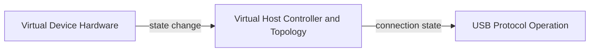

This includes, but is not limited to:

- device power on and power off
- device attachment and detachment
- USB connection and disconnection
- device enumeration
- port enable and disable
- port reset
- suspend
- resume
- Start-of-Frame (SOF) events
- transfer cancellation
- endpoint stall and clear-feature handling

The architecture shall provide a virtual USB bus environment that allows
virtual USB devices to behave, from the perspective of the Linux USB subsystem,
like equivalent physical USB devices, within the limitations of a software-only
implementation.

USB bus events shall therefore be represented in a manner that preserves the
observable behaviour defined by the USB specification, even where exact
hardware timing cannot be reproduced.

Where precise hardware timing cannot be achieved, the architecture shall
provide an appropriate abstraction or simulation of the corresponding USB bus
events. This particularly applies to Start-of-Frame (SOF) events and
timing-sensitive isochronous operation.

The architecture intentionally does not guarantee hard real-time USB timing.

## 2.6 Clear Separation of Responsibilities

The architecture shall clearly separate responsibilities between:

- virtual device hardware
- virtual USB controller and topology management
- USB protocol operation
- userspace control software
- backend-specific device implementation

The virtual device hardware represents the emulated hardware of one USB device.

Virtual USB controller and topology management are responsible for representing
virtual Host Controllers, hubs, ports, device attachment, and host-visible USB
connection state.

USB protocol operation represents the USB-defined behaviour resulting from the
interaction between the Linux USB subsystem, VirtUSB, and the backend.

VirtUSB shall provide the Host Controller infrastructure, topology management,
communication, connection-state propagation, and transfer routing.

Backends shall provide all device-specific behaviour, including USB Chapter 9
request handling, descriptor generation, endpoint behaviour, and application
logic.

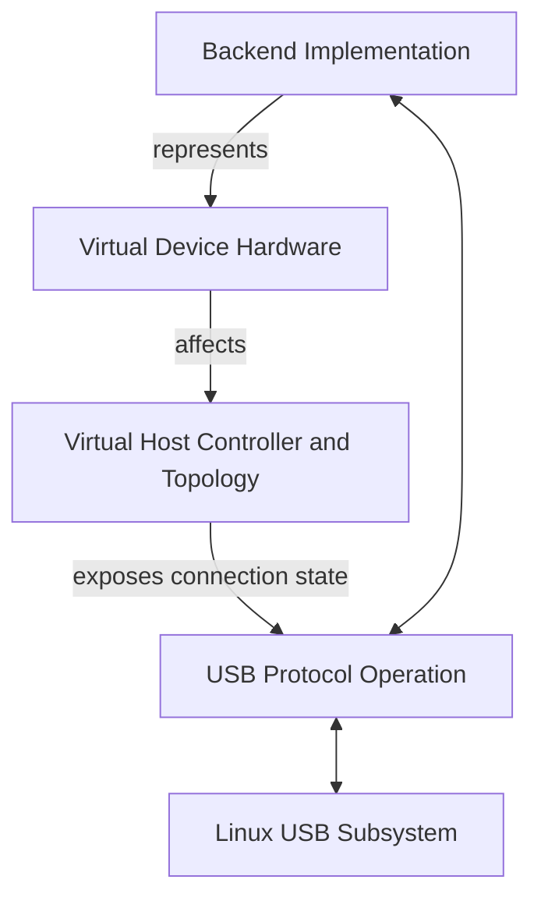

## 2.7 Modular and Extensible Design

The architecture shall allow individual components and interfaces to evolve
without requiring a redesign of the entire system.

Future extensions may include:

- additional backend implementations
- a userspace support library
- diagnostic and testing tools
- additional communication mechanisms
- performance optimizations
- support for newer Linux kernel versions

Extensions shall not bypass the documented public interfaces or introduce
backend-specific behaviour into the core kernel module.

Future architectural extensions shall preserve the separation of responsibility
domains defined by this architecture.

## 2.8 Deterministic Resource Boundaries

The architecture shall define explicit limits and ownership rules for:

- controller instances
- Root Hubs
- ports
- virtual device hardware instances
- topology objects
- attached devices
- endpoints
- pending transfers
- userspace connections
- backend connections
- kernel and userspace memory

Resource usage shall be bounded or configurable where practical.

## 2.9 Robust Failure Handling

A failure of a backend, userspace process, controller instance, or attached
virtual device shall not corrupt unrelated VirtUSB instances or destabilize the
Linux USB subsystem.

Failures affecting one responsibility domain shall not unnecessarily propagate
into other responsibility domains. Where propagation is required, it shall occur
through well-defined architectural interactions.

The architecture shall support controlled startup and shutdown of all
architectural components.

The architecture shall support controlled cleanup of:

- pending transfers
- device connections
- port state
- userspace sessions
- controller resources
- controller removal

## 2.10 Maintainability and Testability

The architecture shall support isolated testing of major components and clear
verification of system requirements.

Interfaces and component boundaries shall be designed so that controller logic,
topology management, protocol handling, error paths, lifecycle behaviour,
responsibility-domain interactions, and backend integration can be tested
independently and systematically.

---

# 3. Architectural Principles

The following principles guide the design and evolution of VirtUSB. They shall
be considered when evaluating architectural decisions and future extensions.

## 3.1 Separation of Responsibility Domains

The VirtUSB architecture distinguishes between software component boundaries
and architectural responsibility domains.

Responsibility domains define ownership, state boundaries, and behavioural
responsibilities. They are independent of software implementation layers.

The primary responsibility domains are:

- Virtual Device Hardware
- Virtual Host Controller and Topology
- USB Protocol Operation

These domains communicate through well-defined architectural interactions while
remaining conceptually independent.

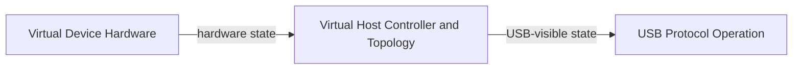

## 3.2 Separation of Concerns

The architecture shall separate responsibilities into clearly defined software
components.

Each component shall have a well-defined purpose and shall avoid unnecessary
knowledge of internal implementation details of other components.

Responsibility domains and software components intentionally describe different
architectural views and shall not be considered equivalent.

## 3.3 Backend Independence

The VirtUSB kernel module shall remain independent of any specific backend
implementation.

Backends may be implemented using different programming languages, USB device
stacks, execution models, or application architectures without requiring
changes to the kernel module.

Each backend instance represents exactly one virtual device hardware instance.
A backend shall neither require knowledge of other backends nor directly manage
controller topology.

## 3.4 Stable Kernel-Userspace Interface

The interface between the VirtUSB kernel module and userspace shall be stable,
well documented, and independent of individual backend implementations.

The interface shall expose architectural concepts rather than implementation
details.

Future extensions shall preserve backward compatibility whenever reasonably
possible.

## 3.5 Explicit and Exclusive Ownership

Ownership of all resources shall be explicitly defined.

This applies to, but is not limited to:

- controller instances
- Root Hubs
- ports
- virtual device hardware instances
- virtual devices
- endpoints
- transfers
- messages
- memory
- backend connections

Every resource shall have a clearly defined owner and lifecycle.

Resources exchanged between the kernel and userspace, in particular messages
and transfer-related data, shall have exactly one owner at any point in time.

Ownership transfers shall be explicit. Ownership shall not implicitly cross
responsibility domains.

The current owner is responsible for the validity, lifetime, and release of the
resource until ownership is transferred or the resource is destroyed.

The architecture shall avoid implicit shared ownership and ambiguous cleanup
responsibilities.

## 3.6 Linux-Native Design

VirtUSB shall integrate naturally into the Linux kernel architecture and shall
follow established Linux kernel design principles where appropriate.

Existing Linux kernel infrastructure shall be reused instead of introducing
project-specific alternatives whenever practical.

## 3.7 Predictable Behaviour

The architecture shall provide predictable and well-defined behaviour.

Equivalent operations under equivalent conditions shall produce equivalent
observable results, independent of the backend implementation.

Equivalent changes of virtual device hardware shall produce equivalent
observable USB behaviour.

Timing behaviour that cannot be guaranteed shall be documented explicitly.

Unexpected implicit behaviour shall be avoided.

## 3.8 Layered Software Architecture

The architecture shall be organized into clearly separated software abstraction
layers.

Higher software layers shall depend only on the documented interfaces of lower
layers and shall not rely on implementation details.

The responsibility domains defined by this architecture are orthogonal to the
software layering and shall not be interpreted as additional software layers.

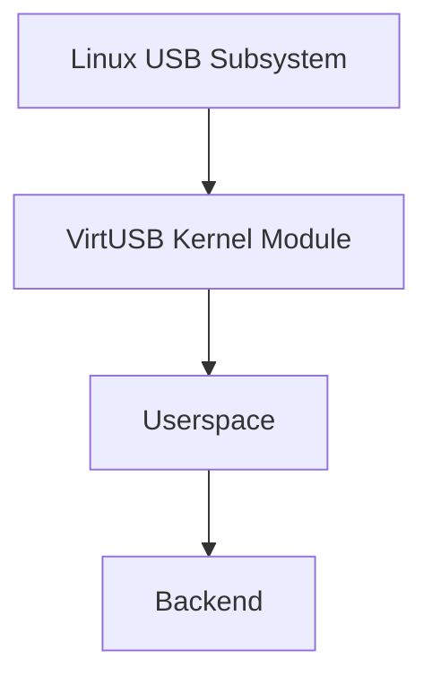

## 3.9 Extensibility

New functionality shall be introduced by extending documented interfaces
instead of modifying unrelated architectural components.

The architecture shall avoid introducing backend-specific functionality into
the common kernel infrastructure.

Future extensions shall preserve the separation of responsibility domains.

## 3.10 Documentation Before Implementation

Architectural changes shall be documented before implementation.

Significant architectural decisions shall be captured in Architecture Decision
Records (ADRs) and reflected in the corresponding architecture documents.

## 3.11 Simplicity

Architectural solutions should be as simple as reasonably possible while
meeting the project requirements.

Unnecessary complexity, premature optimization, and overengineering should be
avoided.

---

# 4. System Decomposition

VirtUSB is decomposed into software components that collectively implement the
VirtUSB architecture.

The architecture is described through three complementary architectural views:

- Software Components
- Architectural Responsibility Domains
- Runtime Objects

Each view describes the same system from a different perspective.

Software Components describe where functionality is implemented.

Architectural Responsibility Domains describe responsibility, ownership, state
boundaries, and behavioural separation independently of the software
implementation.

Runtime Objects describe the architectural objects that exist while the system
is running and the relationships between them.

The three views are orthogonal. A concept in one view shall not be treated as
equivalent to a concept in another view.

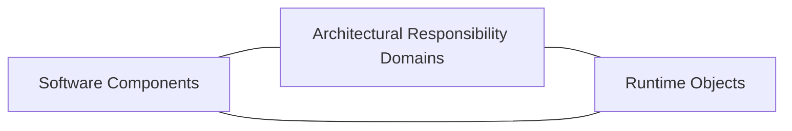

## 4.1 Software Components

The Software Components view describes where VirtUSB functionality is
implemented.

The principal software components are:

- Linux USB Core
- VirtUSB kernel module
- userspace control software
- virtual USB device backend

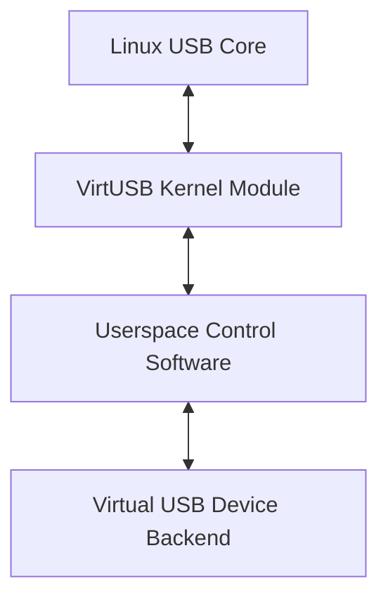

The software component boundaries describe implementation placement and
communication paths. They do not define ownership of every architectural state
or runtime object.

A future userspace support library may be inserted between userspace control
software and the backend or between userspace and the kernel interface without
changing the responsibility-domain or runtime-object views.

## 4.2 Architectural Responsibility Domains

The Architectural Responsibility Domains view separates the major behavioural
and state responsibilities of VirtUSB.

The primary responsibility domains are:

- Virtual Device Hardware
- Virtual Host Controller and Topology
- USB Protocol Operation

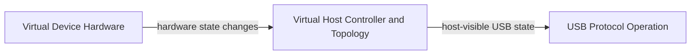

### 4.2.1 Virtual Device Hardware

The Virtual Device Hardware domain represents the emulated hardware of one USB
device.

It includes, where applicable:

- device existence
- device power state
- device reset or reboot
- USB device controller availability
- USB transceiver availability
- firmware or boot state where externally relevant

A backend instance represents exactly one virtual device hardware instance.

The backend may control only the virtual device hardware that it represents.

### 4.2.2 Virtual Host Controller and Topology

The Virtual Host Controller and Topology domain represents the virtual USB
infrastructure managed by VirtUSB.

It includes:

- virtual Host Controller instances
- Root Hubs
- USB hubs
- parent hubs
- parent ports
- device attachment and detachment
- hierarchical USB topology
- host-visible connection state
- topology-related status changes

This domain is owned by VirtUSB and shall not be directly controlled by a
backend implementation.

A backend may request or report changes concerning the virtual device hardware
that it represents. VirtUSB determines and applies the resulting controller and
topology state changes.

### 4.2.3 USB Protocol Operation

The USB Protocol Operation domain represents USB-defined behaviour.

It includes:

- device enumeration
- USB device states
- standard requests
- class requests
- vendor requests
- Control, Bulk, Interrupt, and Isochronous transfers
- endpoint state
- STALL handling
- reset, suspend, and resume behaviour
- transfer completion and cancellation

The Linux USB subsystem, VirtUSB, and the backend participate in this domain
according to their documented responsibilities.

Only USB-defined and host-controller-compatible behaviour shall be visible
through this domain.

## 4.3 Runtime Objects

The Runtime Objects view describes the architectural objects that exist during
system operation.

The principal runtime objects include:

- controller instances
- Root Hubs
- USB hubs
- ports
- backend instances
- virtual device hardware instances
- virtual USB devices
- endpoints
- transfers
- communication sessions

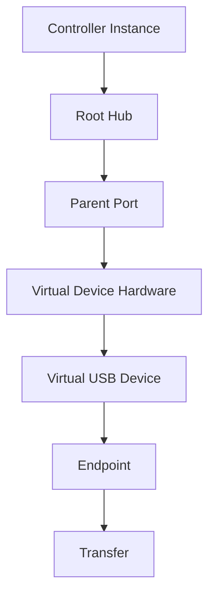

Runtime objects have explicit ownership and independent lifecycles.

A runtime object shall not be treated as equivalent to the software component
that creates, owns, or represents it.

For example:

- a backend is a software component
- a backend instance is a runtime object
- virtual device hardware is a responsibility-domain concept and a runtime object
- a port is a runtime object owned by the topology domain
- enumeration is protocol behaviour rather than a runtime object

## 4.4 Relationship Between the Architectural Views

The three architectural views complement one another.

The following diagram illustrates their relationship without implying that
objects across the views are identical.

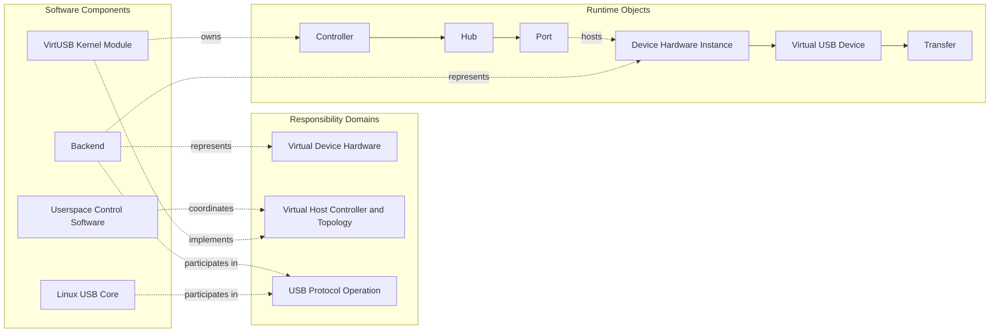

The architecture shall preserve this separation throughout interface design,
runtime management, failure handling, and future extensions.

## 4.5 Linux USB Core

The Linux USB Core discovers and manages virtual USB devices through the
standard Linux Host Controller Driver interface.

From the perspective of the Linux USB subsystem, a VirtUSB controller behaves
like a regular USB Host Controller within the functional and timing limitations
of the software-only implementation.

The Linux USB Core is responsible for:

- USB bus discovery
- USB device enumeration
- device addressing
- configuration selection
- device-driver matching and binding
- normal interaction with USB device drivers

VirtUSB shall not replace or duplicate these responsibilities.

## 4.6 VirtUSB Kernel Module

The VirtUSB kernel module provides the common infrastructure required to create
and manage virtual Host Controller instances.

Its responsibilities include:

- registering Host Controller instances with the Linux USB subsystem
- managing controller creation and destruction
- providing the kernel-userspace interface
- managing Root Hubs, hubs, ports, and virtual USB topology
- representing host-visible connection state
- routing USB transfers and bus events
- handling transfer completion and cancellation
- managing controller-local resources
- cleaning up resources after failures or disconnection

The kernel module owns the Virtual Host Controller and Topology responsibility
domain.

The kernel module shall not implement device-specific USB behaviour.

The kernel module shall not own or emulate backend-specific virtual device
hardware.

## 4.7 Virtual Host Controller Instance

Each configured controller instance is an independent runtime object
representing one virtual USB bus.

A controller instance contains:

- one Host Controller Driver instance
- one virtual Root Hub
- exactly 31 Root Hub downstream ports
- one userspace-facing controller interface
- the topology rooted at that Root Hub
- controller-local queues, state, and resources

The controller owns the Root Hub and all topology state belonging to its virtual
USB bus.

The Root Hub owns its 31 downstream ports. Additional USB hubs may introduce
further downstream ports within the same topology.

Failures or state changes within one controller instance shall not directly
affect other controller instances.

## 4.8 USB Topology

VirtUSB models a hierarchical USB topology rather than a flat list of devices
attached only to Root Hub ports.

Each controller topology begins with one Root Hub.

The Root Hub provides exactly 31 downstream ports.

A virtual USB hub is represented as a normal virtual USB device that additionally
provides downstream ports.

Each virtual USB device is attached to exactly one parent port.

Each parent port belongs to exactly one parent hub and may host at most one
virtual USB device.

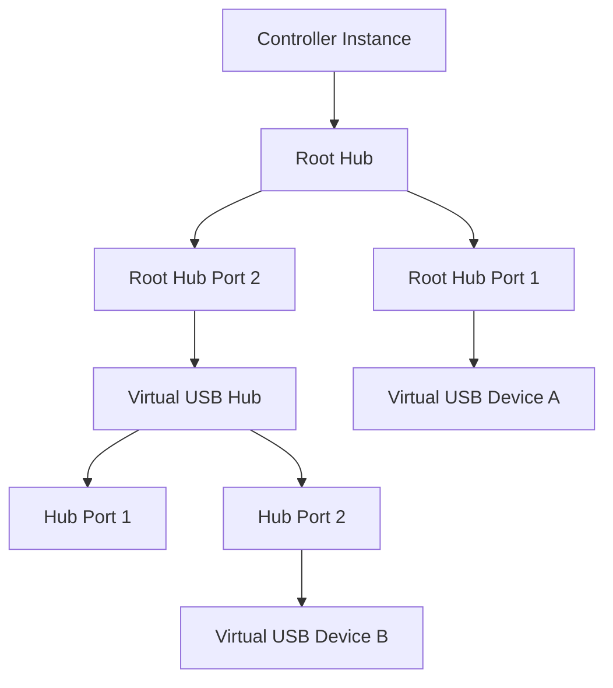

The topology domain records:

- which device is attached to which parent port
- which ports belong to which hub
- which backend instance represents each virtual device
- host-visible connection state
- topology changes caused by attachment and detachment

USB hubs are not special architectural participants. They are virtual USB
devices whose USB-defined behaviour includes Hub Class requests, an interrupt
endpoint, and downstream-port state.

The Linux USB stack remains responsible for normal hub discovery and
enumeration behaviour.

The detailed topology model and attachment interface are defined in subsequent
architecture and interface specifications.

## 4.9 Controller Userspace Interface

Each controller instance exposes a userspace-facing controller interface through
an associated device node such as:

```text
/dev/virtusbX
```

The device node is the entry point through which userspace accesses a specific
controller instance.

The controller interface provides logical access to:

- controller management
- Root Hub and topology management
- backend registration
- backend association
- virtual device attachment and detachment
- virtual device hardware state reporting and control
- host-visible connection-state changes
- USB transfers
- transfer completion and cancellation
- asynchronous bus, topology, hardware, and lifecycle events

The controller interface transports both administrative topology operations and
USB protocol traffic while preserving the separation between the corresponding
responsibility domains.

The controller interface is a logical architectural interface and shall not be
equated with a specific transport mechanism.

The concrete communication protocol and transport mechanisms are defined
separately. An implementation may use one or more mechanisms, including:

- `ioctl()` for control operations
- `read()` and `write()` for message exchange
- `mmap()` for shared-memory regions
- shared queues or ring buffers
- `poll()` or `epoll()` for event notification

The high-level architecture does not require all control, event, and transfer
traffic to use the same communication mechanism.

Low-frequency administrative operations, asynchronous state changes, and
high-volume USB transfer data may use different transport paths while remaining
part of the same logical controller interface.

## 4.10 Control Software

Control software manages the administrative state of virtual controllers and
their topology.

Typical responsibilities may include:

- selecting a controller
- selecting a parent port
- associating a backend with a virtual device
- attaching a virtual device to a parent port
- detaching a virtual device from its parent port
- requesting or propagating changes in virtual device hardware state
- querying controller, topology, port, and device state
- coordinating backend registration and lifecycle operations

Control software does not implement normal USB request processing.

Control software does not own device-specific USB behaviour.

Control software communicates with a controller through its controller
userspace interface.

Control software describes an architectural role and does not necessarily
require a separate process or executable.

The control role and backend role may be implemented within the same process,
provided that their architectural responsibilities remain separated.

## 4.11 Virtual USB Device Backend

A backend represents the virtual hardware of exactly one virtual USB device.

It does not implement a virtual Host Controller and does not own USB topology.

The backend is responsible for the device-specific behaviour and state of the
virtual device hardware that it represents.

Its responsibilities include, where applicable:

- virtual device hardware state
- device power and reset behaviour
- USB device controller availability
- USB descriptors
- USB Chapter 9 request handling
- endpoint behaviour
- class-specific request handling
- vendor-specific request handling
- device-specific protocol handling
- transfer processing
- reactions to USB bus and lifecycle events

Observable USB behaviour results from the interaction between the virtual device
hardware represented by the backend, the Virtual Host Controller and Topology
infrastructure provided by VirtUSB, and the Linux USB subsystem.

A backend may request or report state changes concerning only the virtual device
hardware that it represents.

A backend shall not directly:

- attach another device
- detach another device
- modify another backend instance
- modify another device's hardware state
- reassign topology objects
- control unrelated ports
- manage controller instances

The backend exchanges USB transfers, state changes, and lifecycle events through
the documented userspace interfaces.

The backend role may be implemented in the same userspace process as the control
role or in a separate component. The architecture shall not require a specific
process model.

## 4.12 Component Responsibilities

The principal responsibility allocation is summarized below.

| Responsibility | Primary Owner |
|---|---|
| Linux USB bus discovery and enumeration | Linux USB Core |
| Host Controller Driver integration | VirtUSB kernel module |
| controller instances | VirtUSB kernel module |
| Root Hub and USB topology | VirtUSB kernel module |
| parent hubs and parent ports | VirtUSB kernel module |
| topology attachment and detachment | VirtUSB control plane |
| host-visible connection state | VirtUSB kernel module |
| backend coordination | userspace control software |
| virtual device hardware | backend instance |
| device-specific USB behaviour | backend instance |
| USB transfer routing | VirtUSB kernel module |
| USB transfer processing | backend instance |
| USB device-driver binding | Linux USB Core |

Responsibilities may involve interactions between several components, but each
architectural state and runtime object shall have one explicitly defined owner.

## 4.13 Component Relationships

The Linux USB Core communicates with VirtUSB exclusively through the standard
Host Controller Driver integration.

Userspace communicates with a specific virtual controller through its logical
controller interface and the associated device node.

Control software uses the interface primarily for administrative, topology, and
lifecycle operations.

A backend uses the interface to:

- receive USB requests and bus events
- return transfer results and device responses
- report changes in its own virtual device hardware
- receive relevant topology and USB lifecycle notifications

The controller routes USB transfers and bus events between the Linux USB
subsystem and the backend associated with the addressed virtual USB device.

A backend instance represents virtual device hardware.

The virtual device hardware is attached to one parent port within the topology.

The topology exposes host-visible USB connection state.

The Linux USB Core performs USB discovery, enumeration, and driver binding.


Control operations, state notifications, and transfer-data exchange may use
different concrete transport mechanisms. This distinction shall remain
transparent to the higher-level component model.

The detailed communication channels, message formats, ownership transfers,
shared-memory layout, queueing model, synchronization mechanisms, topology
identifiers, and failure semantics are defined in subsequent architecture
documents.

## 4.14 Architectural Consequences

The decomposition defined by this chapter has the following consequences:

- software components and responsibility domains remain distinct concepts
- runtime objects have explicit owners and independent lifecycles
- a backend is software and is not identical to the virtual USB device it represents
- a backend instance represents exactly one virtual device hardware instance
- virtual device hardware state is independent of topology state
- topology attachment is independent of host-visible USB connection state
- USB connection state is independent of USB enumeration state
- USB hubs are modelled as normal virtual USB devices with downstream ports
- the topology is hierarchical rather than limited to Root Hub ports
- normal USB discovery and enumeration remain responsibilities of the Linux USB stack
- only USB-compatible behaviour is visible through USB protocol operation

These consequences shall be preserved by subsequent interface specifications,
protocol specifications, detailed designs, and implementations.

---

# 5. Kernel-Side Components

The VirtUSB kernel module provides the common infrastructure required to expose
one or more virtual USB Host Controllers to the Linux USB subsystem.

Its primary responsibility is to implement the **Virtual Host Controller and
Topology** responsibility domain.

The kernel module represents the virtual USB infrastructure visible to the
Linux USB subsystem and coordinates communication between the Linux USB Core
and userspace.

Device-specific virtual hardware and device-specific USB behaviour remain
outside the kernel module.

The kernel-side architecture is responsible for:

- Virtual Host Controller implementation
- USB topology management
- USB transfer routing
- kernel-userspace communication
- controller lifecycle management
- resource ownership and lifetime management
- synchronization and concurrency control
- failure detection and cleanup

The kernel-side architecture intentionally does **not** implement:

- virtual device hardware
- USB device descriptors
- USB Chapter 9 request handling
- endpoint-specific behaviour
- device-specific protocols
- application-specific logic

These responsibilities belong exclusively to the userspace backend.

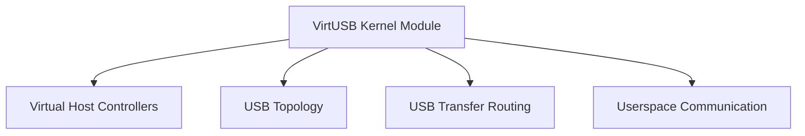

## 5.1 Host Controller

The Host Controller implements the Linux Host Controller Driver interface and
represents one virtual USB Host Controller within the Linux USB subsystem.

Each Host Controller instance operates independently.

A Host Controller owns:

- one Root Hub
- the topology rooted at that Root Hub
- controller-local resources
- controller-local communication state

A Host Controller does **not** own virtual device hardware.

Failures, state changes, or resource exhaustion affecting one controller
instance shall not directly affect other controller instances.

## 5.2 Root Hub

Each controller instance owns one virtual Root Hub.

The Root Hub represents the root of the USB topology managed by the controller.

It initially provides exactly 31 downstream ports.

Additional virtual USB hubs extend the topology by introducing further
downstream ports.

## 5.3 Topology Management

The kernel manages the complete virtual USB topology.

Responsibilities include:

- parent hub management
- parent port management
- device attachment
- device detachment
- host-visible connection state
- port enable and disable
- reset
- suspend and resume
- topology change notification

The kernel owns all topology-related runtime objects.

## 5.4 USB Request Routing

USB requests received from the Linux USB subsystem are routed to the backend
representing the addressed virtual device.

USB request routing belongs exclusively to the USB Protocol Operation
responsibility domain.

The kernel tracks each USB transfer from submission until completion or
cancellation.

Responses generated by the backend are returned through the corresponding Host
Controller instance.

Routing decisions shall remain independent of the representation of virtual
device hardware.

## 5.5 Userspace Communication

The kernel communicates with userspace through the documented controller
interface.

The controller interface transports:

- administrative topology operations
- hardware-state notifications
- USB protocol traffic
- transfer completion
- lifecycle events

The concrete communication mechanisms are defined separately.

The kernel detects backend disconnection or failure and performs the necessary
cleanup to maintain a consistent controller state.

## 5.6 Resource Management

The kernel owns and manages all kernel-side resources.

In particular, the kernel owns all topology-related runtime objects.

Ownership transfers between kernel and userspace shall follow the documented
ownership model.

Backends own no kernel-side runtime objects.

## 5.7 Concurrency

The kernel-side implementation shall support concurrent operation of multiple
controller instances.

Synchronization shall remain transparent to userspace.

Synchronization between responsibility domains shall be performed through
well-defined architectural interactions.

## 5.8 Responsibility Boundaries

The principal kernel-side responsibilities are summarized below.

| Responsibility | Primary Owner |
|---|---|
| Host Controller | VirtUSB kernel module |
| Root Hub | VirtUSB kernel module |
| USB topology | VirtUSB kernel module |
| Parent hubs and ports | VirtUSB kernel module |
| Connection state | VirtUSB kernel module |
| USB transfer routing | VirtUSB kernel module |
| Virtual device hardware | Backend |
| Device-specific USB behaviour | Backend |
| USB enumeration | Linux USB Core |

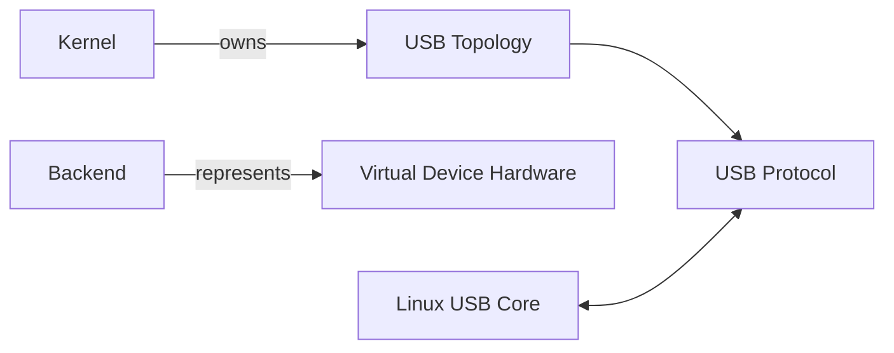

---

# 6. Controller and Topology Model

VirtUSB models one or more independent virtual USB Host Controllers.

Each controller instance:

- is exposed through one controller interface (e.g. `/dev/virtusbX`)
- owns exactly one virtual Root Hub
- owns one independent virtual USB topology
- operates independently of other controller instances

Each controller topology is rooted at one virtual Root Hub. The Root Hub is the
initial topology object rather than the complete topology.

Virtual device hardware is represented by backend instances and is not owned by
the controller.

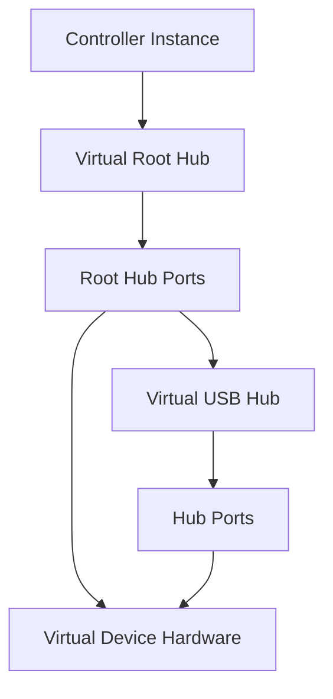

## 6.1 Controller Instance

A controller instance represents one independent virtual USB bus.

Each controller maintains its own:

- Root Hub
- topology
- userspace interface
- backend associations
- transfer state
- runtime resources

A controller owns all topology objects belonging to its USB bus.

Virtual device hardware is not owned by the controller.

Controller instances are isolated from one another. State changes, failures, or
resource exhaustion affecting one controller shall not directly affect other
controllers.

## 6.2 Root Hub

Each controller owns one virtual Root Hub.

The Root Hub represents the root of the USB topology visible to the Linux USB
subsystem.

It initially provides exactly 31 downstream ports.

Additional downstream ports are introduced only by virtual USB hubs that become
part of the topology.

The Root Hub does not implement device-specific behaviour.

## 6.3 Parent Ports

Each parent port represents one attachment point within the USB topology.

A parent port belongs to exactly one parent hub and may host at most one virtual
USB device.

Attachment of virtual device hardware to a parent port is independent of the
host-visible USB connection state.

USB connection state is independent of USB enumeration.

Typical topology and port state changes include:

- attachment
- detachment
- connection
- disconnection
- enable and disable
- reset
- suspend and resume
- change notification

A backend may be associated with a parent port before the represented virtual
device becomes visible to the Linux USB subsystem.

## 6.4 USB Topology

From the perspective of the Linux USB subsystem, each controller represents one
independent USB bus.

The topology consists of:

- one Host Controller
- one Root Hub
- zero or more virtual USB hubs
- parent hubs
- parent ports
- virtual device hardware instances

Every virtual USB device is attached to exactly one parent port.

Every parent port belongs to exactly one parent hub.

The Root Hub forms the root of the topology.

USB hubs are modelled as ordinary virtual USB devices that additionally provide
downstream ports.

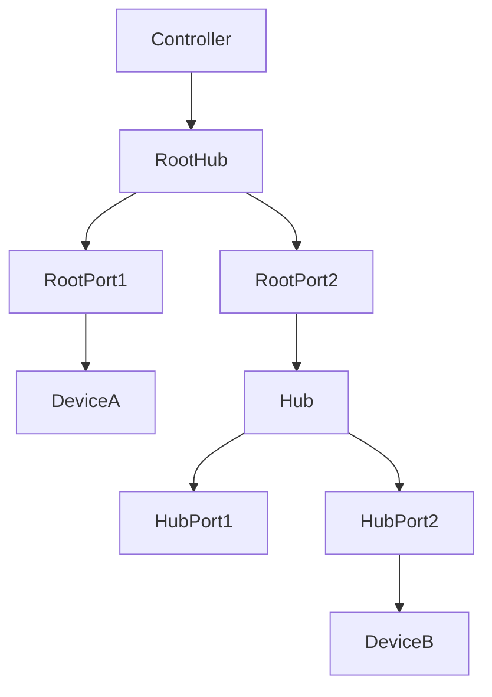

## 6.5 Topology Ownership

Topology ownership follows the architectural ownership model.

| Runtime Object | Primary Owner |
|---|---|
| Controller Instance | VirtUSB kernel module |
| Root Hub | VirtUSB kernel module |
| Virtual USB Hub | VirtUSB kernel module |
| Parent Port | VirtUSB kernel module |
| USB Topology | VirtUSB kernel module |
| Virtual Device Hardware | Backend |

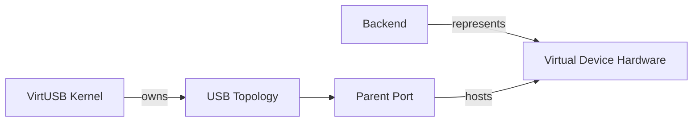

---

# 7. Virtual Device Model

The Virtual Device Model describes the lifecycle and behaviour of virtual device
hardware independently of USB topology and USB protocol operation.

A virtual device is represented by exactly one backend instance.

The backend represents the virtual device hardware but does not own USB
topology or Host Controller resources.

Observable USB behaviour results from the interaction between:

- the virtual device hardware
- the Virtual Host Controller and Topology
- the Linux USB subsystem

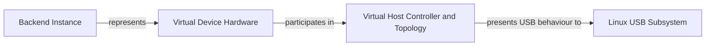

## 7.1 Virtual Device Hardware

Virtual device hardware exists independently of USB topology and USB protocol
operation.

Its lifecycle is independent of attachment, connection, and enumeration.

Typical hardware-related state includes:

- existence
- power state
- reset state
- firmware state
- USB controller availability

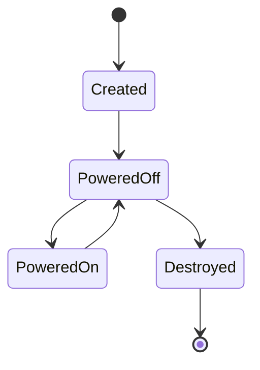

## 7.2 Backend Representation

Each backend instance represents exactly one virtual device hardware instance.

A backend owns the virtual device hardware that it represents.

A backend does not own:

- Host Controllers
- Root Hubs
- USB topology
- parent ports
- other backend instances

The backend interacts with VirtUSB exclusively through the documented
controller interface.

## 7.3 Device Association

Virtual device hardware may exist independently of any USB topology.

Association assigns one virtual device hardware instance to exactly one parent
port within the virtual USB topology.

Association does not imply USB connection or enumeration.

Each parent port may be associated with at most one virtual device hardware
instance.

Each virtual device hardware instance may be associated with at most one parent
port.

## 7.4 Device Attachment and Connection

Association, attachment, USB connection, and enumeration are distinct concepts.

The normal progression is:

```text
Association
    ↓
Attachment
    ↓
USB Connection
    ↓
Enumeration
```

Attachment makes the virtual device part of the USB topology.

USB connection makes the attached device visible to the Linux USB subsystem.

Enumeration is performed afterwards by the Linux USB subsystem.

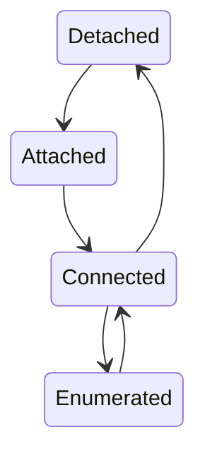

## 7.5 Host-Visible USB Device

A host-visible virtual USB device requires:

- existing virtual device hardware
- attachment to one parent port
- active USB connection

Enumeration is not part of the visibility decision but follows after the device
has become visible.

The relationship is summarized below.

| Hardware | Attached | Connected | Enumerated | Host Visible |
|---|---|---|---|---|
| Yes | No | No | No | No |
| Yes | Yes | No | No | No |
| Yes | Yes | Yes | No | Yes |
| Yes | Yes | Yes | Yes | Yes |

## 7.6 Device Hardware State

The virtual device hardware maintains its own internal state independently of
USB topology.

Typical state transitions include:

- creation
- destruction
- power on
- power off
- reset
- firmware restart

Changes in hardware state may trigger topology or USB protocol changes, but the
states remain architecturally independent.

## 7.7 Device Ownership

Ownership follows the architectural ownership model.

| Runtime Object | Primary Owner |
|---|---|
| Backend Instance | Userspace |
| Virtual Device Hardware | Backend |
| Parent Port | VirtUSB kernel module |
| USB Connection State | VirtUSB kernel module |
| USB Enumeration | Linux USB Core |


---

# 8. Backend Model

A backend is a userspace software component that represents exactly one virtual
device hardware instance.

The backend is not a virtual USB device, a Host Controller, or a topology
object. Instead, it provides the device-specific behaviour required to emulate
one virtual USB device through the VirtUSB architecture.

Observable USB behaviour results from the interaction between:

- the backend
- the virtual device hardware
- the Virtual Host Controller and Topology
- the Linux USB subsystem

```mermaid
flowchart LR
   Backend["Backend"]
   HW["Virtual Device Hardware"]
   Topology["Virtual Host Controller and Topology"]
   USB["USB Protocol Operation"]
   Linux["Linux USB Core"]

   Backend -->|"represents"| HW
   HW --> Topology
   Topology --> USB
   USB <--> Linux
```

## 8.1 Backend Overview

Each backend instance represents exactly one virtual device hardware instance.

A backend:

- owns the represented virtual device hardware
- implements device-specific behaviour
- processes USB requests directed to the represented device
- communicates exclusively through the documented controller interface

A backend does not own or manage Host Controllers, USB topology, or other
backend instances.

## 8.2 Backend Lifecycle

The backend lifecycle is independent of both the virtual device hardware
lifecycle and the USB protocol lifecycle.

```mermaid
stateDiagram-v2
   [*] --> Created
   Created --> Initialized
   Initialized --> Active
   Active --> Inactive
   Inactive --> Active
   Inactive --> Destroyed
   Destroyed --> [*]
```

A backend may therefore exist while:

- not associated with any controller
- associated but not attached
- attached but not connected
- connected and actively processing USB requests

## 8.3 Backend Responsibilities

The backend is responsible for all device-specific behaviour, including:

- virtual device hardware state
- power and reset behaviour
- USB descriptors
- USB Chapter 9 request handling
- endpoint implementation
- class-specific request handling
- vendor-specific request handling
- device-specific protocols
- transfer processing
- generation of transfer responses

The VirtUSB kernel module intentionally remains unaware of these
implementation details.

## 8.4 Backend Authority

A backend may control only the virtual device hardware that it represents.

A backend may:

- modify its own hardware state
- generate descriptors
- process USB requests
- maintain internal device state
- request topology or connection changes for its own device

A backend shall not directly:

- modify another backend
- modify another virtual device
- modify Host Controller instances
- modify USB topology
- reassign parent ports
- manipulate unrelated USB connections

Requests affecting topology or connection state shall be processed through the
VirtUSB control interfaces.

## 8.5 Backend State

A backend may maintain arbitrary internal state.

Examples include:

- configuration data
- caches
- protocol state
- application state
- hardware emulation state
- bridge state
- external resource handles

This internal state is backend-specific and outside the scope of the VirtUSB
architecture.

## 8.6 Backend Independence

The VirtUSB architecture intentionally does not define how a backend is
implemented.

Possible implementations include:

- software emulation
- protocol bridges
- hardware adapters
- virtual machines
- simulation environments
- test backends

As long as a backend complies with the documented controller interface, its
internal implementation remains outside the scope of this architecture.

The backend is intentionally unaware of the implementation details of the
Virtual Host Controller and Topology.

Likewise, the kernel module remains unaware of backend implementation details.

## 8.7 Backend Interaction Model

A backend never communicates directly with the Linux USB subsystem.

All communication occurs through the VirtUSB controller interface.

```mermaid
flowchart LR
   Linux["Linux USB Core"]
   VirtUSB["VirtUSB Kernel Module"]
   Backend["Backend"]

   Linux <--> VirtUSB <--> Backend
```

The backend exchanges:

- USB requests
- transfer responses
- hardware-state changes
- lifecycle notifications
- topology-related notifications

The interface defines the visible API surface between VirtUSB and the backend.
Its implementation is transport-independent.

## 8.8 Responsibility Summary

| Question | Primary Responsibility |
|---|---|
| Who owns virtual device hardware? | Backend |
| Who owns USB topology? | VirtUSB kernel module |
| Who performs USB enumeration? | Linux USB Core |
| Who processes USB requests? | Backend |
| Who routes USB requests? | VirtUSB kernel module |
| Who exposes Host Controllers? | VirtUSB kernel module |

---

# 9. Transfer Model

VirtUSB transports USB protocol transfers between the Linux USB subsystem and
the backend representing the addressed virtual device hardware.

Transfer routing is provided by the Virtual Host Controller and Topology
responsibility domain, while transfer processing remains the responsibility of
the backend.

Transfer handling belongs exclusively to the USB Protocol Operation
responsibility domain.

The architecture supports all USB transfer types defined by USB 2.0:

- Control
- Bulk
- Interrupt
- Isochronous

Transfer handling is independent of the concrete communication mechanism
between kernel and userspace.

```mermaid
flowchart LR
   Linux["Linux USB Core"]
   VirtUSB["VirtUSB Kernel Module"]
   Backend["Backend"]
   HW["Virtual Device Hardware"]

   Linux -->|"Submit URB"| VirtUSB
   VirtUSB -->|"Route request"| Backend
   Backend -->|"Process request"| HW
   Backend -->|"Return response"| VirtUSB
   VirtUSB -->|"Complete URB"| Linux
```

## 9.1 Transfer Overview

A USB transfer consists of:

- request submission
- transfer routing
- backend processing
- completion notification

The architectural model is identical for all USB transfer types.

## 9.2 Transfer Lifecycle

Each USB transfer progresses through a well-defined lifecycle:

1. submission by the Linux USB subsystem
2. routing by the VirtUSB kernel module
3. backend processing
4. transfer completion
5. completion notification to the Linux USB subsystem

Transfers may also be cancelled before completion.

Transfer lifecycle is independent of:

- device attachment
- device power state
- backend lifecycle

except where these events terminate the transfer.

```mermaid
stateDiagram-v2
   [*] --> Submitted
   Submitted --> Routed
   Routed --> Processing
   Processing --> Completed
   Submitted --> Cancelled
   Routed --> Cancelled
   Processing --> Cancelled
   Completed --> [*]
   Cancelled --> [*]
```

The detailed transfer state model is defined separately.

## 9.3 Transfer Ownership

A transfer is owned by exactly one component at any point in time.

Ownership is transferred explicitly between the Linux USB subsystem, the
VirtUSB kernel module, and the backend.

Ownership transfers shall occur only across documented architectural
interfaces.

The architecture intentionally avoids implicit shared ownership of transfer
objects.

## 9.4 Transfer Processing

The Linux USB subsystem schedules USB transfers.

The VirtUSB kernel module routes transfers between the Linux USB subsystem and
the appropriate backend.

The backend performs all device-specific USB request processing.

Each architectural component performs only the responsibilities assigned to it.

## 9.5 Transfer Independence

Each transfer is processed independently of other transfers unless ordering is
required by the USB specification.

Transfers belonging to different controller instances shall remain independent.

The architecture does not impose additional ordering constraints beyond those
required for correct USB operation.

## 9.6 Transfer Completion

Each submitted transfer shall eventually reach exactly one terminal state:

- completed successfully
- completed with an error
- cancelled

Completion shall be reported exactly once.

Once completed, a transfer shall not become active again.

## 9.7 Transfer Types

All supported USB transfer types follow the same architectural transfer model.

Differences between transfer types affect USB protocol semantics but do not
change the overall architectural transfer lifecycle.

Transfer-specific behaviour remains the responsibility of the backend where
required by the USB specification.

## 9.8 Architectural Consequences

The transfer architecture follows the principles established by VirtUSB:

- transfers are scheduled by the Linux USB subsystem
- transfers are routed by the VirtUSB kernel module
- transfers are processed by the backend
- transfer ownership is explicit
- transfer completion occurs exactly once
- transfer handling is independent of the underlying transport mechanism

```mermaid
sequenceDiagram
   participant Linux as Linux USB Core
   participant VirtUSB as VirtUSB Kernel Module
   participant Backend as Backend

   Linux->>VirtUSB: Submit URB
   VirtUSB->>Backend: USB Request
   Backend-->>VirtUSB: Transfer Result
   VirtUSB-->>Linux: URB Completion
```

---

# 10. Communication Model

The VirtUSB architecture defines the logical communication model between the
VirtUSB kernel module and userspace components.

Communication occurs exclusively through the controller interface associated
with one virtual Host Controller instance.

The communication model follows the architectural separation between:

- Virtual Device Hardware
- Virtual Host Controller and Topology
- USB Protocol Operation

The communication model is independent of the underlying transport mechanism.

## 10.1 Communication Principles

Communication between the kernel module and userspace shall follow the
architectural principles defined by this document.

In particular:

- communication is controller-local
- ownership transfers are explicit
- each message has exactly one owner at any point in time
- communication shall remain backend-independent
- transport mechanisms remain transparent to higher architectural layers
- communication crosses responsibility domains only through documented interfaces
- communication shall not expose implementation details

## 10.2 Communication Categories

The architecture distinguishes four logical communication categories:

- administrative operations
- hardware and topology events
- USB protocol requests
- USB protocol responses

```mermaid
flowchart TB
   Admin["Administrative Operations"]
   HW["Hardware & Topology Events"]
   Req["USB Protocol Requests"]
   Resp["USB Protocol Responses"]
```

These categories describe architectural intent rather than transport
mechanisms.

## 10.3 Administrative Communication

Administrative communication configures and controls the virtual USB
environment.

Typical operations include:

- controller management
- backend registration
- backend association
- backend removal
- topology management
- device attachment
- device detachment

Administrative communication is independent of USB protocol processing.

## 10.4 Hardware and Topology Events

Hardware and topology events communicate changes affecting virtual device
hardware or the virtual USB topology.

Typical events include:

- hardware power on
- hardware power off
- hardware reset
- device attachment
- device detachment
- USB connection established
- USB connection removed
- suspend
- resume
- Start-of-Frame (SOF)

These events are distinct from USB transfer requests.

## 10.5 USB Protocol Communication

USB protocol communication transports USB requests and responses.

USB transfer requests originate from the Linux USB subsystem.

The VirtUSB kernel module routes each request to the backend representing the
addressed virtual device hardware.

Each request results in exactly one protocol response.

```mermaid
sequenceDiagram
   participant Linux as Linux USB Core
   participant VirtUSB as VirtUSB Kernel Module
   participant Backend as Backend

   Linux->>VirtUSB: USB Request
   VirtUSB->>Backend: Route Request
   Backend-->>VirtUSB: USB Response
   VirtUSB-->>Linux: Completion
```

Transfer-specific behaviour remains the responsibility of the backend.

## 10.6 Communication Ownership

Communication objects have exactly one owner at any point in time.

Ownership transfers occur only across documented architectural interfaces.

The architecture intentionally avoids implicit shared ownership of messages,
events, and transfer objects.

## 10.7 Controller Scope

Communication is always associated with exactly one controller instance.

Administrative operations, topology events, hardware events, and USB protocol
traffic belonging to one controller shall not affect other controller
instances.

The architecture intentionally isolates communication between independent
virtual USB buses.

## 10.8 Ordering Guarantees

Communication shall preserve the ordering required for correct USB operation.

Ordering guarantees apply only where required by the USB specification or by
documented VirtUSB interfaces.

The architecture intentionally does not impose additional ordering constraints.

Ordering requirements specific to concrete transport mechanisms are defined
outside this high-level architecture.

## 10.9 Architectural Consequences

The communication architecture follows the fundamental VirtUSB principles:

- communication is controller-local
- communication is transport-independent
- ownership is explicit
- responsibility domains remain separated
- backend implementations remain independent
- protocol traffic is separated from administrative communication

```mermaid
flowchart LR
   HW["Virtual Device Hardware"]
   TOPO["Virtual Host Controller and Topology"]
   USB["USB Protocol Operation"]

   HW --> TOPO
   TOPO --> USB
   TOPO -.administrative.-> HW
   USB -.protocol.-> HW
```

---
# 11. Runtime Model

The Runtime Model describes the lifetime, ownership, relationships, and
interaction of the runtime objects that collectively form a VirtUSB system.

Runtime objects are independent of software components and responsibility
domains. Software components create, own, or represent runtime objects, but are
not identical to them.

The runtime architecture intentionally separates the lifecycles of controllers,
topology objects, virtual device hardware, backend instances, and USB transfers.

## 11.1 Runtime Principles

The runtime model follows these principles:

- runtime objects have explicit ownership
- runtime objects have independent lifecycles
- ownership, representation, and association are distinct concepts
- runtime relationships are explicit
- runtime behaviour shall remain consistent with the architectural principles

## 11.2 Runtime Objects

| Runtime Object | Created by | Primary Owner |
|---|---|---|
| Controller Instance | VirtUSB | VirtUSB |
| Root Hub | VirtUSB | VirtUSB |
| Parent Port | VirtUSB | VirtUSB |
| Backend Instance | Userspace | Userspace |
| Virtual Device Hardware | Backend | Backend |
| USB Transfer | Linux/VirtUSB | Current Owner |

```mermaid
flowchart TB
 Controller --> RootHub --> ParentPort
 Backend --> DeviceHW
 DeviceHW --> Transfer
```

## 11.3 Controller Runtime

A controller instance represents one independent virtual USB bus.

It owns:

- one Root Hub
- the complete USB topology
- controller-local resources
- controller interface state

Controller instances are independent runtime objects.

## 11.4 Topology Runtime

The topology exists for the lifetime of its controller.

Topology objects include:

- Root Hub
- virtual USB hubs
- parent ports
- attachment relationships

Topology objects remain independent of backend lifecycles.

```mermaid
flowchart TB
 Controller-->RootHub
 RootHub-->Port
 Port-->Hub
 Hub-->HubPort
 HubPort-->Device
```


## 11.5 Virtual Device Hardware Runtime

Virtual device hardware exists independently of USB attachment, USB connection,
and enumeration.

Typical lifecycle states include:

- created
- powered off
- powered on
- reset
- destroyed

The backend represents exactly one virtual device hardware instance.

## 11.6 Backend Runtime

Backend instances are userspace runtime objects.

A backend may exist:

- without association
- associated with a parent port
- attached
- connected
- operational

Backend lifetime is independent of controller lifetime except where explicitly
terminated.

## 11.7 USB Transfer Runtime

Transfers exist only while active.

Each transfer progresses through:

- submission
- routing
- processing
- completion or cancellation

Completed transfers leave the active runtime state.

```mermaid
stateDiagram-v2
 [*] --> Submitted
 Submitted --> Routed
 Routed --> Processing
 Processing --> Completed
 Submitted --> Cancelled
 Routed --> Cancelled
 Processing --> Cancelled
 Completed --> [*]
 Cancelled --> [*]
```


## 11.8 Runtime Relationships

Runtime relationships include:

| Relationship | Example |
|---|---|
| Ownership | Backend owns Virtual Device Hardware |
| Representation | Backend represents Virtual Device Hardware |
| Containment | Root Hub contains Parent Ports |
| Association | Virtual Device Hardware associated with Parent Port |
| Communication | Linux USB Core ↔ VirtUSB ↔ Backend |

```mermaid
flowchart LR
 Backend--represents-->HW
 HW--associated with-->Port
 Port-->Hub
 Hub-->Controller
 Controller<-->Linux
```

## 11.9 Typical Runtime Sequence

Typical runtime sequence:

1. Controller created
2. Root Hub created
3. Backend created
4. Virtual Device Hardware created
5. Association
6. Attachment
7. USB connection
8. USB enumeration
9. Normal USB operation
10. USB transfers
11. Disconnect
12. Detach
13. Backend shutdown
14. Controller removal

```mermaid
sequenceDiagram
 participant B as Backend
 participant V as VirtUSB
 participant L as Linux USB Core

 B->>V: Create / Associate
 V->>L: Connection
 L->>V: Enumerate
 L->>V: USB Requests
 V->>B: Route Requests
 B-->>V: Responses
 V-->>L: Completion
```

## 11.10 Architectural Consequences

The runtime architecture establishes that:

- runtime objects have independent lifecycles
- ownership is explicit
- representation is distinct from ownership
- topology is independent of backend implementation
- virtual device hardware is independent of USB visibility
- communication follows documented interfaces
- transfers are transient runtime objects
- software components, responsibility domains, and runtime objects remain separate architectural views.

---

# 12. Concurrency Model

The VirtUSB architecture supports concurrent execution of multiple controller
instances, backend instances, runtime objects, and USB transfers.

Concurrency affects execution only. It shall not change the architectural
relationships between software components, responsibility domains, or runtime
objects.

Correct concurrent execution shall preserve the architectural behaviour defined
by this specification.

## 12.1 Concurrency Principles

The runtime architecture is based on the following principles:

- runtime objects have independent lifecycles
- controller instances are isolated
- ownership remains explicit
- ordering is preserved where required
- synchronization mechanisms are implementation-specific

Concurrency shall never violate the documented ownership or lifecycle rules.

## 12.2 Runtime Object Concurrency

Multiple runtime objects may exist and execute concurrently.

Examples include:

- controller instances
- USB topologies
- backend instances
- virtual device hardware instances
- USB transfers

```mermaid
flowchart LR
   C1["Controller 1"]
   C2["Controller 2"]
   B1["Backend 1"]
   B2["Backend 2"]
   T1["Transfer A"]
   T2["Transfer B"]
```

The architecture defines behavioural guarantees rather than scheduling
requirements.

## 12.3 Controller Isolation

Each controller instance operates independently.

Controller instances own independent:

- USB topologies
- runtime objects
- communication state
- transfer queues
- controller resources

State changes, failures, or heavy workload affecting one controller instance
shall not directly affect another controller instance.

## 12.4 Backend Isolation

Backend instances operate independently.

A backend shall not directly:

- modify another backend
- modify another virtual device hardware instance
- manipulate another controller
- modify unrelated topology objects

Interaction between backends occurs only through documented architectural
interfaces where explicitly supported.

## 12.5 Transfer Concurrency

Multiple USB transfers may be active simultaneously.

Transfers belonging to different controllers, devices, or endpoints may execute
concurrently where permitted by the USB specification.

Ordering constraints required by endpoint semantics remain defined by the USB
specification rather than by VirtUSB.

## 12.6 Synchronization Principles

The architecture specifies required observable behaviour but intentionally does
not prescribe synchronization mechanisms.

Implementations shall ensure:

- consistent object ownership
- consistent object lifetime
- consistent topology state
- correct transfer processing
- correct communication ordering

Synchronization primitives such as mutexes, lock-free algorithms, event loops,
or message passing remain implementation details.

## 12.7 Ownership Under Concurrency

Concurrent execution shall never violate the architectural ownership model.

At any point in time:

- every runtime object has exactly one owner
- ownership transfers are explicit
- ownership changes shall not become observable in an intermediate state

Implicit shared ownership is intentionally avoided.

## 12.8 Ordering Guarantees

Ordering shall be preserved where required by:

- the USB specification
- documented VirtUSB interfaces

Independent controller instances may execute without additional architectural
ordering constraints.

Administrative operations and USB protocol traffic may have different ordering
requirements.

## 12.9 Execution Model Independence

VirtUSB intentionally remains independent of the userspace execution model.

Backends may be implemented using:

- single-threaded event loops
- worker-thread pools
- asynchronous execution
- multiple cooperating processes
- mixed execution models

Likewise, the architecture does not require a specific kernel-side execution
model beyond the guarantees provided by the Linux kernel and the Host Controller
Driver interface.

The same backend implementation may be executed using different execution
models without affecting the architectural behaviour.

## 12.10 Architectural Consequences

The concurrency architecture establishes that:

- controller instances remain isolated
- runtime objects have independent lifecycles
- backend implementations remain independent
- ownership is explicit and preserved
- synchronization mechanisms are implementation-specific
- communication remains controller-local
- concurrency shall not alter the architectural behaviour

```mermaid
flowchart LR
   Kernel["VirtUSB Kernel"]
   Controller["Controller"]
   Topology["Topology"]
   Backend["Backend"]
   Hardware["Virtual Device Hardware"]

   Kernel --> Controller
   Controller --> Topology
   Backend --> Hardware

   Controller -.independent.-> Controller
   Backend -.independent.-> Backend
```

---

# 13. Failure and Recovery Model

The VirtUSB architecture defines the observable behaviour following failures.

Failure handling shall preserve:

- architectural consistency
- explicit ownership
- runtime object integrity
- controller isolation

The architecture specifies behavioural guarantees rather than implementation-
specific detection or recovery algorithms.

## 13.1 Failure Principles

Failures shall be detected, contained, and recovered while preserving the
architectural relationships defined by this specification.

Failure handling shall not violate:

- ownership rules
- responsibility-domain boundaries
- runtime object integrity
- controller isolation

## 13.2 Failure Scope

Failures are intentionally isolated to the smallest practical architectural
scope.

| Failure | Typical Scope |
|---|---|
| Backend failure | One backend instance |
| Controller failure | One controller instance |
| Communication failure | One controller interface |
| Transfer failure | One transfer |
| Virtual device hardware failure | One virtual device |

```mermaid
flowchart LR
   Backend --> Hardware
   Hardware --> Transfer
   Controller -.isolated.-> Controller
```

## 13.3 Runtime Object Failures

Runtime objects may terminate independently.

Typical runtime object failures include:

- backend termination
- controller removal
- virtual device hardware removal
- communication endpoint failure
- transfer cancellation

Failure of one runtime object shall not leave unrelated runtime objects in an
inconsistent state.

## 13.4 Backend Failure

If a backend becomes unavailable while associated with a controller, the
controller shall restore a consistent runtime state.

Typical recovery actions include:

- terminating pending communication
- cancelling active transfers
- disconnecting the affected virtual USB device
- releasing backend-owned resources
- removing backend associations

Loss of a backend shall not invalidate unrelated topology objects.

Topology ownership remains within the VirtUSB kernel module.

Automatic backend restart is outside the scope of this architecture.

## 13.5 Communication Failure

If communication through the controller interface is interrupted, the affected
controller shall perform the necessary cleanup.

Communication failures shall not leave partially owned resources or inconsistent
runtime state.

Detection and recovery mechanisms remain implementation-specific.

## 13.6 Transfer Recovery

Transfers affected by failures shall eventually reach exactly one terminal
state.

Possible terminal states include:

- successful completion
- completion with an error
- cancellation

No transfer shall remain permanently active because of a backend or
communication failure.

## 13.7 Resource Cleanup

Cleanup follows the architectural ownership model.

Each owner is responsible for releasing the runtime objects that it owns.

Cleanup may include:

- runtime objects
- pending transfers
- backend associations
- communication resources
- controller resources

Cleanup shall not transfer ownership implicitly.

## 13.8 Recovery Behaviour

Following successful cleanup, the affected controller may continue normal
operation where practical.

Typical recovery scenarios include:

- attaching a replacement backend
- creating replacement runtime objects
- reconnecting a virtual USB device
- creating new USB transfers
- continuing operation of unaffected controllers

Recovery shall preserve the architectural ownership model and the separation
between responsibility domains.

```mermaid
sequenceDiagram
   participant Backend
   participant VirtUSB
   participant Linux

   Backend--xVirtUSB: Failure
   VirtUSB->>VirtUSB: Cleanup
   VirtUSB-->>Linux: Complete / Cancel Transfers
   Backend->>VirtUSB: Replacement Backend
```

## 13.9 Architectural Consequences

The failure model establishes that:

- failures remain locally contained where practical
- runtime object integrity is preserved
- ownership remains explicit
- unrelated controller instances remain unaffected
- transfers always reach a terminal state
- recovery preserves the architectural relationships defined by VirtUSB

---

# 14. Extensibility

The VirtUSB architecture is designed to evolve while preserving its fundamental
architectural principles.

Architectural evolution shall preserve:

- software component boundaries
- responsibility-domain boundaries
- runtime object relationships
- explicit ownership
- behavioural guarantees

New functionality shall extend the architecture rather than modify unrelated
architectural concepts.

## 14.1 Extensibility Principles

VirtUSB defines architectural extension points that allow future evolution
without requiring fundamental redesign.

Architectural extensions shall:

- preserve documented interfaces
- preserve ownership rules
- preserve runtime object integrity
- preserve controller isolation
- remain consistent with the architectural principles defined by this document

## 14.2 Software Component Extensibility

The architecture permits new software components provided they integrate through
documented interfaces.

Examples include:

- backend libraries
- software emulation backends
- hardware adapters
- protocol bridges
- diagnostic tools
- recording and replay components
- testing frameworks

Introducing new software components shall not require modifications to the core
architecture.

```mermaid
flowchart TB
   Core["VirtUSB Core"]
   Backend["Backends"]
   Library["Support Libraries"]
   Tools["Diagnostic Tools"]
   Replay["Replay / Recording"]

   Core --> Backend
   Core --> Library
   Core --> Tools
   Core --> Replay
```

## 14.3 Responsibility Domain Extensibility

The responsibility domains are intentionally extensible.

Future architectural evolution may introduce:

- additional virtual hardware capabilities
- extended topology functionality
- support for future USB protocol features

Extensions shall not violate the separation between:

- Virtual Device Hardware
- Virtual Host Controller and Topology
- USB Protocol Operation

## 14.4 Runtime Object Extensibility

The runtime model permits introduction of additional runtime objects where
required.

Examples include:

- USB hub transaction translators
- USB streams
- future USB4 routing objects
- diagnostic runtime objects

New runtime objects shall define:

- ownership
- lifecycle
- relationships
- architectural responsibilities

Existing runtime objects shall not require fundamental redesign.

## 14.5 Communication Extensibility

The logical controller interface is independent of the underlying communication
mechanism.

Future implementations may introduce:

- shared-memory transports
- zero-copy mechanisms
- io_uring-based communication
- optimized message queues
- alternative transport implementations

Such extensions shall preserve the same architectural communication model.

## 14.6 Functional Extensibility

The architecture supports future functional evolution.

Examples include:

- userspace support libraries
- monitoring components
- logging infrastructure
- tracing facilities
- recording and replay
- management utilities
- virtual USB hubs
- future USB standards

Functional extensions shall integrate through documented architectural
interfaces.

## 14.7 Compatibility

Future architectural evolution should preserve compatibility wherever
reasonably practical.

Compatibility should be maintained across all three architectural views:

- Software Components
- Responsibility Domains
- Runtime Objects

Architectural changes affecting public interfaces or fundamental behaviour
shall be documented through Architecture Decision Records (ADRs) and reflected
in the architecture documentation.

## 14.8 Architectural Consequences

The extensibility model establishes that:

- architectural extension points are explicit
- software components may evolve independently
- responsibility domains remain stable
- runtime object relationships remain consistent
- communication mechanisms remain replaceable
- ownership and behavioural guarantees are preserved

```mermaid
flowchart LR
   Architecture["Architecture"]
   Components["Software Components"]
   Domains["Responsibility Domains"]
   Runtime["Runtime Objects"]
   Communication["Communication"]

   Architecture --> Components
   Architecture --> Domains
   Architecture --> Runtime
   Architecture --> Communication
```

---

# 15. Architectural Constraints

The following architectural constraints define the fundamental properties of
VirtUSB.

These constraints are architectural invariants. They shall remain true for every
conforming implementation, independent of implementation details.

Changes to these constraints constitute architectural changes rather than
implementation changes.

## 15.1 Architectural Invariants

The VirtUSB architecture is founded on the following invariants:

- software component boundaries remain explicit
- responsibility domains remain separated
- runtime object relationships remain consistent
- ownership remains explicit
- behavioural guarantees remain preserved

Architectural extensions shall evolve the architecture without violating these
invariants.

```mermaid
flowchart LR
   Components["Software Components"]
   Domains["Responsibility Domains"]
   Runtime["Runtime Objects"]
   Ownership["Ownership"]
   Behaviour["Behaviour"]

   Components --> Domains
   Domains --> Runtime
   Runtime --> Ownership
   Ownership --> Behaviour
```

## 15.2 Platform Constraints

VirtUSB is designed exclusively for Linux.

The architecture assumes:

- Linux kernel integration
- Host Controller Driver (HCD) infrastructure
- out-of-tree kernel module implementation
- DKMS-compatible distribution

Platform-specific implementation details shall not alter the architectural
behaviour defined by this specification.

Supporting additional operating systems requires architectural evaluation and
may require changes beyond the scope of this architecture.

## 15.3 Controller Architecture Constraints

Each controller instance shall provide:

- one virtual Host Controller
- one virtual Root Hub
- one controller interface

The Root Hub shall initially provide exactly 31 downstream ports.

Controller instances shall operate independently.

The architecture intentionally does not support multiple Root Hubs within a
single controller instance.

## 15.4 Responsibility Domain Constraints

The architectural separation of responsibility domains shall be preserved.

In particular:

- Virtual Device Hardware shall remain independent of USB topology
- USB Protocol Operation shall remain independent of hardware implementation
- the kernel module shall not implement device-specific USB behaviour
- the backend shall implement all device-specific USB behaviour
- communication shall occur exclusively through the documented controller
  interface
- controller management shall remain independent of backend implementation

Responsibility domains shall not be merged or bypassed by architectural
extensions.

## 15.5 Runtime Model Constraints

Runtime objects shall:

- have explicit ownership
- have independent lifecycles
- define explicit relationships
- preserve architectural consistency

Creation, destruction, ownership, and relationships shall remain well defined
throughout runtime.

## 15.6 Backend Neutrality

The architecture shall remain independent of any particular backend
implementation.

No architectural component shall require:

- a specific USB device stack
- a specific programming language
- a specific userspace framework
- a specific execution model

Backend-specific implementation details shall not become observable through the
architectural interfaces.

Backend-specific functionality shall not become part of the common kernel
architecture.

## 15.7 Ownership Constraints

The explicit ownership model defined by this architecture shall be preserved.

At any point in time:

- each runtime object has exactly one owner
- ownership transfers are explicit
- ownership defines cleanup responsibility

Ownership shall never depend on execution order or implementation-specific
synchronization mechanisms.

Implicit shared ownership is intentionally prohibited.

## 15.8 Architectural Integrity

Future architectural evolution shall preserve consistency across all
architectural views:

- Software Components
- Responsibility Domains
- Runtime Objects

Architectural changes affecting public interfaces, ownership rules, behavioural
guarantees, or fundamental architectural relationships shall be documented by
Architecture Decision Records (ADRs) and reflected in the architecture
documentation.

Violation of an architectural invariant requires revision of the architecture
rather than implementation-specific justification.

## 15.9 Architectural Consequences

The architectural constraints establish that:

- architectural invariants remain stable
- software component boundaries remain explicit
- responsibility domains remain separated
- runtime object integrity is preserved
- ownership remains explicit
- behavioural guarantees remain unchanged by implementation choices

```mermaid
flowchart TB
   Platform["Platform"]
   Controller["Controller Architecture"]
   Domains["Responsibility Domains"]
   Runtime["Runtime Model"]
   Backend["Backend Neutrality"]
   Ownership["Ownership"]
   Integrity["Architectural Integrity"]

   Platform --> Controller
   Controller --> Domains
   Domains --> Runtime
   Runtime --> Backend
   Backend --> Ownership
   Ownership --> Integrity
```

---

# 16. Architectural Evolution

The VirtUSB architecture is intended to evolve in a controlled and
well-documented manner.

This document defines the current normative high-level architecture of VirtUSB.
Future architectural evolution is expected and shall preserve the fundamental
architectural principles established by this specification.

Architectural evolution shall preserve:

- architectural consistency
- documented interfaces
- responsibility boundaries
- runtime object relationships
- behavioural guarantees

Architectural evolution shall occur through documented architectural decisions
rather than undocumented implementation changes.

## 16.1 Evolution Principles

Future architectural evolution shall:

- preserve software component boundaries
- preserve responsibility-domain separation
- preserve runtime object integrity
- preserve explicit ownership
- maintain compatibility where reasonably practical

Architectural evolution shall extend the architecture rather than introduce
unrelated concepts or violate existing architectural constraints.

## 16.2 Architecture Decision Records

Architectural decisions shall be documented using Architecture Decision Records
(ADRs).

Each ADR documents:

- the architectural problem
- the considered alternatives
- the selected solution
- the rationale behind the decision
- the architectural consequences

An ADR may:

- introduce a new architectural concept
- modify an existing architectural concept
- supersede a previous architectural decision
- deprecate an existing architectural approach

ADRs document the decision-making process. They complement, but do not replace,
the normative architecture defined by this document.

```mermaid
flowchart LR
   ADR["Architecture Decision Record"]
   HLA["High-Level Architecture"]
   Impl["Implementation"]

   ADR --> HLA
   HLA --> Impl
```

## 16.3 Evolution of Architectural Views

Architectural evolution shall preserve consistency across all architectural
views:

- Software Components
- Responsibility Domains
- Runtime Objects

Changes affecting one architectural view shall be evaluated for their impact on
the remaining architectural views.

The architectural views together describe one consistent architecture rather
than independent models.

```mermaid
flowchart TB
   Components["Software Components"]
   Domains["Responsibility Domains"]
   Runtime["Runtime Objects"]

   Components --> Architecture["VirtUSB Architecture"]
   Domains --> Architecture
   Runtime --> Architecture
```

## 16.4 Future Architectural Work

Future architectural work may include, for example:

- backend communication mechanisms
- userspace communication protocol
- transfer queue architecture
- detailed memory ownership transitions
- synchronization strategies
- security architecture
- userspace support libraries
- virtual USB hub implementation
- support for future USB standards

Additional architectural topics may be introduced as project requirements
evolve.

## 16.5 Relationship to this Document

This document represents the normative high-level architecture of VirtUSB.

Accepted architectural decisions shall be reflected in this document to ensure
that it remains an accurate description of the current architecture.

Whenever an ADR introduces, modifies, supersedes, or deprecates an
architectural decision, the corresponding sections of this document shall be
updated accordingly.

This document therefore describes what the architecture currently is.

ADRs explain how and why the architecture evolved.

## 16.6 Architectural Consequences

The architectural evolution model establishes that:

- the High-Level Architecture is the normative architectural specification
- ADRs document architectural decisions and their rationale
- implementation follows the documented architecture
- architectural evolution remains controlled and traceable
- consistency across all architectural views is preserved
- architectural principles and behavioural guarantees remain stable
