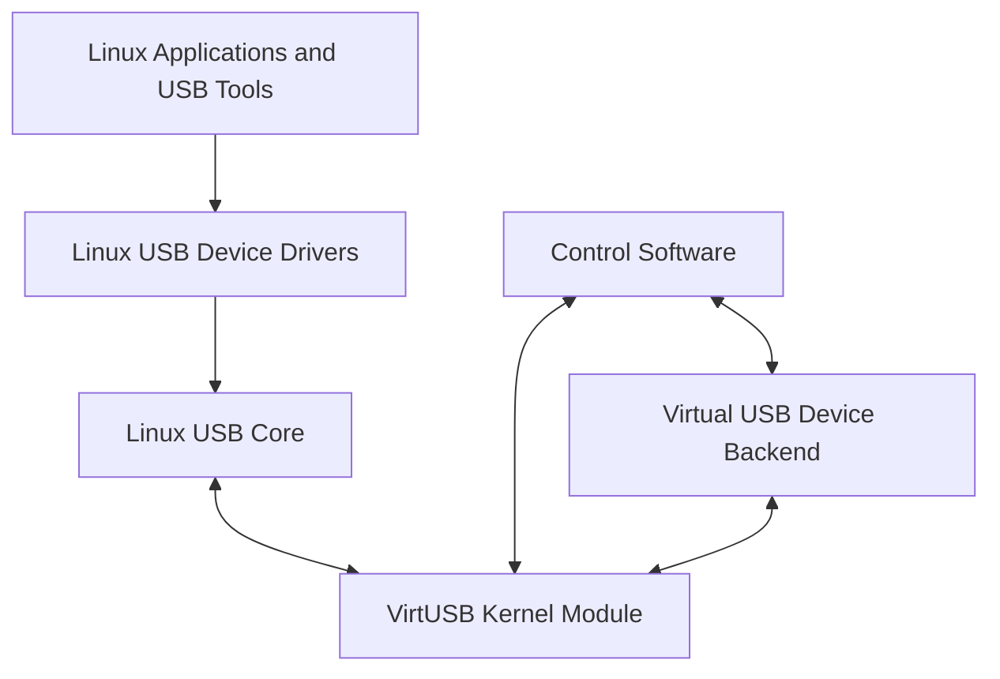
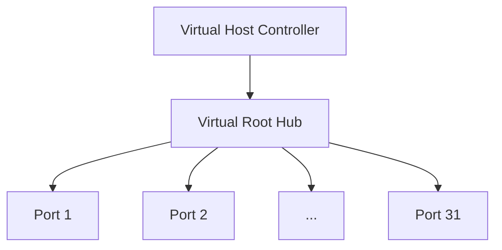
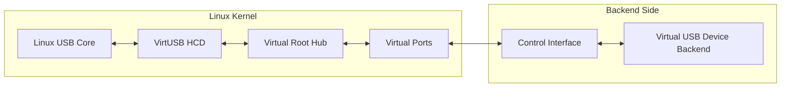
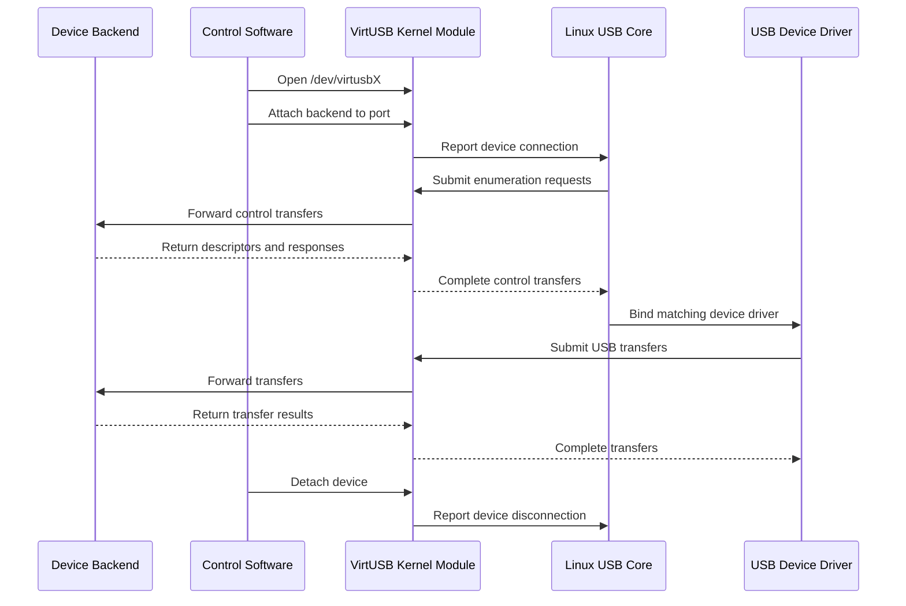
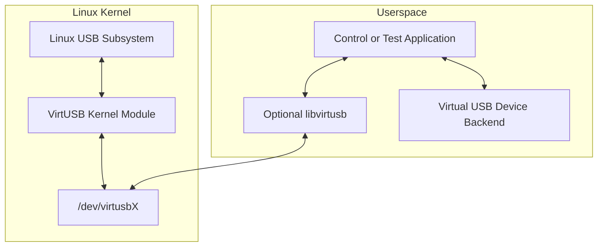

# VirtUSB System Overview

## 1. Purpose

This document provides a high-level overview of VirtUSB.

It describes the system context, the principal components, their responsibilities,
and the boundaries between VirtUSB and virtual USB device backends.

Detailed architectural decisions are documented separately in the high-level
architecture documentation and in Architecture Decision Records (ADRs).

---

## 2. System Objective

VirtUSB is a virtual USB Host Controller for Linux.

Its purpose is to enable the development, integration, and testing of USB devices
without requiring physical USB device hardware.

Virtual devices connected through VirtUSB are represented through the standard
Linux USB subsystem and are intended to behave like devices attached to a physical
USB Host Controller.

---

## 3. System Context

VirtUSB connects virtual USB device backends to the standard Linux USB stack.

The Linux USB subsystem interacts with VirtUSB as a Host Controller Driver. A
control interface allows software outside the kernel module to create, attach,
control, and detach virtual USB devices.

The exact communication model between the kernel module, control software, and
backends is not defined by this document.

---

## 4. Principal Components

### 4.1 VirtUSB Kernel Module

The VirtUSB kernel module implements one or more virtual USB Host Controller
instances.

Its principal responsibilities are:

- integration with the Linux USB subsystem
- creation and management of virtual Host Controller instances
- creation and management of virtual Root Hubs and their ports
- presentation of attached virtual USB devices to the Linux USB stack
- forwarding USB transfers between the Linux USB subsystem and the corresponding
  backend
- reporting connection, disconnection, status, and transfer events
- providing a control interface for each controller instance

The kernel module does not implement device-specific USB behaviour.

### 4.2 Virtual Host Controller

A controller is one independent virtual USB Host Controller instance.

Each controller:

- is represented by one character device using the naming scheme
  `/dev/virtusbX`
- provides exactly one virtual Root Hub
- provides 31 downstream Root Hub ports
- operates independently from other controller instances

The number of controller instances is configured when the kernel module is loaded.

### 4.3 Virtual Root Hub

Each virtual Host Controller provides exactly one virtual Root Hub.

The Root Hub represents the connection point between the Linux USB subsystem and
virtual USB devices. It reports port status and port-status changes through the
standard Linux USB Host Controller mechanisms.

Each Root Hub always exposes **31 downstream ports**. Each port operates
independently and may have zero or one attached virtual USB device.

### 4.4 Virtual USB Device Backend

A backend implements the behaviour of a virtual USB device.

Its responsibilities include, as applicable:

- providing USB descriptors
- implementing Chapter 9 request handling
- maintaining device-specific state
- implementing endpoint behaviour
- processing Control, Bulk, Interrupt, and Isochronous transfers
- producing device-specific data and responses

VirtUSB shall not require or prefer a particular backend implementation.

A backend may be implemented by a userspace process, a library, a test framework,
or another software component, provided that it uses the defined VirtUSB interface.

### 4.5 Control Software

Control software manages virtual controllers and virtual devices through the
VirtUSB control interface.

Its responsibilities may include:

- opening a controller character device
- attaching a backend to a Root Hub port
- detaching a virtual device
- exchanging transfer data and events with the kernel module
- monitoring controller, port, and device state

The future `libvirtusb` library may provide a stable userspace abstraction for
this interface. The library is not required for the initial kernel implementation.

---

## 5. System Boundary

VirtUSB is responsible for virtual Host Controller behaviour and integration with
the Linux USB subsystem.

The backend is responsible for USB device behaviour.

### 5.1 VirtUSB Responsibilities

VirtUSB is responsible for:

- representing virtual Host Controllers to Linux
- representing Root Hubs and ports
- accepting USB requests from the Linux USB core
- forwarding transfers to the corresponding backend
- returning backend responses to the Linux USB core
- managing controller, port, and attachment state
- reporting USB connection and disconnection events
- supporting all required USB transfer types

### 5.2 Backend Responsibilities

A backend is responsible for:

- defining the identity and capabilities of the virtual USB device
- supplying descriptors
- handling device requests
- implementing endpoint semantics
- maintaining device-specific protocol and application state
- generating transfer results and device data

### 5.3 Explicit Boundary

VirtUSB provides the transport and Host Controller infrastructure required for a
backend to implement a USB device compliant with the USB 2.0 Device Framework.

VirtUSB itself does not implement device-specific Chapter 9 behaviour such as
returning device descriptors or defining device configurations.

---

## 6. Typical Operational Flow

A typical virtual device session follows this sequence:

1. The VirtUSB kernel module is loaded with the requested number of controller
   instances.
2. Linux registers each VirtUSB controller and its virtual Root Hub.
3. Control software opens `/dev/virtusbX`.
4. A backend is assigned to an available Root Hub port.
5. VirtUSB reports a device connection on that port.
6. The Linux USB subsystem begins device enumeration.
7. Control transfers are forwarded to the backend.
8. The backend returns descriptors and other device responses.
9. Linux selects and loads an appropriate USB device driver.
10. Further Control, Bulk, Interrupt, or Isochronous transfers are exchanged.
11. The backend is detached or terminated.
12. VirtUSB reports device disconnection to the Linux USB subsystem.

---

## 7. Transfer Model

VirtUSB shall support the standard USB transfer types:

- Control
- Bulk
- Interrupt
- Isochronous

The system must preserve the semantic properties required by the Linux USB
subsystem and the virtual device backend. Detailed queueing, scheduling,
cancellation, timeout, and completion behaviour is defined by the architecture
and interface specifications.

---

## 8. Timing Model

VirtUSB does not provide hard real-time guarantees.

In particular, the following timing is not guaranteed with hard real-time
precision:

- USB Start-of-Frame generation and frame timing
- Isochronous transfer scheduling and completion

Virtual USB timing depends on the Linux scheduler, kernel execution latency, and
the selected backend implementation.

VirtUSB may model USB frame and microframe progression, but it cannot guarantee
exact 1 ms frame periods or 125 us high-speed microframe periods under all system
conditions.

---

## 9. Deployment View

The initial VirtUSB deployment consists of an out-of-tree Linux kernel module and
one or more external backend applications or libraries.

The kernel module shall be installable and removable through DKMS.

---

## 10. Interfaces

VirtUSB has the following principal interfaces:

| Interface | Purpose |
| --- | --- |
| Linux HCD interface | Integrates VirtUSB with the Linux USB subsystem |
| Root Hub interface | Reports virtual port status and status changes |
| `/dev/virtusbX` | Controls one virtual Host Controller instance |
| Backend protocol | Exchanges device state, transfers, and events |
| Optional `libvirtusb` API | Provides a stable userspace abstraction |

The concrete userspace protocol and API are outside the scope of this overview.

---

## 11. Project Scope

The VirtUSB project includes:

- the VirtUSB Linux kernel module
- public kernel/userspace interface definitions
- tools required to build, install, load, unload, and test the module
- DKMS integration
- reference or test backends where useful
- architecture, interface, development, and testing documentation
- the future `libvirtusb` userspace library

---

## 12. Out of Scope

The following items are outside the responsibility of VirtUSB:

- physical USB Host Controller hardware
- physical USB device firmware
- implementation of arbitrary device-class protocols
- device-specific Chapter 9 responses
- hard real-time USB timing guarantees
- a custom USB protocol analyzer
- a mandatory or preferred backend framework

---

## 13. Architectural Constraints

The following constraints apply to the system:

- the target operating system is Linux
- the kernel module remains outside the mainline Linux kernel tree unless this is
  changed by a future project decision
- the module must be compatible with DKMS
- the project must compile with GCC and LLVM/Clang where applicable
- the kernel implementation must follow Linux kernel coding and documentation
  conventions
- the design must support multiple independent controller instances
- each controller must provide one Root Hub with 31 ports
- the backend interface must remain implementation-neutral

---

## 14. Open Architectural Questions

The following topics require further architectural definition:

- userspace communication mechanism and protocol
- ownership and lifetime of controllers, ports, devices, endpoints, and transfers
- backend registration and attachment model
- transfer queueing and completion model
- asynchronous event delivery
- cancellation and timeout behaviour
- error reporting and recovery
- process termination and backend failure handling
- access control and permissions for `/dev/virtusbX`
- support for USB speeds and speed negotiation
- frame and microframe representation
- memory ownership and copy strategy
- concurrency and synchronization model
- compatibility strategy across Linux kernel versions

These questions shall be resolved in the high-level architecture and in ADRs where
multiple viable alternatives exist.
