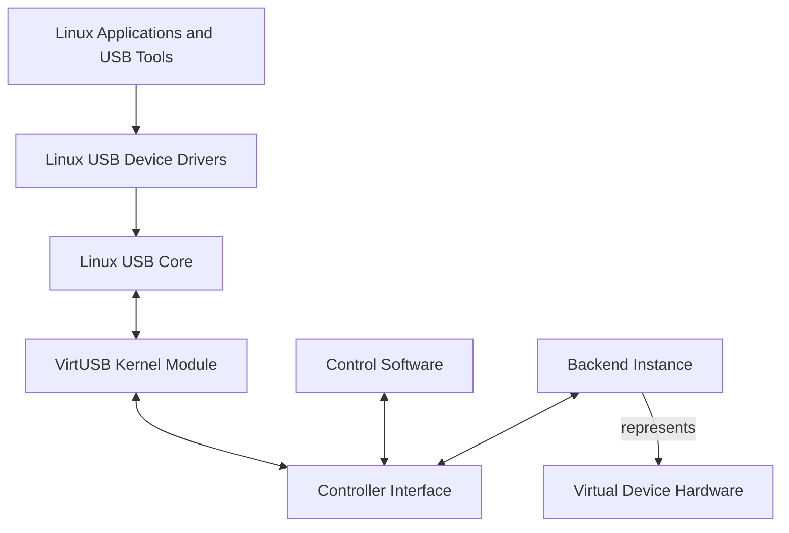
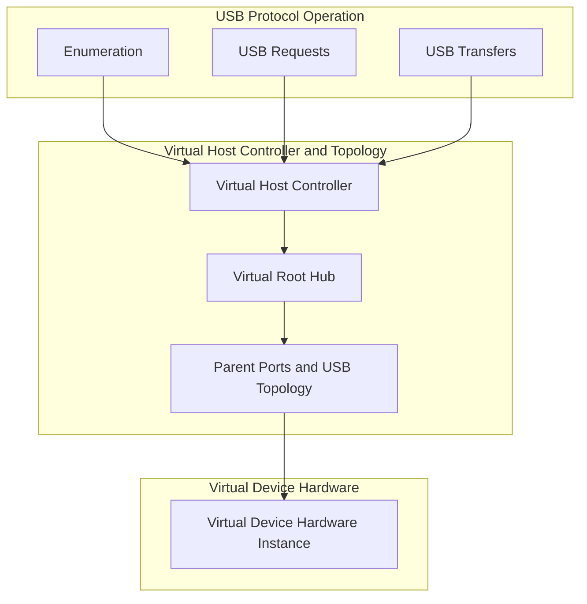
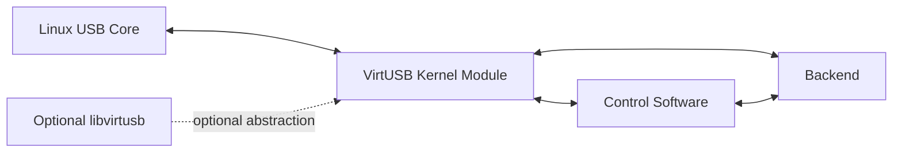
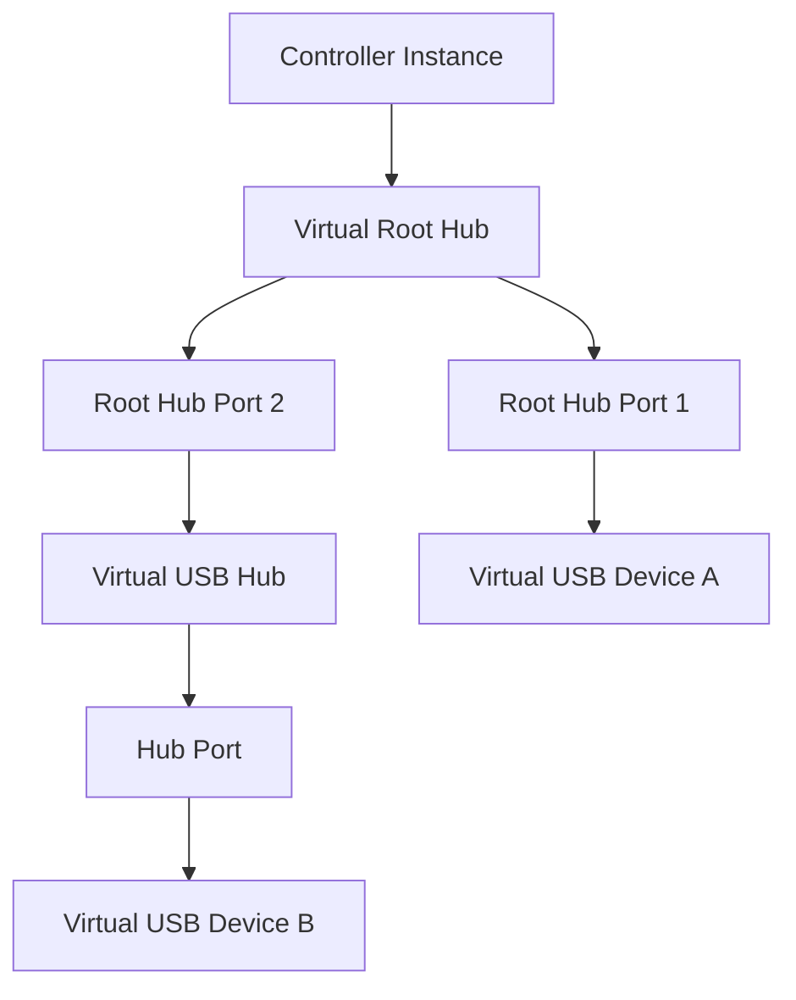
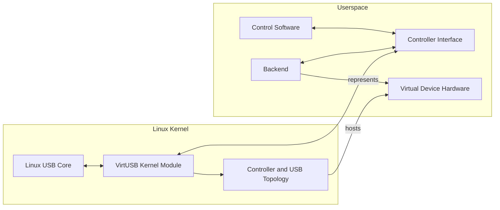
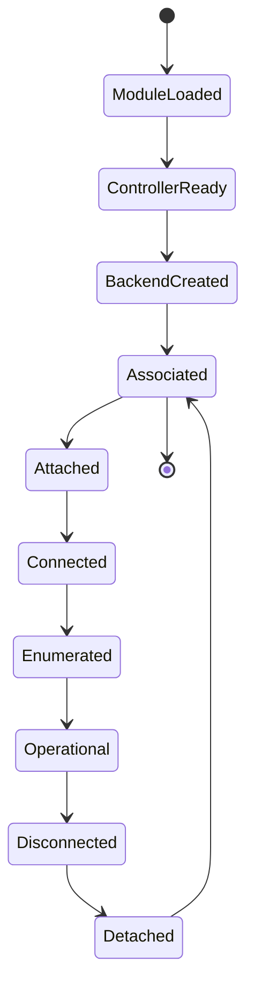
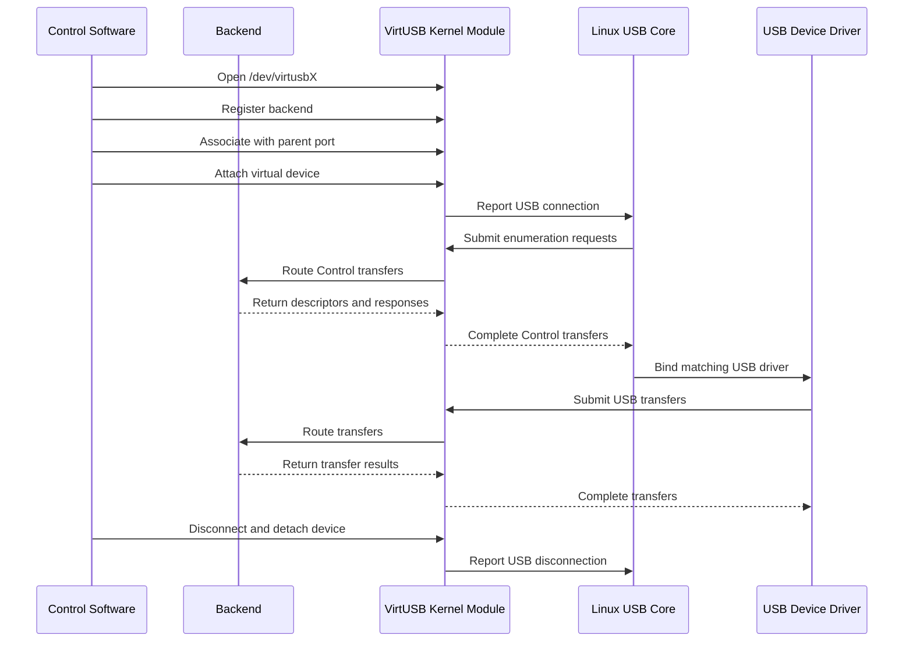
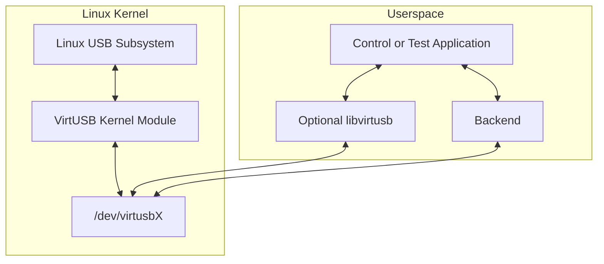

# VirtUSB System Overview

# Table of Contents

1. Purpose
2. System Objective
3. System Context
4. Architectural Responsibility Layers
5. Principal Software Components
6. System Boundary
7. Typical Operational Flow
8. Transfer Model
9. Timing Model
10. Deployment View
11. Interfaces
12. Project Scope
13. Out of Scope
14. Architectural Constraints
15. Relationship to the High-Level Architecture

# 1. Purpose

This document provides a high-level overview of VirtUSB.

It describes the system context, the principal software components, the
architectural responsibility layers, the major runtime relationships, and the
boundaries between VirtUSB and virtual USB device backends.

Detailed architectural models, ownership rules, runtime behaviour, communication
semantics, failure handling, concurrency, and architectural constraints are
defined in `doc/architecture/high-level-architecture.md` and in Architecture
Decision Records (ADRs).

---

# Definitions and Abbreviations

The terminology and abbreviations used by this document are defined in
`doc/glossary.md`.

Project-wide terminology is intentionally defined in the glossary and is not
redefined in this document.

---

# 2. System Objective

VirtUSB provides one or more virtual USB Host Controllers for Linux.

Its purpose is to enable development, integration, testing, simulation, and
automation of USB devices without requiring corresponding physical USB device
hardware.

Virtual USB devices connected through VirtUSB are represented through the
standard Linux USB subsystem and are intended to behave like devices attached
to a physical USB Host Controller, subject to the functional and timing
limitations of a software-only implementation.

VirtUSB shall remain independent of a specific backend implementation,
programming language, USB device stack, userspace framework, or execution model.

---

# 3. System Context

VirtUSB connects userspace backend software to the standard Linux USB stack.

The Linux USB subsystem interacts with VirtUSB through the Linux Host Controller
Driver interface.

Userspace interacts with a specific controller instance through the logical
Controller Interface. A character device such as `/dev/virtusbX` may provide the
concrete entry point for that interface.

A backend instance represents exactly one Virtual Device Hardware instance.

The exact communication protocol, transport mechanism, message format, and
serialization are outside the scope of this overview.

---

# 4. Architectural Responsibility Layers

VirtUSB separates architectural responsibilities into three layers:

- Virtual Device Hardware
- Virtual Host Controller and Topology
- USB Protocol Operation

These layers describe responsibility and state boundaries. They are not
additional software components and shall not be interpreted as implementation
layers.

## 4.1 Virtual Device Hardware

The Virtual Device Hardware layer represents the emulated hardware of one USB
device.

Typical state includes:

- existence
- power state
- reset or reboot state
- USB device controller availability
- firmware or boot state where externally relevant

A backend instance represents exactly one Virtual Device Hardware instance.

The backend may control only the Virtual Device Hardware that it represents.

## 4.2 Virtual Host Controller and Topology

The Virtual Host Controller and Topology layer represents the virtual USB
infrastructure managed by VirtUSB.

It includes:

- controller instances
- Root Hubs
- virtual USB hubs
- parent hubs
- parent ports
- device association
- device attachment and detachment
- host-visible USB connection state
- topology-related state changes

The VirtUSB kernel module owns this layer.

## 4.3 USB Protocol Operation

The USB Protocol Operation layer represents USB-defined behaviour.

It includes:

- USB device enumeration
- standard, class-specific, and vendor-specific requests
- endpoint behaviour
- Control, Bulk, Interrupt, and Isochronous transfers
- reset, suspend, and resume behaviour
- transfer completion and cancellation

The Linux USB subsystem, VirtUSB, and the backend participate in this layer
according to their documented responsibilities.

---

# 5. Principal Software Components

The principal software components are:

- Linux USB Core
- VirtUSB kernel module
- Control Software
- Backend
- optional `libvirtusb`

## 5.1 Linux USB Core

The Linux USB Core discovers and manages virtual USB devices through the
standard Host Controller Driver interface.

It remains responsible for:

- bus discovery
- device enumeration
- address assignment
- configuration selection
- device-driver matching and binding
- interaction with USB device drivers

VirtUSB does not replace these responsibilities.

## 5.2 VirtUSB Kernel Module

The VirtUSB kernel module implements one or more virtual USB Host Controller
instances.

Its principal responsibilities include:

- Linux HCD integration
- controller creation and removal
- Root Hub creation
- hierarchical USB topology management
- parent-port management
- host-visible USB connection state
- USB request routing
- transfer tracking, completion, and cancellation
- userspace communication
- controller-local resource management
- failure cleanup

The kernel module does not implement device-specific USB behaviour or backend-
specific Virtual Device Hardware.

## 5.3 Virtual Host Controller

A controller instance represents one independent virtual USB bus.

Each controller instance:

- has one Host Controller Driver instance
- owns one virtual Root Hub
- owns the topology rooted at that Root Hub
- exposes one Controller Interface
- operates independently of other controller instances

The number of controller instances is configured when the kernel module is
loaded.

## 5.4 Virtual Root Hub and USB Topology

Each controller instance owns exactly one virtual Root Hub.

The Root Hub initially exposes exactly 31 downstream ports.

Additional virtual USB hubs may extend the topology by providing further
downstream ports.

Every virtual USB device is attached to exactly one parent port. Every parent
port belongs to exactly one parent hub and may host at most one virtual USB
device.

## 5.5 Backend

A backend is a userspace software component that represents exactly one Virtual
Device Hardware instance.

Typical responsibilities include:

- Virtual Device Hardware state
- power and reset behaviour
- USB descriptors
- USB Chapter 9 request handling
- endpoint implementation
- class-specific request handling
- vendor-specific request handling
- device-specific protocol handling
- USB transfer processing
- generation of transfer responses

A backend does not own Host Controllers, Root Hubs, parent ports, or USB
topology.

A backend never communicates directly with the Linux USB subsystem.

## 5.6 Control Software

Control Software manages the administrative state of controllers, backends, and
topology through the Controller Interface.

Typical responsibilities may include:

- opening `/dev/virtusbX`
- selecting a controller
- registering a backend
- associating Virtual Device Hardware with a parent port
- attaching and detaching a virtual device
- requesting or propagating hardware-state changes
- querying controller, topology, port, and device state
- monitoring lifecycle and error events

The control role and backend role may be implemented in the same process or in
separate processes.

## 5.7 Optional libvirtusb

A future `libvirtusb` library may provide a stable userspace abstraction over
the Controller Interface.

The library is optional and is not required for the initial kernel
implementation.

---

# 6. System Boundary

VirtUSB is responsible for the virtual Host Controller infrastructure and the
virtual USB topology.

The backend is responsible for the Virtual Device Hardware and device-specific
USB behaviour.

The Linux USB Core remains responsible for standard host-side USB behaviour,
including enumeration and driver binding.

## 6.1 VirtUSB Responsibilities

VirtUSB is responsible for:

- representing virtual Host Controllers to Linux
- representing Root Hubs, hubs, and parent ports
- managing USB topology
- managing association, attachment, and detachment
- reporting host-visible connection and disconnection
- accepting USB requests from the Linux USB Core
- routing requests to the corresponding backend
- returning backend responses to the Linux USB Core
- supporting Control, Bulk, Interrupt, and Isochronous transfers

## 6.2 Backend Responsibilities

A backend is responsible for:

- representing one Virtual Device Hardware instance
- defining the identity and capabilities of the virtual USB device
- supplying descriptors
- handling device-specific USB requests
- implementing endpoint semantics
- maintaining device-specific protocol and application state
- generating transfer results and device data

## 6.3 Explicit Boundary

VirtUSB provides the Host Controller, topology, communication, and routing
infrastructure required for a backend to implement a USB device.

VirtUSB itself does not provide device-specific descriptors, configurations,
class behaviour, or application logic.

---

# 7. Typical Operational Flow

Association, attachment, USB connection, and enumeration are distinct steps.

A typical virtual device session follows this sequence:

1. The VirtUSB kernel module is loaded with the requested number of controller
   instances.
2. Linux registers each controller and its virtual Root Hub.
3. Control Software opens `/dev/virtusbX`.
4. A backend instance is created.
5. The backend instance represents one Virtual Device Hardware instance.
6. The Virtual Device Hardware is associated with one parent port.
7. The virtual device is attached to the USB topology.
8. VirtUSB reports a USB connection on that parent port.
9. The Linux USB subsystem begins enumeration.
10. Enumeration requests are routed to the backend.
11. The backend returns descriptors and other device responses.
12. Linux binds an appropriate USB device driver.
13. Normal Control, Bulk, Interrupt, or Isochronous transfers are exchanged.
14. The USB connection is removed.
15. The virtual device is detached or reassigned.
16. The backend may remain active, terminate, or be reused according to the
    backend lifecycle.

---

# 8. Transfer Model

VirtUSB supports all standard USB transfer types:

- Control
- Bulk
- Interrupt
- Isochronous

The Linux USB subsystem schedules transfers.

The VirtUSB kernel module routes transfers.

The backend performs device-specific transfer processing.

Transfer handling is independent of the concrete kernel-userspace transport
mechanism.

Every submitted transfer eventually reaches exactly one terminal state:

- successful completion
- completion with an error
- cancellation

Detailed queueing, timeout, cancellation, ownership, and completion semantics
are defined by the High-Level Architecture and interface specifications.

---

# 9. Timing Model

VirtUSB does not provide hard real-time guarantees.

In particular, the following timing cannot be guaranteed with hard real-time
precision:

- USB Start-of-Frame generation
- frame and microframe timing
- Isochronous transfer scheduling
- Isochronous transfer completion

Virtual USB timing depends on:

- Linux scheduler behaviour
- kernel execution latency
- userspace scheduling
- communication latency
- backend implementation

VirtUSB may model USB frame and microframe progression, but it cannot guarantee
exact 1 ms frame periods or 125 µs high-speed microframe periods under all
system conditions.

Isochronous operation is therefore provided on a best-effort basis.

---

# 10. Deployment View

The initial VirtUSB deployment consists of an out-of-tree Linux kernel module
and one or more userspace applications or libraries.

The kernel module shall be installable and removable through DKMS.

---

# 11. Interfaces

VirtUSB has the following principal interfaces:

| Interface | Purpose |
|---|---|
| Linux HCD Interface | Integrates VirtUSB with the Linux USB subsystem |
| Root Hub Interface | Reports Root Hub and port status changes |
| Controller Interface | Logical interface between one controller instance and userspace |
| `/dev/virtusbX` | Character-device entry point implementing the Controller Interface |
| Backend Protocol | Exchanges hardware state, lifecycle events, USB requests, and transfer results |
| Optional `libvirtusb` API | Provides a stable userspace abstraction |

The Controller Interface is an architectural concept and shall not be equated
with one specific transport mechanism.

The concrete userspace protocol, API, message format, and transport mechanisms
are outside the scope of this overview.

---

# 12. Project Scope

The VirtUSB project includes:

- the VirtUSB Linux kernel module
- public kernel-userspace interface definitions
- tools required to build, install, load, unload, and test the module
- DKMS integration
- reference and test backends where useful
- architecture, interface, development, and testing documentation
- the future optional `libvirtusb` userspace library

---

# 13. Out of Scope

The following items are outside the responsibility of VirtUSB:

- physical USB Host Controller hardware
- physical USB device firmware
- implementation of arbitrary USB device-class protocols
- device-specific descriptor content
- device-specific Chapter 9 responses
- hard real-time USB timing guarantees
- a mandatory backend framework
- a preferred programming language or execution model
- a custom USB protocol analyzer

---

# 14. Architectural Constraints

The following constraints apply to the system:

- the target operating system is Linux
- the kernel module remains outside the mainline Linux kernel tree unless changed
  by a future project decision
- the module must support DKMS-compatible distribution
- the project must compile with GCC and LLVM/Clang where applicable
- the kernel implementation must follow Linux kernel coding and documentation
  conventions
- the design must support multiple independent controller instances
- each controller must provide exactly one Root Hub
- each Root Hub must initially expose exactly 31 downstream ports
- the backend interface must remain implementation-neutral
- responsibility layers must remain separated
- runtime objects must have explicit ownership
- a backend instance may control only the Virtual Device Hardware it represents

---

# 15. Relationship to the High-Level Architecture

This document intentionally provides a concise system-level overview.

The High-Level Architecture defines the normative architectural model in
detail, including:

- Architectural Principles
- Software Components
- Responsibility Domains
- Runtime Objects
- Controller and Topology Model
- Virtual Device Model
- Backend Model
- Transfer Model
- Communication Model
- Runtime Model
- Concurrency Model
- Failure and Recovery Model
- Extensibility
- Architectural Constraints
- Architectural Evolution

Architecture Decision Records document the rationale for significant
architectural changes.

This overview shall remain consistent with the High-Level Architecture and the
project glossary.
