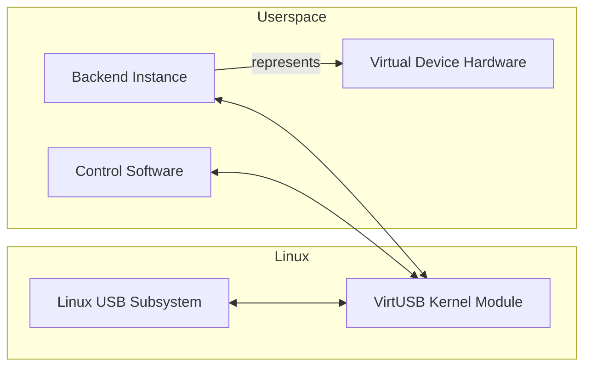
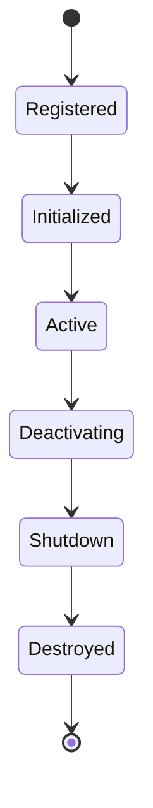
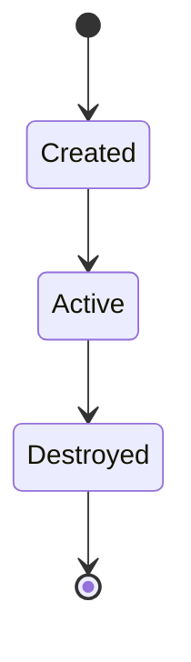
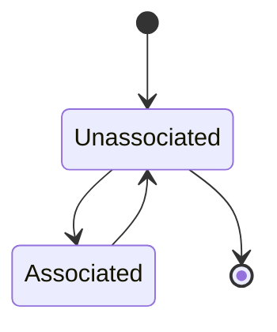
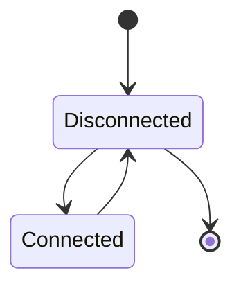
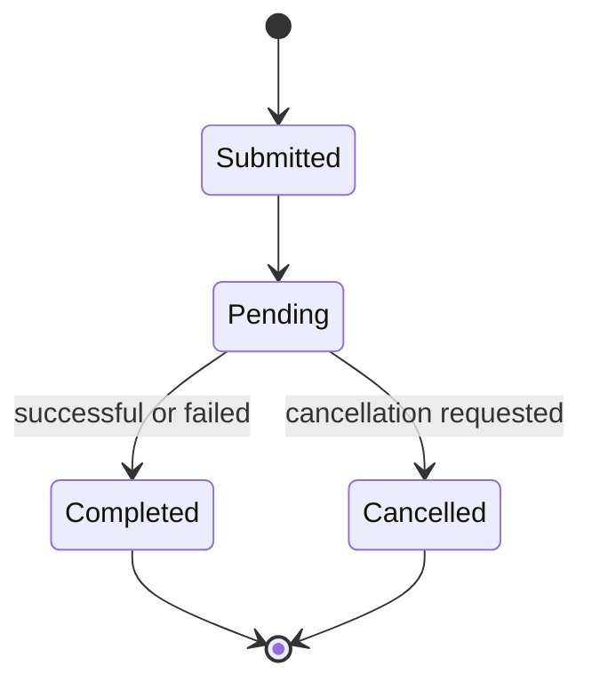
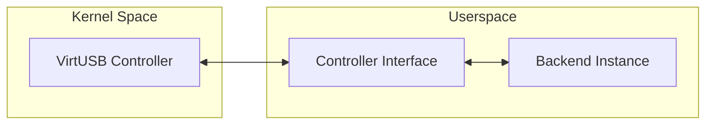
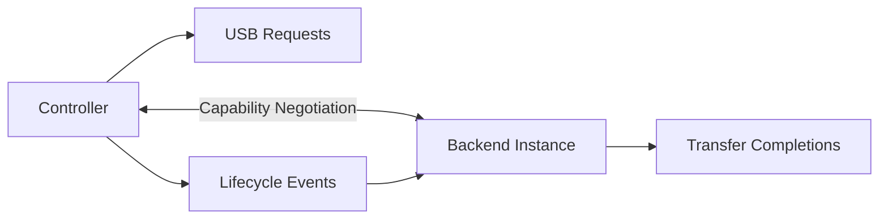
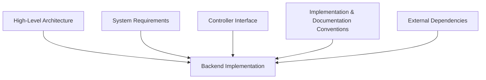
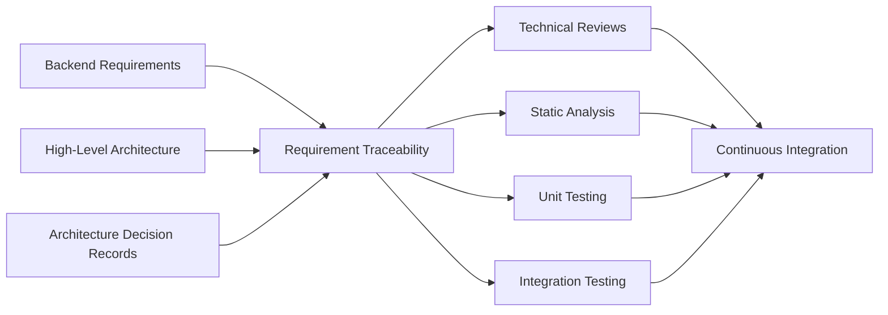

# VirtUSB Backend Requirements

**Status:** Draft

# Table of Contents

# Table of Contents

1. Purpose
2. Scope
3. Definitions and Abbreviations
4. References
5. Backend Overview
6. General Backend Requirements
7. Backend Lifecycle Requirements
8. Virtual Device Hardware Requirements
9. USB Transfer Requirements
10. Controller Interface Requirements
11. Backend Quality Requirements
12. Constraints
13. Verification

Appendix A – Requirement Traceability

Appendix B – Reference Documents

# 1. Purpose

This document defines the backend requirements for VirtUSB.

The requirements specify **what** backend implementations shall provide without
specifying **how** these requirements are implemented.

This document refines the System Requirements by allocating system-level
responsibilities to backend implementations while remaining independent of
specific implementation details.

This document is intended primarily for developers, software architects,
reviewers, and contributors involved in the design, implementation,
verification, and maintenance of VirtUSB backend implementations.

Implementation details are defined in separate project documents, including the
System Overview, the High-Level Architecture, Architecture Decision Records
(ADRs), and subsequent design specifications.

This document intentionally does not define:

- backend APIs
- communication protocols
- algorithms
- internal data structures
- implementation-specific synchronization mechanisms
- other implementation details

These topics are addressed by the corresponding architecture and design
documents.

---

# 2. Scope

This document specifies the requirements applicable to VirtUSB backend
implementations.

The scope includes the functionality required for backend implementations to
represent Virtual Device Hardware and to communicate through the documented
Controller Interface.

This document allocates the responsibilities defined by the System Requirements
to backend implementations while remaining independent of their concrete
implementation.

Backend implementations shall remain independent of any specific emulation,
simulation, hardware, operating environment, or application domain unless
explicitly required by other project documents.

The relationship between backend implementations, the Controller Interface, and
the VirtUSB kernel module is defined only to the extent necessary to allocate
responsibilities and define backend requirements.

The following are outside the scope of this document:

- backend APIs
- communication protocol definitions
- backend-specific implementation details
- internal algorithms
- internal data structures
- implementation of the VirtUSB kernel module
- implementation of the Controller Interface

These topics are specified in dedicated project documents.

---

# 3. Definitions and Abbreviations

The terminology and abbreviations used by this document are defined in the
VirtUSB Glossary (`doc/glossary.md`).

---

# 4. References

This document is based on the following project documents and external
references.

Project-specific documents define the VirtUSB architecture, terminology, and
engineering process. External references provide the technical background and
platform-specific requirements relevant to this specification.

## 4.1 Project Documents

- VirtUSB Glossary
- VirtUSB System Overview
- VirtUSB High-Level Architecture
- VirtUSB System Requirements
- VirtUSB Architecture Decision Records (ADRs)

## 4.2 External References

- Universal Serial Bus Specification, Revision 2.0
- Linux Kernel Documentation
- Linux USB Subsystem Documentation

---

# 5. Backend Overview

Backend implementations provide the software responsible for representing
Virtual Device Hardware within the VirtUSB architecture.

Each Backend Instance represents exactly one Virtual Device Hardware Instance.

A backend implements the device-specific USB behaviour required to process USB
requests, maintain device state, and exchange information through the
documented Controller Interface.

Backend implementations operate independently of the VirtUSB kernel module.

The VirtUSB kernel module is responsible for exposing virtual USB Host
Controllers to the Linux USB subsystem, managing the USB topology, and routing
USB transfers and lifecycle events through the Controller Interface.

Backend implementations are responsible exclusively for device-specific
behaviour.

Backend implementations may execute in arbitrary userspace environments and are
independent of any specific programming language, framework, execution model,
hardware platform, or application domain.

The relationship between the principal architectural components is illustrated
below.

Backend implementations complying with the documented Controller Interface may
be integrated into the VirtUSB architecture without requiring modifications to
the common controller infrastructure.

---

# 6. General Backend Requirements

Backend implementations shall satisfy the following general requirements:

- represent exactly one Virtual Device Hardware Instance.
- implement all device-specific USB behaviour.
- communicate exclusively through the documented Controller Interface.
- remain independent of specific hardware platforms, operating environments,
  programming languages, frameworks, application domains, and implementation
  technologies unless explicitly required by other project documents.
- accurately emulate the behaviour of the represented Virtual Device Hardware.
- maintain all USB-defined device state throughout the lifetime of the Backend
  Instance.
- expose supported capabilities through the documented Controller Interface.
  Unsupported capabilities shall be reported explicitly.
- manage all allocated resources throughout their lifetime. Resources shall be
  released during normal shutdown as well as during error recovery.
- detect internal errors and report them through the documented Controller
  Interface without compromising the stability of the overall VirtUSB
  architecture.

Backend implementations should also satisfy the following recommendations:

- provide sufficient diagnostic information to support debugging, testing, and
  maintenance.
- ensure that diagnostic output does not alter the externally observable
  behaviour of the backend.
- minimise unnecessary implementation complexity.

---

# 7. Backend Lifecycle Requirements

The Backend Lifecycle is independent of the Virtual Device Hardware lifecycle,
USB attachment state, USB connection state, and USB transfer lifecycle.

Backend implementations shall satisfy the following lifecycle requirements:

- support registration through the documented Controller Interface before
  becoming available for use.
- perform all required initialization before accepting USB requests.
- enter the Active state only after successful initialization.
- stop accepting new USB requests during deactivation while completing or
  terminating outstanding operations in a defined manner.
- perform an orderly shutdown before the Backend Instance is destroyed.
- release all allocated resources during shutdown regardless of whether the
  shutdown was initiated during normal operation or following an error.
- ensure that failures during lifecycle transitions do not leave the Backend
  Instance in an undefined state. Partial initialization or activation shall
  be rolled back or completed in a defined manner.

Lifecycle transitions shall not implicitly change the USB topology, backend
association, device attachment, or device connection state.

---

# 8. Virtual Device Hardware Requirements

Each Backend Instance represents exactly one Virtual Device Hardware Instance.

The lifecycle of a Backend Instance is independent of:

- backend association
- device attachment
- USB connection
- USB transfer processing

The following sections describe these concepts independently.

## 8.1 Backend Representation

Backend implementations shall:

- represent exactly one Virtual Device Hardware Instance.
- maintain exactly one Backend Instance for each represented Virtual Device
  Hardware Instance.
- maintain all USB-defined device state throughout the lifetime of the Backend
  Instance.
- remain independent of the represented hardware implementation technology.

## 8.2 Backend Instance Lifecycle

The Backend Instance lifecycle describes the existence of the backend itself.

Backend implementations shall:

- support creation and destruction of Backend Instances.
- complete all required initialization before entering the Active state.
- release all allocated resources when the Backend Instance is destroyed.
- ensure that Backend Instance existence is independent of USB topology and USB
  connection state.

## 8.3 Backend Association

A Backend Instance may be associated with one Parent Port.

Association does not imply USB attachment or USB connection.

Backend implementations shall:

- support association with exactly one Parent Port at any point in time.
- support removal of the association without destroying the Backend Instance.
- remain fully operational while not associated with any Parent Port.
- ensure that a Backend Instance is associated with at most one Parent Port.

## 8.4 Device Attachment

Attachment determines whether the represented Virtual Device Hardware is
attached to the associated Parent Port.

Backend implementations shall:

- support attachment of the represented Virtual Device Hardware.
- support detachment without destroying the Backend Instance.
- ensure that attachment is possible only while associated with a Parent Port.

Attachment shall not automatically make a virtual USB device visible to the
Linux USB subsystem.

## 8.5 USB Connection

USB connection determines whether the attached Virtual Device Hardware is
visible to the Linux USB subsystem.

Backend implementations shall:

- support USB connection independently of Backend Instance creation.
- support USB disconnection independently of Backend Instance destruction.
- ensure that a Backend Instance is connected only while attached to a Parent
  Port.

## 8.6 USB Device Behaviour

Backend implementations shall:

- correctly process USB reset operations in accordance with the USB
  specification.
- provide complete, valid, and internally consistent USB descriptors required
  for successful device enumeration.
- support every implemented USB configuration.
- provide every implemented USB interface.
- provide every endpoint required by the implemented interfaces.
- ensure that descriptor, configuration, interface, and endpoint information
  remains internally consistent throughout the lifetime of the Backend
  Instance.

## 8.7 Resource Management

Backend implementations shall:

- preserve allocated resources while temporarily detached or disconnected.
- release all resources associated with the Backend Instance when it is
  destroyed.
- ensure that temporary changes in association, attachment, or connection state
  do not result in unnecessary destruction or recreation of internal backend
  resources.

---

# 9. USB Transfer Requirements

USB transfer processing shall emulate the device-side behaviour of the
represented Virtual Device Hardware as observed by the Linux USB subsystem.

Backend implementations shall satisfy the following USB transfer requirements:

- accept and process every USB transfer type supported by the represented
  Virtual Device Hardware.
- preserve the semantics of every submitted USB transfer.
- preserve transfer data without modification unless explicitly required by the
  USB specification.
- preserve packet boundaries where required by the USB specification.
- correctly support short packets and zero-length packets where permitted by
  the USB specification.
- preserve transfer ordering whenever required by the USB specification.
- ensure that every submitted transfer eventually reaches exactly one terminal
  state.

The transfer lifecycle diagram illustrates the externally observable transfer
states. It intentionally does not prescribe an internal backend
implementation.

## 9.1 General Transfer Handling

Backend implementations shall:

- process transfers independently unless USB semantics require different
  behaviour.
- ensure that transfer processing remains transparent to the Linux USB host
  stack.
- avoid introducing implementation-specific transfer behaviour visible to the
  host.

## 9.2 Control Transfers

Backend implementations shall:

- correctly process the Setup, optional Data, and Status stages of every
  control transfer.
- support every Standard, Class, and Vendor request implemented by the
  represented Virtual Device Hardware.
- correctly report unsupported requests in accordance with the USB
  specification.

## 9.3 Bulk Transfers

Backend implementations shall:

- correctly process bulk transfers in accordance with the USB specification.
- preserve the delivery and error-handling semantics defined for bulk
  endpoints.

## 9.4 Interrupt Transfers

Backend implementations shall:

- correctly process interrupt transfers in accordance with the USB
  specification.
- preserve the polling semantics defined by the endpoint descriptor.

## 9.5 Isochronous Transfers

Backend implementations shall:

- correctly process isochronous transfers in accordance with the USB
  specification.
- preserve the timing and delivery semantics defined for isochronous
  endpoints.
- not introduce retransmission behaviour that is not defined for isochronous
  transfers.

## 9.6 Transfer Completion

Backend implementations shall:

- complete every submitted transfer exactly once.
- report transfer completion only after transfer processing has finished.
- ensure that transfer completion accurately reflects the observed USB
  transaction outcome.
- not report a second completion after a transfer has reached a terminal state.

## 9.7 Pending Transfers

Backend implementations shall:

- allow transfers to remain pending until normal completion or cancellation.
- not terminate transfers solely because of implementation-defined timeout
  policies.
- retain sufficient state to complete or cancel every pending transfer
  deterministically.

## 9.8 Transfer Cancellation

Backend implementations shall:

- support cancellation of pending transfers.
- terminate a successfully cancelled transfer with a cancellation completion
  status.
- ensure that a cancelled transfer cannot later complete with a different
  status.
- handle races between normal completion and cancellation deterministically.

## 9.9 Transfer Status Reporting

Backend implementations shall:

- report transfer status using USB host-controller semantics.
- report successful completion, cancellation, and USB-defined transfer errors
  consistently.
- map backend-internal failures to appropriate externally observable USB
  transfer status values.
- not expose backend implementation details through transfer status reporting.

---

# 10. Controller Interface Requirements

The Controller Interface defines the behavioural contract between the VirtUSB
controller infrastructure and Backend Instances.

It intentionally defines architectural responsibilities rather than a concrete
API, communication protocol, transport mechanism, or serialization format.

The Controller Interface shall satisfy the following requirements:

- clearly separate controller responsibilities from backend
  responsibilities.
- remain independent of any specific communication mechanism.
- remain independent of any specific transport implementation.
- provide a stable behavioural contract across compatible interface revisions.
- support capability negotiation.
- support lifecycle management.
- support USB transfer processing.
- support asynchronous event delivery.
- support future interface extensions without breaking existing
  implementations.

## 10.1 Interface Responsibilities

The Controller Interface shall:

- define clear responsibilities for both the VirtUSB controller
  infrastructure and Backend Instances.
- avoid overlapping responsibilities.
- avoid requiring Backend Instances to replicate controller
  functionality.
- preserve the architectural separation defined by the High-Level
  Architecture.

## 10.2 Interface Stability

The Controller Interface shall:

- remain backward compatible within compatible interface revisions.
- define sufficient versioning to detect incompatible interface
  revisions.
- avoid unnecessary interface changes.

## 10.3 Capability Negotiation

The Controller Interface shall:

- allow both the VirtUSB controller infrastructure and Backend
  Instances to advertise supported capabilities.
- distinguish between mandatory and optional capabilities.
- detect mandatory capability mismatches during interface
  initialization.
- allow unsupported optional capabilities without preventing normal
  operation.
- permit future capabilities without changing the architectural model.

Capability negotiation determines the mutually supported interface features
before normal operation begins.

## 10.4 Request Handling

The Controller Interface shall:

- define how USB requests are delivered to Backend Instances.
- preserve request ordering where required by the USB specification.
- avoid exposing implementation-specific transport behaviour.

## 10.5 Completion Handling

The Controller Interface shall:

- define how completed USB requests are reported.
- guarantee that every completed request is reported exactly once.
- preserve completion ordering where required.

## 10.6 Lifecycle Events

The Controller Interface shall support delivery of lifecycle events,
including:

- backend association
- device attachment
- USB connection
- USB disconnection
- USB reset
- suspend
- resume

Lifecycle events shall be delivered independently of USB transfer
processing.

## 10.7 Future Extensibility

The Controller Interface shall:

- support addition of new optional interface features.
- preserve compatibility for existing implementations whenever
  optional features are introduced.
- allow interface evolution without changing the architectural model.
 
---

# 11. Backend Quality Requirements

Backend implementations shall satisfy the following quality requirements to
ensure long-term maintainability, reliable operation, efficient resource usage,
and architectural consistency across supported platforms.

## 11.1 Maintainability

Backend implementations shall:

- use a clear and consistent software architecture.
- separate functional components with well-defined responsibilities.
- minimise unnecessary implementation complexity.
- document externally observable behaviour where appropriate.
- preserve compatibility with the documented Controller Interface.

## 11.2 Reliability

Backend implementations shall:

- operate correctly during continuous operation.
- maintain a consistent internal state throughout their lifetime.
- recover gracefully from recoverable error conditions.
- avoid data corruption and resource leaks.
- ensure that failures do not leave the Backend Instance in an undefined state.

## 11.3 Robustness

Backend implementations shall:

- validate externally supplied input before processing.
- tolerate invalid or unexpected requests without undefined behaviour.
- fail predictably and consistently when unrecoverable errors occur.
- preserve Controller Interface integrity during error handling.

## 11.4 Testability

Backend implementations shall:

- support verification of externally observable behaviour.
- permit automated testing where practical.
- produce deterministic behaviour for identical inputs and operating
  conditions.
- allow error conditions to be reproduced during testing.

The quality requirements shall enable automated verification of backend
behaviour independently of a specific backend implementation.

## 11.5 Portability

Backend implementations shall:

- avoid unnecessary dependencies on a specific operating system,
  runtime, or framework.
- isolate platform-specific functionality where required.
- preserve consistent externally observable behaviour across supported
  platforms.

## 11.6 Resource Efficiency

Backend implementations shall:

- use CPU time, memory, and other system resources efficiently.
- release resources promptly when no longer required.
- avoid unnecessary resource consumption during idle operation.
- scale resource usage with the workload whenever practical.

## 11.7 Architectural Compliance

Backend implementations shall:

- comply with the architectural principles defined by the High-Level
  Architecture.
- preserve the documented separation of responsibilities.
- communicate exclusively through the documented Controller Interface.
- avoid assumptions about the internal implementation of the VirtUSB
  controller infrastructure.

## 11.8 Concurrency

Backend implementations shall:

- support concurrent processing where permitted by the USB
  specification.
- avoid introducing unnecessary serialization.
- ensure thread safety where concurrent execution is supported.
- preserve the behavioural guarantees defined by the Controller
  Interface.
  
---

# 12. Constraints

Backend implementations shall comply with the architectural and development
constraints defined by the VirtUSB project.

These constraints ensure that independently developed Backend Instances remain
compatible with the documented architecture, Controller Interface, and
long-term project objectives.

The diagram illustrates that backend implementations are governed by multiple
architectural and project documents rather than by the Controller Interface
alone.

## 12.1 Compliance with Project Architecture

Backend implementations shall:

- comply with the documented High-Level Architecture.
- preserve the documented separation of responsibilities.
- not introduce behaviour that conflicts with documented architectural
  decisions.
- remain independent of the internal implementation of the VirtUSB controller
  infrastructure.

## 12.2 Compliance with the Controller Interface

Backend implementations shall:

- comply with the documented Controller Interface.
- implement all mandatory interface requirements.
- correctly identify interface incompatibilities before normal operation
  begins.
- avoid relying on implementation-specific interface behaviour.

## 12.3 Implementation Conventions

Backend implementations shall:

- follow the project's documented implementation conventions.
- use consistent naming, coding, formatting, and documentation conventions.
- avoid implementation practices that unnecessarily reduce maintainability,
  portability, or readability.

## 12.4 Documentation Conventions

Backend implementations shall:

- follow the project's documentation conventions.
- document externally observable behaviour where appropriate.
- keep implementation documentation consistent with the implemented
  functionality.
- ensure that public documentation remains consistent with the documented
  Controller Interface.

## 12.5 External Dependencies

Backend implementations shall:

- minimise unnecessary external dependencies.
- document all required external dependencies.
- avoid dependencies that unnecessarily restrict portability.
- ensure that external dependencies remain compatible with the project's
  licensing and distribution requirements.
- avoid introducing mandatory dependencies that are unrelated to backend
  functionality.

---

# 13. Verification

Compliance with this specification shall be verified using documented,
repeatable, and objective verification activities.

The selected verification methods shall provide objective evidence that Backend
Implementations satisfy the requirements defined by this specification.

The verification activities complement one another and collectively provide
evidence that a Backend Implementation conforms to the documented
requirements and architectural constraints.

## 13.1 Requirement Traceability

Verification activities shall:

- establish traceability between requirements and verification evidence.
- establish traceability between requirements and the High-Level Architecture
  where applicable.
- ensure that every mandatory requirement is covered by at least one
  verification activity.
- document any justified deviations.

## 13.2 Documentation Reviews

Project documentation shall:

- be reviewed for technical correctness and consistency.
- remain consistent across related project documents.
- be updated whenever implementation or architectural changes affect the
  documented behaviour.

## 13.3 Static Code Analysis

Backend implementations shall:

- be verified using one or more static code analysis tools.
- resolve or justify reported findings before release.
- perform static analysis as part of the normal development workflow.

## 13.4 Unit Testing

Backend implementations shall:

- verify individual functional components using unit tests where practical.
- verify normal operation and relevant error conditions.
- produce repeatable test results.

## 13.5 Integration Testing

Backend implementations shall:

- verify correct interaction through the documented Controller Interface.
- verify supported USB transfer types.
- verify Backend Instance lifecycle behaviour.
- verify association, attachment, and connection handling.
- verify externally observable behaviour against the documented requirements.

## 13.6 Continuous Integration

The verification process shall:

- support automated execution of verification activities where practical.
- execute static analysis and automated tests within the continuous
  integration workflow.
- prevent verification regressions from remaining undetected.
- archive verification results where practical.

---

# Appendix A – Requirement Traceability (Example)

The following table illustrates the recommended structure of a requirement
traceability matrix. The actual project traceability matrix is maintained
separately.

| Requirement | Verification | ADR | Status |
|-------------|--------------|-----|--------|
| ...         | ...          | ... | ...    |

---

# Appendix B – Reference Documents (Example)

The following table illustrates the recommended structure for maintaining
project reference documents.

| ID      | Document | Version |
|---------|----------|---------|
| ...     | ...      | ...     |
