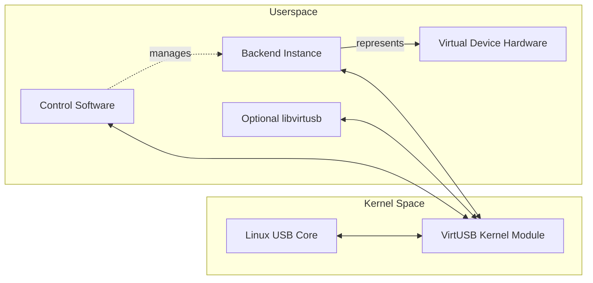
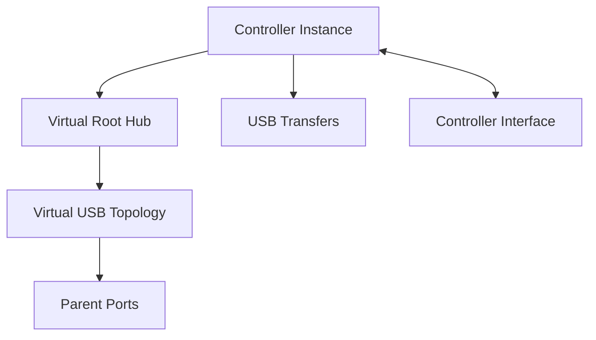
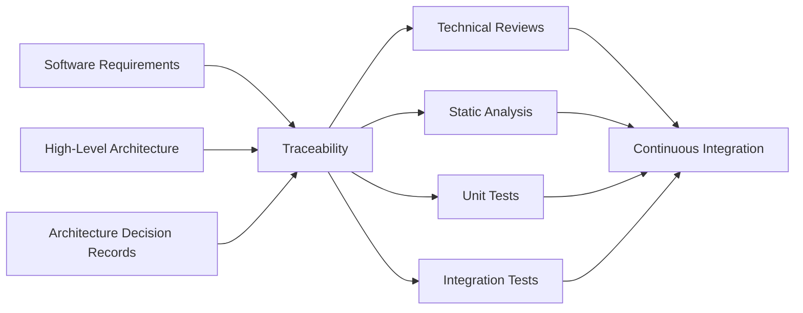

# VirtUSB Software Requirements

**Status:** Draft

# Table of Contents

1. Purpose
2. Scope
3. Definitions and Abbreviations
4. References
5. Software Overview
6. Kernel Module Requirements
7. Userspace Requirements
8. Backend Integration Requirements
9. Software Interface Requirements
10. Software Quality Requirements
11. Constraints
12. Verification

Appendix A – Requirement Traceability

Appendix B – Reference Documents

# 1. Purpose

This document defines the software requirements for VirtUSB.

The requirements specify **what** the VirtUSB software components shall provide
without specifying **how** these requirements are implemented.

This document refines the System Requirements by allocating responsibilities to
the individual software components while remaining independent of specific
implementation details.

This document is intended primarily for developers, software architects,
reviewers, and contributors involved in the design, implementation,
verification, and maintenance of VirtUSB.

Implementation details are defined in separate project documents, including the
System Overview, the High-Level Architecture, Architecture Decision Records
(ADRs), and subsequent design specifications.

This document intentionally does not define:

- algorithms
- internal data structures
- concrete APIs
- communication protocols
- transport mechanisms
- implementation-specific synchronization mechanisms
- ownership and memory-management implementation details

These topics are addressed by the corresponding architecture and design
documents.

---

# 2. Scope

This document specifies the software requirements for the VirtUSB software
system.

The scope includes the software components required to implement the
requirements defined by the VirtUSB System Requirements.

The software components covered by this document include:

- VirtUSB Linux kernel module
- userspace control software
- backend integration
- optional userspace support libraries
- documented software interfaces between these components

This document allocates responsibilities to the individual software components
while remaining independent of their concrete implementation.

The High-Level Architecture provides the structural framework for these
requirements.

The following are outside the scope of this document:

- concrete implementation details
- internal algorithms
- communication protocol definitions
- internal data structures
- synchronization primitives
- ownership and memory-management mechanisms
- backend-specific implementation details

These topics are specified in dedicated project documents.

---

# 3. Definitions and Abbreviations

The terminology and abbreviations used by this document are defined in the
VirtUSB Glossary (`doc/glossary.md`).

---

# 4. References

This document is based on the following project documents and external
references.

Project-specific documents define the VirtUSB architecture, terminology, and
requirements. External references provide the technical background and
platform-specific requirements relevant to this specification.

## 4.1 Project Documents

- VirtUSB Glossary
- VirtUSB System Overview
- VirtUSB High-Level Architecture
- VirtUSB System Requirements
- VirtUSB Backend Requirements
- VirtUSB Architecture Decision Records (ADRs)

## 4.2 External References

- Universal Serial Bus Specification, Revision 2.0
- Linux Kernel Documentation
- Linux USB Subsystem Documentation

---

# 5. Software Overview

This section provides an overview of the principal VirtUSB software components
and their documented relationships.

The software architecture is described through three complementary views:

- Software Components
- Responsibility Domains
- Runtime Objects

This document allocates requirements primarily to Software Components while
remaining consistent with the responsibility and runtime models defined by the
High-Level Architecture.

The principal software components are:

- VirtUSB Linux kernel module
- Control Software
- Backend
- optional `libvirtusb`

Each software component shall have clearly defined responsibilities and shall
interact with other components only through documented interfaces.

Responsibility boundaries shall minimize coupling and support independent
implementation, testing, maintenance, and future extension.

---

# 6. Kernel Module Requirements

The VirtUSB kernel module shall provide the common infrastructure required to
expose one or more independent virtual USB Host Controllers to the Linux USB
subsystem.

## 6.1 Controller Management

The kernel module shall:

- support creation, initialization, operation, and removal of controller
  instances.
- support configuration of the number of controller instances.
- isolate the runtime state and resources of independent controller instances.
- register each controller instance with the Linux USB subsystem.
- remove all controller-local resources when a controller instance is removed.
- release all remaining resources when the kernel module is unloaded.

## 6.2 Root Hub and Topology Management

The kernel module shall:

- create exactly one virtual Root Hub for each controller instance.
- initially expose exactly 31 Root Hub ports.
- maintain the hierarchical virtual USB topology rooted at the Root Hub.
- manage parent hubs and parent ports.
- ensure that each parent port belongs to exactly one parent hub.
- ensure that each parent port hosts at most one attached virtual USB device.
- report topology and port-status changes through the Linux HCD integration.

## 6.3 Association, Attachment, and Connection

The kernel module shall:

- maintain controller-local backend associations.
- distinguish between backend association, device attachment, USB connection,
  and enumeration.
- permit association only with a valid parent port.
- permit attachment only while the corresponding backend is associated.
- permit host-visible USB connection only while the device is attached.
- support disconnection and detachment without requiring controller recreation.
- preserve topology consistency during reassignment and removal.

## 6.4 USB Transfer Management

The kernel module shall:

- accept USB transfers submitted by the Linux USB subsystem.
- support Control, Bulk, Interrupt, and Isochronous transfers.
- route each transfer to the Backend Instance associated with the addressed
  virtual USB device.
- track each transfer until completion or cancellation.
- ensure that each transfer reaches exactly one terminal state.
- return transfer results to the Linux USB subsystem.
- support deterministic handling of races between completion and cancellation.
- release transfer resources after terminal completion.

## 6.5 Lifecycle and Bus Events

The kernel module shall:

- generate and propagate relevant controller, topology, port, and device
  lifecycle events.
- support USB connection and disconnection.
- support USB reset, suspend, and resume events.
- support Start-of-Frame events where required by the documented architecture.
- deliver lifecycle events independently of normal transfer processing.

## 6.6 Controller Interface

The kernel module shall:

- expose one logical Controller Interface for each controller instance.
- provide a concrete userspace entry point such as `/dev/virtusbX`.
- support control operations, lifecycle events, USB requests, and transfer
  completions through the Controller Interface.
- remain independent of a specific userspace programming language or framework.
- detect userspace communication failure and restore a consistent
  controller-local runtime state.

## 6.7 Error Handling and Diagnostics

The kernel module shall:

- reject invalid controller, topology, backend, and transfer operations.
- contain failures to the smallest practical controller-local scope.
- cancel or complete affected transfers during failure cleanup.
- release resources according to the documented ownership model.
- provide diagnostic information suitable for development, testing, and
  maintenance.
- avoid exposing backend-specific implementation details through kernel
  diagnostics or public interfaces.

---

# 7. Userspace Requirements

Userspace software shall provide the functionality required to manage controller
instances and integrate Backend Instances through the documented Controller
Interface.

The control role and backend role may be implemented in the same process or in
separate processes.

## 7.1 Controller Access

Userspace software shall:

- connect to one or more controller instances through their Controller
  Interfaces.
- identify the target controller for every controller-local operation.
- isolate state and communication belonging to independent controller
  instances.
- detect controller removal and communication failure.
- release controller-local userspace resources when a controller connection is
  closed.

## 7.2 Backend Management

Userspace software shall:

- support registration and removal of Backend Instances.
- maintain the relationship between one Backend Instance and one represented
  Virtual Device Hardware Instance.
- support backend capability negotiation.
- prevent one Backend Instance from controlling unrelated Virtual Device
  Hardware.
- detect backend termination and initiate controlled cleanup.

## 7.3 Topology and Device Management

Userspace software shall:

- support backend association with a parent port.
- support removal of an association without destroying the Backend Instance.
- support device attachment and detachment.
- support USB connection and disconnection.
- distinguish association, attachment, connection, and enumeration.
- prevent invalid topology operations from being forwarded to the kernel module.
- support reassignment only while the device is not attached or connected.

## 7.4 Transfer and Event Processing

Userspace software shall:

- receive USB requests intended for Backend Instances.
- route requests to the corresponding Backend Instance.
- return transfer completions through the Controller Interface.
- process controller, topology, device, backend, and transfer events.
- preserve ordering where required by the USB specification or documented
  interfaces.
- support asynchronous event notification.

## 7.5 Resource and Error Management

Userspace software shall:

- track all userspace resources associated with controllers, Backend Instances,
  events, and transfers.
- release resources during normal shutdown and failure recovery.
- prevent communication failure from leaving partially owned resources.
- report operational and communication errors through documented mechanisms.
- provide logging and diagnostic information suitable for development and
  verification.

---

# 8. Backend Integration Requirements

Backend integration shall permit independently developed backend
implementations to participate in VirtUSB without requiring backend-specific
changes to the kernel module.

Backend integration shall:

- remain independent of any specific backend implementation.
- use the documented Controller Interface.
- support exactly one Virtual Device Hardware Instance per Backend Instance.
- support backend registration, initialization, activation, deactivation, and
  removal.
- support capability negotiation before normal operation begins.
- support backend association with exactly one parent port at a time.
- support attachment, detachment, connection, and disconnection.
- support delivery of USB requests and return of transfer completions.
- support delivery of lifecycle and bus events.
- detect and handle communication failures, invalid operations, and backend
  failures in a controlled manner.
- avoid exposing implementation-specific transport behaviour to Backend
  Instances.
- permit different backend architectures, programming languages, frameworks,
  and execution models.

Backend-specific functionality shall not require modifications to the common
VirtUSB kernel architecture.

---

# 9. Software Interface Requirements

Software interfaces shall provide clear behavioural contracts between VirtUSB
software components.

## 9.1 General Interface Requirements

Software interfaces shall:

- define clear responsibilities for each participating component.
- expose only the functionality required for component interaction.
- minimize coupling between components.
- use consistent interface-design principles.
- preserve documented ownership and lifecycle rules.
- support independent implementation and testing.
- support future extension while preserving compatibility where reasonably
  practical.

## 9.2 Controller Interface

The Controller Interface shall:

- provide the logical interface between one controller instance and userspace.
- remain independent of a specific transport mechanism.
- remain independent of a specific backend implementation.
- support controller management.
- support topology management.
- support backend association.
- support device attachment and detachment.
- support USB connection and disconnection.
- support USB request and transfer-completion exchange.
- support asynchronous lifecycle and bus events.
- support capability and version negotiation.
- provide sufficient identifiers to associate operations and events with the
  affected controller, parent port, Backend Instance, virtual USB device, or
  transfer.

## 9.3 Internal Interfaces

Internal software interfaces shall:

- remain private unless explicitly documented as public.
- avoid leaking implementation details across component boundaries.
- remain consistent with the High-Level Architecture.
- avoid duplicating Controller Interface responsibilities.
- be documented where required for maintenance and verification.

Detailed API definitions, message formats, and transport mechanisms are
specified separately.

---

# 10. Software Quality Requirements

The VirtUSB software shall satisfy the following quality requirements.

## 10.1 Maintainability

The software shall:

- use clear and consistent component boundaries.
- minimize unnecessary implementation complexity.
- follow documented coding and documentation conventions.
- maintain consistency between implementation and public documentation.
- support future extension without unnecessary architectural change.

## 10.2 Reliability and Robustness

The software shall:

- operate reliably during continuous use.
- maintain consistent state during normal and abnormal operation.
- validate externally supplied input before processing.
- handle invalid operations without undefined behaviour.
- recover gracefully from recoverable failures.
- prevent failures in one controller instance from corrupting unrelated
  controller instances.
- avoid resource leaks and data corruption.

## 10.3 Testability

The software shall:

- support unit testing where practical.
- support integration testing of kernel and userspace components.
- support automated regression testing.
- support isolated verification of controller, topology, backend, interface,
  transfer, and failure behaviour.
- produce repeatable results for equivalent inputs and operating conditions.

## 10.4 Portability and Compatibility

The software shall:

- support relevant processor architectures supported by Linux where practical.
- support GCC and LLVM/Clang toolchains where applicable.
- minimize platform-specific implementation details.
- preserve stable documented public interfaces where reasonably practical.
- document incompatible changes and provide suitable version detection.

## 10.5 Security

The software shall:

- operate within the Linux security model.
- require no privileges beyond those necessary for the implemented operation.
- validate data crossing the Controller Interface.
- define trust relationships between kernel space and userspace.
- prevent one Backend Instance from controlling unrelated runtime objects.
- avoid exposing internal implementation details through public interfaces or
  error reporting.

## 10.6 Resource Efficiency

The software shall:

- use CPU time, memory, and other resources efficiently.
- avoid unnecessary work during idle operation.
- scale resource usage with configured controllers and active transfers where
  practical.
- release resources promptly when no longer required.

---

# 11. Constraints

The VirtUSB software shall comply with the following constraints:

- follow the architectural principles defined by the High-Level Architecture.
- preserve the documented responsibility boundaries.
- target supported Linux platforms and toolchains defined by the project.
- use the project's documented build system and development workflow.
- comply with documented coding, formatting, and documentation conventions.
- minimize unnecessary external dependencies.
- remain independent of a mandatory backend framework, programming language, or
  execution model.
- communicate across the kernel-userspace boundary only through documented
  public interfaces.

Userspace components shall use Doxygen for public API documentation where
applicable.

Kernel components shall follow Linux kernel coding and documentation
conventions. Public kernel interfaces and relevant internal kernel functions
shall use kernel-doc where appropriate.

Detailed coding and documentation conventions are provided in
`doc/code-documentation-examples.md`.

External dependencies shall be selected to minimize complexity while remaining
suitable for project requirements and compatible with the project's licensing
model.

---

# 12. Verification

Compliance with this specification shall be verified using documented,
repeatable, and objective verification activities.

## 12.1 Requirement Traceability

Verification activities shall:

- establish traceability between software requirements, implementation, and
  verification evidence.
- reference relevant High-Level Architecture sections and ADRs where
  applicable.
- ensure that every mandatory requirement is covered by at least one
  verification activity.
- document justified deviations.

## 12.2 Documentation Reviews

Project documentation shall:

- be reviewed for technical correctness, completeness, and consistency.
- remain consistent across related project documents.
- be updated when architectural or implementation changes affect documented
  behaviour.

## 12.3 Static Analysis

The software shall:

- be checked using appropriate static-analysis tools.
- resolve or justify reported findings before release.
- perform static analysis as part of the normal development workflow.

## 12.4 Unit Testing

Unit tests shall:

- verify individual software components where practical.
- cover normal operation and relevant error conditions.
- produce repeatable results.

## 12.5 Integration Testing

Integration tests shall verify:

- Linux HCD integration.
- controller creation and removal.
- Root Hub and topology behaviour.
- Controller Interface operation.
- backend registration and association.
- attachment, connection, enumeration, and disconnection.
- all supported USB transfer types.
- completion and cancellation behaviour.
- failure detection, containment, cleanup, and recovery.
- operation of multiple independent controller instances.

## 12.6 Continuous Integration

The verification process shall:

- support automated build, analysis, and testing where practical.
- execute static analysis and automated tests in continuous integration.
- detect verification regressions.
- archive verification results where practical.

---

# Appendix A – Requirement Traceability

The following table illustrates the recommended structure of a requirement
traceability matrix. The actual project traceability matrix is maintained
separately.

| Requirement | Verification | ADR | Status |
|-------------|--------------|-----|--------|
| ... | ... | ... | ... |

---

# Appendix B – Reference Documents

The following table illustrates the recommended structure for maintaining
project reference documents.

| ID | Document | Version |
|----|----------|---------|
| ... | ... | ... |
