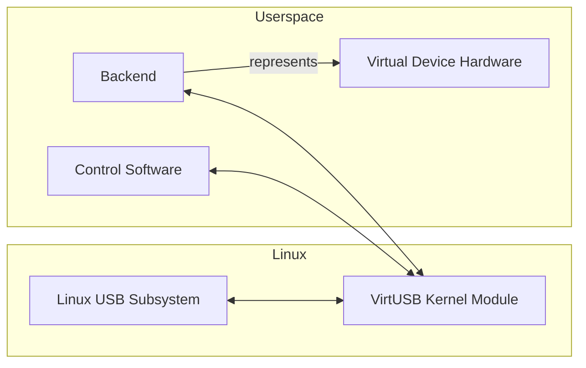
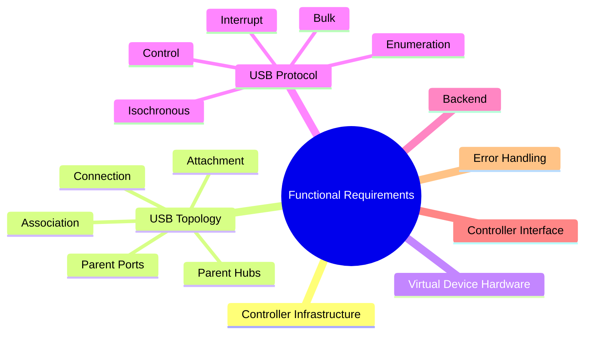
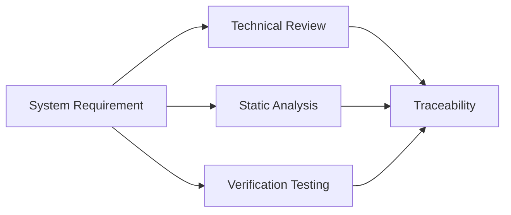

# VirtUSB System Requirements

**Status:** Draft

# Table of Contents

1. Purpose
2. Scope
3. Definitions and Abbreviations
4. References
5. System Overview
6. Functional Requirements
7. Interface Requirements
8. Non-Functional Requirements
9. Constraints
10. Explicit Non-Goals
11. Verification

Appendix A – Requirement Traceability

Appendix B – Reference Documents

# 1. Purpose

This document defines the system requirements for VirtUSB.

The requirements specify **what** the VirtUSB system shall provide without
specifying **how** these requirements are implemented.

This document is intended primarily for developers, architects, reviewers, and
contributors involved in the design, implementation, verification, and
maintenance of VirtUSB.

Implementation details are defined in separate project documents, including the
System Overview, the High-Level Architecture, Architecture Decision Records
(ADRs), and subsequent design specifications.

This document intentionally does not define:

- implementation details
- software architecture
- algorithms
- data structures
- communication protocols
- interface definitions
- implementation-specific synchronization mechanisms
- other design decisions

These topics are addressed by the corresponding architecture and design
documents.
---

# 2. Scope

VirtUSB is a Linux-based software system providing one or more virtual USB Host
Controllers for developing, testing, simulating, and validating USB devices
without requiring corresponding physical USB hardware.

VirtUSB operates exclusively within the Linux environment.

The system consists of an out-of-tree Linux kernel module together with
supporting userspace software.

The scope of VirtUSB includes:

- virtual USB Host Controller infrastructure
- virtual Root Hub implementation
- hierarchical virtual USB topology
- parent hub and parent port management
- Controller Interface
- kernel-userspace communication
- backend integration
- USB transfer and bus event transport

VirtUSB interfaces with the Linux USB subsystem on one side and userspace
components on the other.

The following are outside the scope of VirtUSB:

- implementation of the Linux USB subsystem
- backend-specific implementation details
- device-specific USB behaviour
- USB device application logic
- physical USB hardware
- non-Linux operating systems

VirtUSB is intended for developers, testers, continuous integration systems,
and automated test environments requiring virtual USB hardware for software
development, validation, and regression testing.

Typical use cases include:

- USB device development
- software-defined USB device prototyping
- automated testing
- regression testing
- protocol validation
- USB software integration testing
- backend development

---

# 3. Definitions and Abbreviations

The terminology and abbreviations used by this document are defined in
`doc/glossary.md`.

---

# 4. References

This document is based on the following project documents and external
references.

Project-specific documents define the VirtUSB architecture, terminology, and
engineering process. External references provide the technical background and
platform-specific requirements relevant to this specification.

## 4.1 Project Documents

- VirtUSB Glossary
- VirtUSB System Overview
- VirtUSB High-Level Architecture
- VirtUSB Architecture Decision Records (ADRs)

## 4.2 External References

- Universal Serial Bus Specification, Revision 2.0
- Linux Kernel Documentation
- Linux USB Subsystem Documentation

---

# 5. System Overview

This section provides a high-level overview of the problem addressed by VirtUSB
and the operational context in which the system is intended to be used.

Detailed architectural concepts, responsibility layers, runtime objects, and
communication models are defined by the System Overview and the High-Level
Architecture documents.

## 5.1 Problem Statement

Developing, testing, and validating USB devices traditionally requires
dedicated physical USB hardware.

This increases development effort, complicates automated testing, and makes it
difficult to reproduce specific USB scenarios consistently.

Existing approaches typically rely on one or more of the following:

- physical USB hardware
- software simulation with limited operating-system integration
- specialized USB test equipment

These approaches often lack flexibility, require additional hardware, or do not
allow virtual USB devices to participate in the standard Linux USB subsystem as
regular USB devices.

VirtUSB addresses these limitations by providing one or more virtual USB Host
Controllers that allow software-defined Virtual Device Hardware to appear as
standard USB devices from the perspective of the Linux operating system.

Typical use cases include:

- USB device development
- software-defined USB device prototyping
- automated testing
- regression testing
- protocol validation
- USB software integration testing
- backend development

## 5.2 System Context

VirtUSB operates as an out-of-tree Linux kernel module and integrates with the
Linux USB subsystem through the standard Host Controller Driver (HCD)
interface.

Userspace software communicates with individual controller instances through
the Controller Interface.

Backend instances represent Virtual Device Hardware and provide device-specific
USB behaviour.

From the perspective of the Linux operating system, applications, USB device
drivers, and diagnostic tools interact with virtual USB devices through the
standard Linux USB infrastructure without requiring VirtUSB-specific support.

Typical external tools include:

- `lsusb`
- `usb-devices`
- `usbmon`
- USB protocol analyzers

---

# 6. Functional Requirements

This section defines the functional requirements of VirtUSB. These requirements
describe the externally observable behaviour of the system without specifying
implementation details.

## 6.1 Controller Infrastructure

VirtUSB shall support one or more virtual USB Host Controllers.

The system shall allow the number of virtual Host Controllers to be configured.

Each virtual Host Controller shall operate independently of all other
controllers.

Each controller shall maintain its own runtime state, Controller Interface, and
virtual USB topology.

The creation, initialization, and removal of controllers shall be supported
through the documented Controller Interface.

## 6.2 USB Topology

VirtUSB shall support a hierarchical virtual USB topology.

Each controller shall provide exactly one virtual Root Hub.

The Root Hub shall initially expose exactly 31 downstream ports.

Additional parent ports may be provided by virtual USB hubs.

Each parent port shall belong to exactly one parent hub.

Each parent port shall support at most one attached virtual USB device.

The system shall distinguish between:

- association
- attachment
- connection
- enumeration

## 6.3 Virtual Device Hardware

VirtUSB shall support software-defined Virtual Device Hardware.

Each Virtual Device Hardware instance shall be represented by exactly one
backend instance.

A backend instance may exist independently of any controller or parent-port
assignment.

Each backend instance may be associated with at most one parent port at any
point in time.

Each parent port shall support at most one associated backend instance.

Associating a backend instance with a parent port shall not automatically make
the corresponding virtual USB device visible to the operating system.

The system shall support attaching and detaching virtual USB devices without
requiring controller recreation.

## 6.4 Device Enumeration

Virtual USB devices shall be enumerated through the standard Linux USB
enumeration process.

Virtual USB devices shall appear as standard USB devices to the Linux USB
subsystem.

Standard Linux tools shall be able to discover and inspect virtual USB devices
without requiring VirtUSB-specific modifications.

The observable enumeration behaviour shall be consistent with equivalent
physical USB devices within the limitations of a software-only implementation.

## 6.5 USB Transfers

VirtUSB shall support all USB transfer types defined by the USB 2.0
specification.

The system shall transport USB transfers between the Linux USB subsystem and
the associated backend instance.

Each submitted transfer shall eventually reach exactly one terminal state:

- completed successfully
- completed with an error
- cancelled

### 6.5.1 Control Transfers

The system shall support USB Control transfers required for device
initialization, enumeration, and normal operation.

Standard USB requests shall be handled by backend implementations.

### 6.5.2 Bulk Transfers

The system shall support USB Bulk transfers.

Bulk transfers shall preserve the ordering required by the USB specification.

### 6.5.3 Interrupt Transfers

The system shall support USB Interrupt transfers.

Interrupt transfers shall behave consistently with the USB specification within
the limitations of the execution environment.

### 6.5.4 Isochronous Transfers

The system shall support USB Isochronous transfers.

Isochronous transfers shall preserve the functional behaviour defined by the
USB specification.

The system shall not guarantee hard real-time timing or deterministic USB frame
scheduling.

## 6.6 Backend

VirtUSB shall remain independent of any specific backend implementation.

Backend implementations shall communicate exclusively through the documented
Controller Interface.

Backend implementations shall be responsible for all device-specific USB
behaviour.

The system shall support different backend implementations provided they comply
with the documented interface.

## 6.7 Controller Interface

The system shall provide a documented Controller Interface for managing virtual
USB controllers and virtual USB devices.

The Controller Interface shall support:

- controller management
- backend association
- device attachment and detachment
- topology management
- USB transfer exchange
- lifecycle-event notification

## 6.8 Error Handling

The system shall detect invalid operations affecting controller management,
topology management, device management, and backend interaction.

Backend failures shall not compromise unrelated virtual Host Controllers.

The system shall restore a consistent runtime state following communication
failures, backend termination, topology changes, or device removal.

The system shall report errors through the documented Controller Interface.

The system shall ensure that resources associated with failed or terminated
operations are released in a controlled manner.

---

## 7. Interface Requirements

This section defines the requirements for the Controller Interface between the
VirtUSB kernel module and userspace components.

The requirements describe the logical Controller Interface without mandating a
specific communication mechanism, transport protocol, or serialization format.

The Controller Interface shall provide communication between individual
VirtUSB controller instances and userspace components.

Backend implementations and control software shall communicate with the
VirtUSB kernel module exclusively through the documented Controller Interface.

The Controller Interface shall remain independent of any specific backend
implementation, programming language, userspace framework, or execution model.

The Controller Interface shall support concurrent communication with multiple
independent virtual Host Controllers.

The Controller Interface shall provide the operations required for:

- controller management
- topology management
- backend association
- device attachment and detachment
- USB transfer exchange
- lifecycle management

The Controller Interface shall support asynchronous notification of relevant:

- USB bus events
- controller lifecycle events
- topology changes
- device lifecycle events

The Controller Interface shall provide a documented mechanism for reporting:

- operational errors
- communication failures
- backend failures
- topology-related failures

The Controller Interface shall provide sufficient information to allow
userspace components to identify the affected:

- controller instance
- parent hub
- parent port
- backend instance
- virtual USB device
- USB transfer

The Controller Interface shall support future functional extension while
preserving backward compatibility whenever reasonably practical.

The detailed communication protocol, message formats, transport mechanisms, and
versioning strategy are defined separately and are outside the scope of this
requirements specification.

---

# 8. Non-Functional Requirements

This section defines the non-functional requirements of VirtUSB. These
requirements describe the quality attributes and operational characteristics
expected from the system.

## 8.1 Performance

VirtUSB shall provide sufficient performance for interactive USB device
development, testing, simulation, and validation.

The system shall support concurrent operation of multiple independent virtual
Host Controllers.

Performance shall scale with the configured number of controller instances
within the practical limitations of the underlying Linux system.

The architecture shall not require unnecessary synchronization between
independent controller instances.

## 8.2 Reliability

VirtUSB shall operate reliably during continuous use.

Failures affecting one virtual Host Controller, backend instance, or Virtual
Device Hardware instance shall not compromise unrelated controller instances.

The system shall detect communication failures and restore a consistent runtime
state.

The system shall support controlled recovery following backend termination,
topology changes, communication failures, or device removal.

## 8.3 Maintainability

VirtUSB shall be designed to support long-term maintenance and future
development.

The project shall maintain up-to-date technical documentation describing the
system requirements, architecture, public interfaces, and terminology.

Architectural decisions shall be documented using Architecture Decision Records
(ADRs).

The implementation shall follow a consistent coding style.

Static analysis tools shall be used to improve code quality and detect
potential defects.

The software architecture shall remain modular to facilitate future extension
and maintenance.

## 8.4 Portability

VirtUSB shall support multiple processor architectures supported by the Linux
kernel where practical.

The project shall support GCC and LLVM/Clang toolchains.

Platform-specific implementation details shall be minimized where reasonably
practical.

Backend implementations shall remain independent of processor architecture
where practical.

## 8.5 Security

VirtUSB shall operate within the Linux security model.

The system shall not require privileges beyond those necessary for operating a
Linux kernel module.

The documented Controller Interface shall validate externally supplied input
before processing.

Trust relationships between kernel space and userspace shall be explicitly
defined.

## 8.6 Testability

VirtUSB shall be designed to support systematic verification.

The project shall support unit testing where practical.

The project shall support integration testing of kernel and userspace
components.

Automated testing shall be supported to facilitate regression testing and
continuous integration.

The architecture shall support isolated verification of controller
infrastructure, USB topology, backend interaction, and transfer handling.

## 8.7 Compatibility

VirtUSB shall maintain compatibility with supported Linux kernel versions.

Public interfaces shall remain stable whenever reasonably practical.

Changes affecting documented public interfaces shall preserve backward
compatibility whenever reasonably practical or shall be documented accordingly.

The Controller Interface shall support controlled future extension without
requiring unnecessary changes to existing userspace applications.

---

# 9. Constraints

This section defines constraints that influence the design and implementation of
VirtUSB. These constraints originate from project objectives, the target
platform, and external requirements rather than from functional behaviour.

## 9.1 Platform Constraints

VirtUSB shall target Linux systems exclusively.

The kernel component shall be implemented as an out-of-tree Linux kernel
module.

The project shall rely on the standard Linux Host Controller Driver (HCD)
infrastructure and use interfaces intended for external kernel modules wherever
reasonably practical.

The implementation shall follow established Linux kernel development
conventions where applicable.

## 9.2 Technology Constraints

The project shall use CMake as its primary build system.

The kernel module shall integrate with the standard Linux kernel build
infrastructure.

DKMS integration may be provided to simplify installation on supported Linux
systems.

Project documentation shall be maintained in Markdown format.

Mermaid diagrams may be used to document architectural relationships and system
behaviour.

## 9.3 Licensing Constraints

VirtUSB shall be distributed under an approved open-source license.

The selected license shall permit third-party backend implementations.

Third-party software dependencies shall be compatible with the project's
licensing model.

Licensing requirements shall be documented for external dependencies where
applicable.

---

# 10. Explicit Non-Goals

This section defines capabilities that are intentionally outside the scope of
VirtUSB. These items are explicitly excluded from the project to clarify its
intended scope and to avoid ambiguity regarding future development.

VirtUSB is **not** intended to provide:

- physical USB Host Controller implementations
- USB device firmware
- implementation of device-specific USB behaviour
- virtual USB device emulation outside the Linux operating system
- replacement, modification, or reimplementation of the Linux USB subsystem
- mandatory backend framework or programming model
- custom USB protocol analysis or protocol capture functionality
- hard real-time guarantees for USB isochronous transfers

---

# 11. Verification

This section defines how compliance with the system requirements is verified.

Each requirement specified in this document shall be verifiable by one or more
documented verification methods.

Verification methods may include:

- technical review
- architecture review
- static analysis
- unit testing
- integration testing
- system testing

The selected verification method shall be appropriate for the corresponding
requirement.

Each requirement shall be assigned a unique identifier.

Verification artifacts shall reference the corresponding requirement
identifier.

Where applicable, verification artifacts shall also reference:

- the corresponding High-Level Architecture section
- the corresponding Architecture Decision Record (ADR)

Requirement traceability shall be maintained throughout the project lifecycle.

The project shall maintain traceability between:

- system requirements
- architecture documentation
- Architecture Decision Records
- implementation
- verification artifacts

The traceability model shall support demonstrating that each implemented
requirement has been verified using one or more documented verification
activities.

---

# Appendix A – Requirement Traceability (Example)

The following table illustrates the recommended structure of a requirement
traceability matrix. The actual project traceability matrix is maintained
separately.

| Requirement | Verification | ADR | Status |
|-------------|--------------|-----|--------|
| ...         | ...          | ... | ...    |

---
# Appendix B – Reference Documents (Example)

The following table illustrates the recommended structure for maintaining
project reference documents.

| ID      | Document | Version |
|---------|----------|---------|
| ...     | ...      | ...     |
