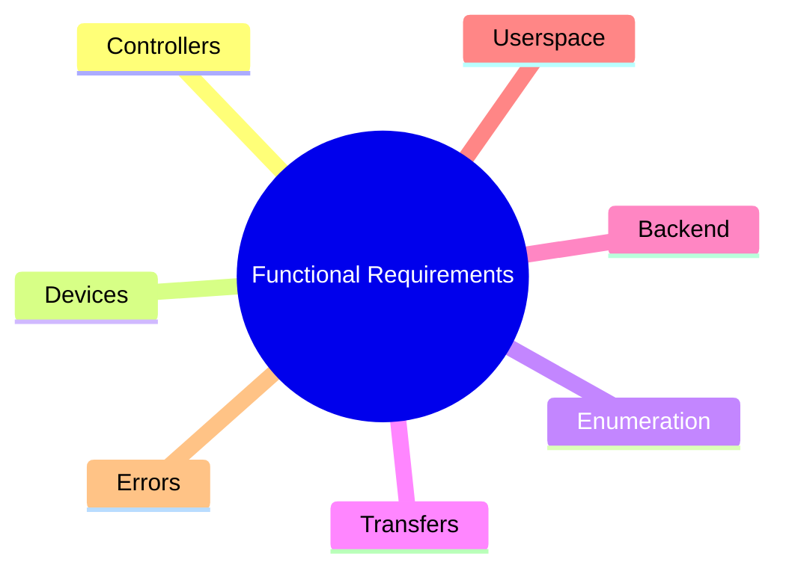

# VirtUSB System Requirements

**Status:** Draft

# Table of Contents

1. Purpose
2. Scope
3. Definitions and Abbreviations
4. References
5. System Overview
6. Functional Requirements
7. Interface Requirements
8. Non-Functional Requirements
9. Constraints
10. Explicit Non-Goals
11. Verification
Appendix A – Requirement Traceability

# 1. Purpose

This document defines the system requirements for VirtUSB.

The requirements describe **what** the VirtUSB system shall provide without
specifying **how** these requirements are implemented.

This document is primarily intended for developers, architects and reviewers
participating in the design and implementation of VirtUSB.

Implementation details are specified in other project documents, including the
High-Level Architecture, the Software Requirements and the Architecture
Decision Records (ADRs).

This document intentionally does not specify implementation details,
algorithms, data structures, interfaces or other design decisions.

---

# 2. Scope

VirtUSB is a Linux-based software system providing one or more virtual USB Host
Controllers for developing, testing, and validating USB devices without
requiring dedicated physical USB hardware.

VirtUSB operates exclusively within the Linux environment. The system consists
of an out-of-tree Linux kernel module together with supporting userspace
components.

The scope of VirtUSB includes:

- virtual USB Host Controller infrastructure
- virtual Root Hub implementation
- downstream port management
- kernel-userspace communication
- virtual USB device backend integration
- USB transfer and bus event transport

VirtUSB interfaces with the Linux USB subsystem on one side and userspace
components on the other.

The following are outside the scope of VirtUSB:

- implementation of the Linux USB subsystem
- backend-specific implementation details
- USB device application logic
- physical USB hardware
- non-Linux operating systems

VirtUSB is intended for developers, testers, and automated test environments
requiring virtual USB hardware for software development and validation.

Typical use cases include:

- USB device development
- automated testing
- regression testing
- protocol validation
- USB software integration testing

---

# 3. Definitions and Abbreviations

The terminology and abbreviations used by this document are defined in
`doc/glossary.md`.

---

# 4. References

This document is based on the following references.

Project-specific documents define the VirtUSB architecture and its evolution.
External references provide the technical background and platform-specific
requirements relevant to this specification.

- VirtUSB High-Level Architecture
- Architecture Decision Records (ADRs)
- Universal Serial Bus Specification, Revision 2.0
- Linux Kernel Documentation
- Linux USB Subsystem Documentation

---

# 5. System Overview

This section provides a high-level overview of the problem addressed by VirtUSB
and the environment in which the system operates.

## 5.1 Problem Statement

Developing and testing USB devices traditionally requires dedicated physical
USB hardware. This increases development effort, complicates automated testing,
and makes it difficult to reproduce specific USB scenarios consistently.

Existing approaches typically rely on either physical hardware, software
simulation with limited integration into the operating system, or specialized
hardware test equipment. These approaches often lack flexibility, require
additional hardware, or do not present virtual USB devices through the standard
Linux USB subsystem.

VirtUSB addresses these limitations by providing virtual USB Host Controllers
that allow software-defined USB devices to behave like physical USB devices
from the perspective of the Linux operating system.

Typical use cases include:

- USB device development
- automated testing
- regression testing
- protocol validation
- USB software integration testing

## 5.2 System Context

VirtUSB operates as a Linux kernel module and integrates with the Linux USB
subsystem through the standard Host Controller Driver (HCD) interface.

Userspace components manage virtual controllers and communicate with backend
implementations that provide the behaviour of virtual USB devices.

From the perspective of the Linux operating system, applications and diagnostic
tools interact with virtual USB devices through the standard Linux USB
infrastructure without requiring VirtUSB-specific support.

Typical external tools include:

- `lsusb`
- `usb-devices`
- `usbmon`
- USB protocol analyzers

---

# 6. Functional Requirements

This section defines the functional requirements of VirtUSB. These requirements
describe the externally observable behaviour of the system without specifying
implementation details.

## 6.1 Virtual Host Controllers

VirtUSB shall support one or more virtual USB Host Controllers.

The system shall allow the number of virtual Host Controllers to be configured.

Each virtual Host Controller shall operate independently of all other
controllers.

Each controller shall maintain its own runtime state, communication interface,
and virtual USB bus.

The creation, initialization, and removal of controllers shall be supported
through the documented userspace interface.

## 6.2 Virtual USB Devices

VirtUSB shall support software-defined virtual USB devices.

Each virtual USB device shall be represented by a backend implementation.

A backend may exist independently of any controller or port assignment.

Each backend may be associated with at most one downstream port at any point in
time.

Each downstream port shall support at most one associated backend.

Associating a backend with a port shall not automatically make the
corresponding virtual USB device visible to the operating system.

The system shall support attaching and detaching virtual USB devices without
requiring controller recreation.

## 6.3 Device Enumeration

Virtual USB devices shall be enumerated through the standard Linux USB
enumeration process.

Virtual USB devices shall appear as standard USB devices to the Linux USB
subsystem.

Standard Linux tools shall be able to discover and inspect virtual USB devices
without requiring VirtUSB-specific modifications.

The observable enumeration behaviour shall be consistent with that of
equivalent physical USB devices within the limitations of a software-based
implementation.

## 6.4 USB Transfers

VirtUSB shall support all USB transfer types required by the USB 2.0
specification.

The system shall transport USB transfers between the Linux USB subsystem and
the associated backend.

Each submitted transfer shall eventually reach exactly one terminal state:

- completed successfully
- completed with an error
- cancelled

## 6.4.1 Control Transfers

The system shall support USB control transfers required for device
initialization, enumeration, and normal operation.

Standard USB requests defined by the USB specification shall be supported
through backend implementations.

## 6.4.2 Bulk Transfers

The system shall support USB bulk transfers.

Bulk transfers shall preserve the ordering required by the USB specification.

## 6.4.3 Interrupt Transfers

The system shall support USB interrupt transfers.

Interrupt transfers shall behave consistently with the USB specification within
the limitations of the execution environment.

## 6.4.4 Isochronous Transfers

The system shall support USB isochronous transfers.

Isochronous transfers shall preserve the functional behaviour defined by the
USB specification.

The system shall not guarantee hard real-time timing or deterministic USB frame
scheduling.

## 6.5 Backend Interaction

VirtUSB shall remain independent of any specific backend implementation.

Backend implementations shall communicate exclusively through the documented
userspace interface.

Backend implementations shall be responsible for all device-specific USB
behaviour.

The system shall support different backend implementations provided they comply
with the documented interface.

## 6.6 Userspace Interaction

The system shall provide a documented userspace interface for managing virtual
USB controllers and virtual USB devices.

The userspace interface shall support controller management operations.

The userspace interface shall support backend association and device management
operations.

The userspace interface shall support notification of relevant USB bus and
device lifecycle events.

## 6.7 Error Handling

The system shall detect invalid operations affecting controller management,
device management, and backend interaction.

Backend failures shall not compromise the operation of unrelated virtual Host
Controllers.

The system shall restore a consistent runtime state following communication
failures, backend termination, or device removal.

The system shall report errors through the documented userspace interface.

The system shall ensure that resources associated with failed or terminated
operations are released in a controlled manner.

---

# 7. Interface Requirements

This section defines the interface requirements between the VirtUSB kernel
module and userspace components.

The requirements describe the logical interface exposed by VirtUSB without
mandating a specific communication mechanism or protocol.

The interface shall provide communication between the VirtUSB kernel module and
userspace components.

Backend implementations shall communicate with the kernel module exclusively
through the documented interface.

The interface shall remain independent of any specific backend implementation,
programming language, or userspace framework.

The interface shall support concurrent communication with multiple independent
virtual Host Controllers.

The interface shall provide the operations required for:

- controller management
- backend association
- device attachment and detachment
- USB transfer exchange
- lifecycle management

The interface shall support asynchronous notification of relevant USB bus,
controller, and device lifecycle events.

The interface shall provide a documented mechanism for reporting operational
errors and communication failures.

The interface shall provide sufficient information to allow userspace
components to identify the affected controller, virtual device, or transfer.

Changes affecting the documented interface shall preserve backward
compatibility whenever reasonably practical.

---

# 8. Non-Functional Requirements

This section defines the non-functional requirements of VirtUSB. These
requirements describe the quality attributes and operational characteristics
expected from the system.

## 8.1 Performance

VirtUSB shall provide sufficient performance for interactive USB device
development, testing, and validation.

The system shall support concurrent operation of multiple virtual Host
Controllers.

Performance shall scale with the configured number of controller instances
within the practical limitations of the underlying Linux system.

## 8.2 Reliability

VirtUSB shall operate reliably during continuous use.

Failures affecting one virtual Host Controller or backend shall not compromise
the operation of unrelated controller instances.

The system shall detect communication failures and restore a consistent runtime
state.

The system shall support controlled recovery following backend termination or
device removal.

## 8.3 Maintainability

VirtUSB shall be designed to support long-term maintenance and future
development.

The project shall maintain up-to-date technical documentation describing the
system architecture and public interfaces.

Architectural decisions shall be documented using Architecture Decision Records
(ADRs).

The implementation shall follow a consistent coding style.

Static analysis tools shall be used to improve code quality and detect potential
defects.

The software architecture shall remain modular to facilitate future extension
and maintenance.

## 8.4 Portability

VirtUSB shall support multiple processor architectures supported by the Linux
kernel where practical.

The project shall support GCC and LLVM/Clang toolchains.

Platform-specific implementation details shall be minimized where reasonably
practical.

## 8.5 Security

VirtUSB shall operate within the Linux security model.

The system shall not require privileges beyond those necessary for operating a
Linux kernel module.

The documented userspace interface shall validate externally supplied input
before processing.

Trust relationships between kernel-space and userspace shall be explicitly
defined.

## 8.6 Testability

VirtUSB shall be designed to support systematic verification.

The project shall support unit testing where practical.

The project shall support integration testing of kernel and userspace
components.

Automated testing shall be supported to facilitate regression testing and
continuous integration.

## 8.7 Compatibility

VirtUSB shall maintain compatibility with supported Linux kernel versions.

Public interfaces shall remain stable whenever reasonably practical.

Changes affecting documented public interfaces shall preserve backward
compatibility whenever reasonably practical or shall be documented accordingly.

---

# 9. Constraints

This section defines constraints that influence the design and implementation of
VirtUSB. These constraints originate from project objectives, the target
platform, and external requirements rather than from functional behaviour.

## 9.1 Platform Constraints

VirtUSB shall target Linux systems exclusively.

The kernel component shall be implemented as an out-of-tree Linux kernel
module.

The project shall rely only on interfaces intended for external kernel modules
where reasonably practical.

## 9.2 Technology Constraints

The project shall use CMake as its primary build system.

The kernel module shall integrate with the standard Linux kernel build
infrastructure.

DKMS integration may be provided to simplify installation on supported Linux
systems.

Project documentation shall be maintained in Markdown format.

## 9.3 Licensing Constraints

VirtUSB shall be distributed under an approved open-source license.

The selected license shall permit third-party backend implementations.

Third-party software dependencies shall be compatible with the project's
licensing model.

Licensing requirements shall be documented for external dependencies where
applicable.

---

# 10. Explicit Non-Goals

This section defines capabilities that are intentionally outside the scope of
VirtUSB. These items are explicitly excluded from the project to clarify its
intended scope and to avoid ambiguity regarding future development.

VirtUSB is **not** intended to provide:

- physical USB Host Controller implementations
- USB device firmware
- virtual USB device emulation outside the Linux operating system
- replacement, modification, or reimplementation of the Linux USB subsystem
- custom USB protocol analysis or protocol capture functionality
- hard real-time guarantees for USB isochronous transfers

---

# 11. Verification

This section defines how compliance with the system requirements is verified.

Each requirement specified in this document shall be verifiable by one or more
documented verification methods.

Verification methods may include:

- technical review
- static analysis
- unit testing
- integration testing
- system testing

The selected verification method shall be appropriate for the corresponding
requirement.

Each requirement shall be assigned a unique identifier.

Verification artifacts shall reference the corresponding requirement
identifier.

Where applicable, verification artifacts shall also reference the corresponding
Architecture Decision Records (ADRs).

Requirement traceability shall be maintained throughout the project lifecycle.

---

# Appendix A – Requirement Traceability (Example)

The following table illustrates the recommended structure of a requirement
traceability matrix. The actual project traceability matrix is maintained
separately.

| Requirement | Verification | ADR | Status |
|-------------|--------------|-----|--------|
| ...         | ...          | ... | ...    |

---
# Appendix B – Reference Documents (Example)

The following table illustrates the recommended structure for maintaining
project reference documents.

| ID      | Document | Version |
|---------|----------|---------|
| ...     | ...      | ...     |
